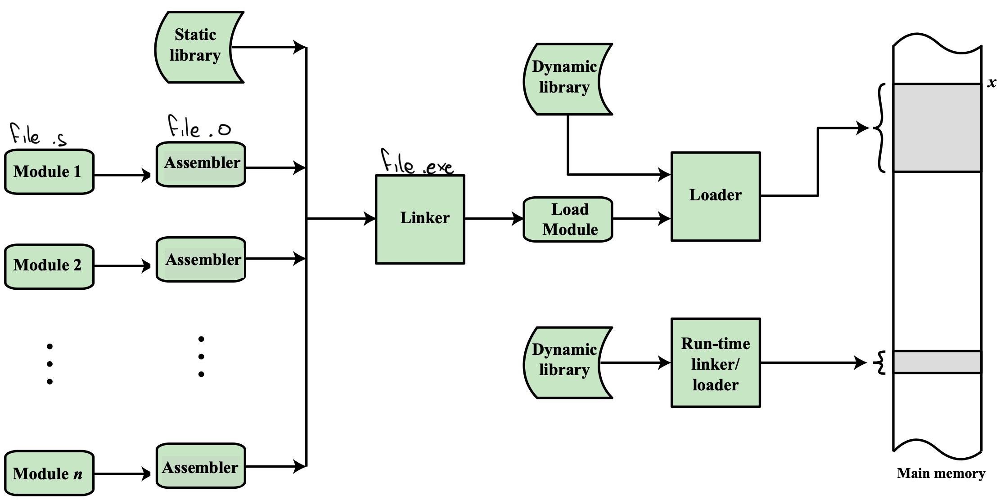

# Assembler

1. Text Editor
   Scrittura del codice ARM in formato .s
2. Assemblatore
   Traduzione in modulo oggetto, formato .o
3. Linker
   Costruzione del programma eseguibile .exe
4. Loader
   Caricare in memoria il programma e imposta il PC in modo che l'elaboratore inizi l'esecuzione
5. Debugger

### Assemblatore

comando: `arm-linux-gnueabi-as`
Nel file sorgente ci sono istruzioni macchina (es: ADD, SUB)
Istruzioni per l'assemblatore (es: .text, .bss)
Ci sono anche label... che vanno gestite separatamente

L'assemblatore legge carattere per carattere il codice assembly e lo traduce in istruzioni macchina, esegue le istruzioni per l'assemblatore (.word, .skip), sostituisce i simboli (.equ, label)

Per poter gestire anche le foward label devono essere esegute 2 scansioni
Le label esterne vengono salvate separatamente così che il linker possa poi gestirle e aggiungere i dati ove necessario (il linker gestisce anche simboli utilizzati tra segmenti diversi, l'assembler lavora separatamente per .text, .data, .bss)

### Linker

comando: `arm-linux-gnueabi-ld`

1. Calcola l'estensione di memoria occupata da ciascun modulo, così da poter impostare gli indirizzi delle label
2. Risolve i riferimenti esterni

##### Librerie

-   Libreria statica:
    Viene fornita già in fase di assemblaggio (moduli .o), e fornisce funzioni utili al programmatore, però essendo statica se si vuole aggirnarla è necessario ricompilare
-   Libreria dinamica:
    Contiene istruzioni i cui simboli vengono caricati solamente dal loader, rendendo questo indipendente dall'eseguibile
