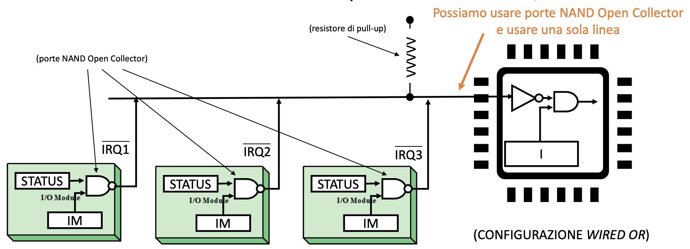
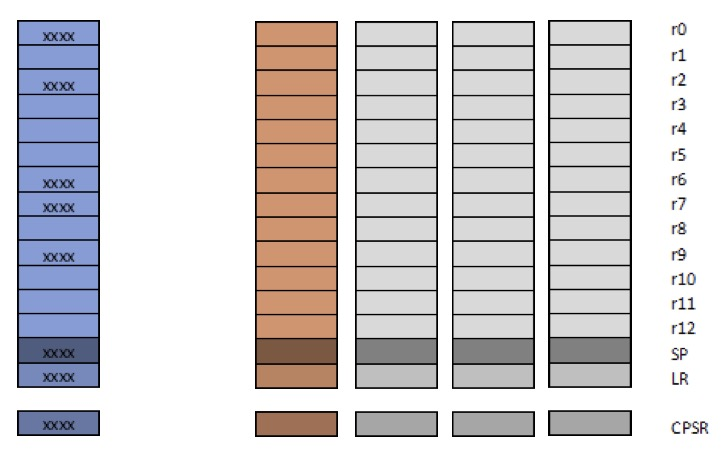
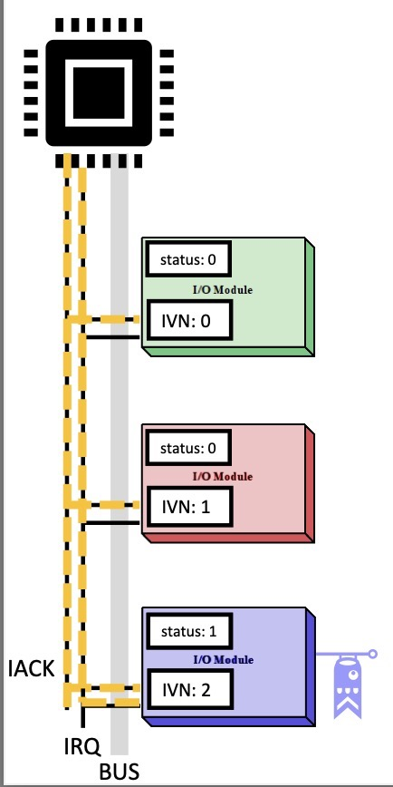
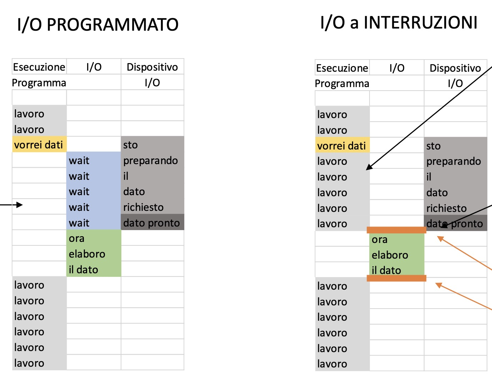

Le istruzioni necessarie per leggere e scrivere dai dispostivi di input e output

Ogni dispositivo ha della logica di controllo che permette di tradurre quanto arriva dal sensore e standardizzarlo secondo degli standard di I/O

Poi queste informazioni standardizzate vengono inviate all'elaboratore tramite il modulo I/O che è collegato direttamente al bus

Se il modulo I/O è di tipo programmed allora il processore può eseguire direttamente delle istruzioni di I/O quali:
- Controllo
- Test
- Lettura
  Si divide in 3 operazioni
  - Controllo dispositivo
  - Test: controlla se il dispositivo è pronto ad accettare operazioni di lettura
  - Lettura: La CPU legge i dati dal data register del modulo
- Scrittura
  Uguale al processo di lettura, ma la cpu scrive sul data register

Per dare accesso alla cpu ai data register del modulo si possono utilizzare 2 metodi:
- Usare dei normali indirizzi, trattando il dispositivo come una memoria
- Utilizzare un altro bus da collegare separatamente alla CPU, dovendo così implementare delle altre istruzioni

Problema: 
	In questo modo la cpu deve attendere che il test vada a buon fine e questo può richiedere molto tempo, i dispositivi I/O sono quasi sempre più lenti della cpu

Per risolvere questo problema è possibile usare gli I/O interrupt
- Il processore notifica il dispositivo I/O che vuole svolgere una determinata operazione
- Quando l'operazione è completa, il dispositivo invia un interrupt alla cpu per notificarla che i dati sono pronti
- Solo a questo punto la cpu interrompe le sue operazioni ed esegue quella di I/O
	Quando il processore riceve un interrupt (IRQ)
	- Interrompere quello che sta facendo (Salvataggio Contesto)
	- Passare velocemente a leggere il dato pronto (RSI)
	- Ritornare a quelle che stava facendo (Ripristino Contesto)

Questo significa che non vengono persi cicli nell'attesa che il dispositivo sia pronto

- IRQ (Interrupt ReQuest)
	Viene trasmessa attraverso una linea separata alla cpu, tutti i dispositivi I/O si collegano alla cpu utilizzando un OR logico

È necessario ottenere i dati dal dispositivo velocemente perché altrimenti quei dati potrebbero essere persi
- Salvataggio Contesto
	Viene salvato il PC e altri registri di stato
	Commuta il valore in un registro che blocca ulteriori interrupt
	carica nel PC il RSI

	Per fare ciò si possono anche utilizzare i banked registers, ovvero avere più set di registri, e si può selezionare il gruppo di registri da utilizzare in base alla situazione

    

- RSI (Routine di Servizio)
	Si può implementare via software oppure via hardware
	Preambolo:
	1. Capire chi ha generato l'IRQ
		software polling: chiedo ad uno ad uno ai dispositivi se hanno generato l'interrupt
		via hardware: utilizzare più linee per i IRQ, una per device
	2. Ordinare gli interrupt se sono arrivati più interrupt nello stesso istante
		L'ordine viene dato dall'ordine in cui viene chiesto ai dispositivi se hanno generato l'interrupt
		È anche possibile gestire la priorità utilizzando i registri IM, quando sto gestendo un interrupt imposto a 0 gli IM dei device che non possono interromperla, mentre ad 1 gli IM dei device più importanti
	3. Inizializzare l'RSI
		Ogni modulo di I/O ha un IVN identificativo, e una tabella fa il link tra questi valori e degli indirizzi di memoria, i quali contengono le istruzioni per l'RSI che gestisce quel dispositivo

        

### Altre applicazioni
Gli interrupt vengono utilizzati anche per gestire molti altri processi del processore
- Program: cose come la divisione per zero
- Timer: interrupt generato da un timer che permette al computer di eseguire specifiche azioni in momenti specifici
- Hardware failure: errori di memoria o di energia

ARM gestisce 6 livelli di interrupt
Utilizza Interrupt vettorizzati e banked registers (solo da R7-R14)
