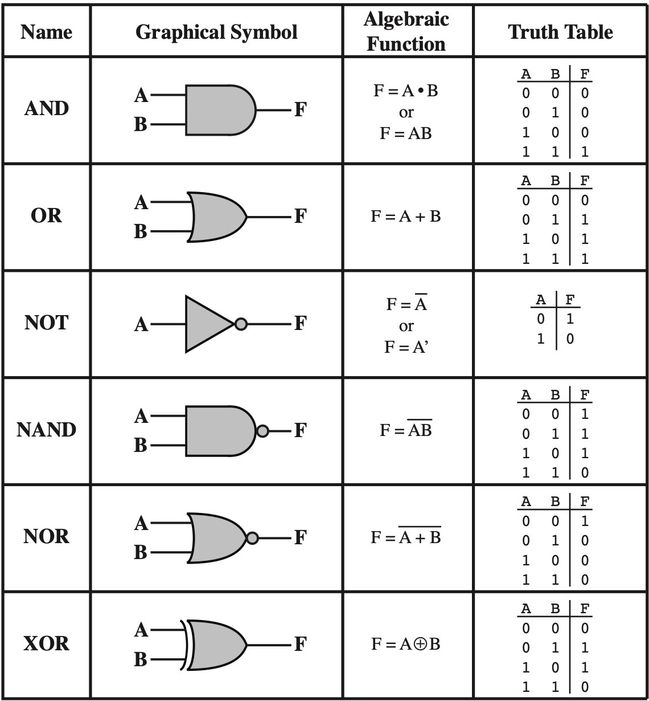
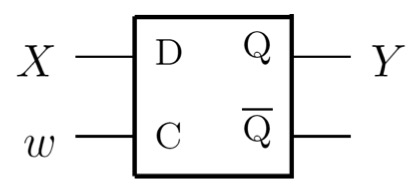
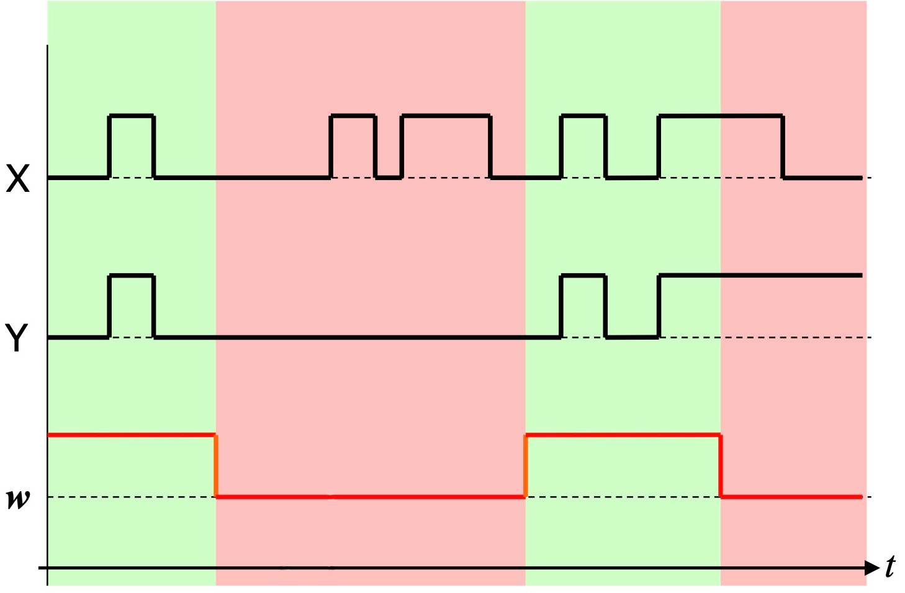
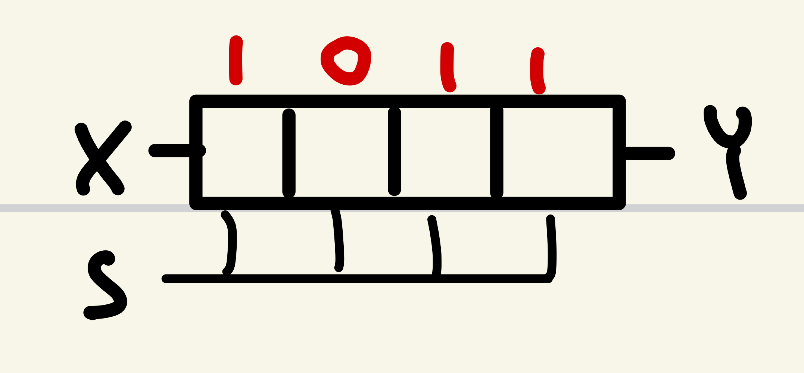
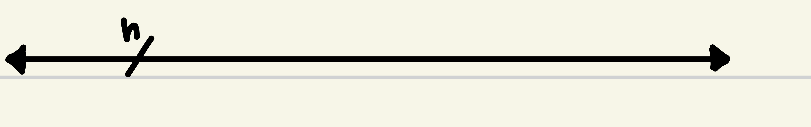

Ci sono solo 2 valori che il computer è in grado di interpretare:
- Vero, 1, alto, +5V
- Falso, 0, basso, 0V

## Porta logica
Una porta logica è un dispositivo con n ingressi e una sola uscita

Nota che ogni porta può essere ottenuta come combinazione di altre porte (per esempio ogni porta si può ricostruire combinando _OR e NOT_, _OR e AND_, _NOR_ o _NAND_)

## Registri

Un registro è in grado di memorizzare il valore X e mantenerlo in output Y
w è il segnale di controllo, se w è `1` il registro memorizza il valore di X, se `0` lo ignora

Si possono mettere più registri in serie per ottenere un "registro a scorrimento"
ad ogni input i valori scorrono da sinistra verso destra

Se X = `0` si può effettuare la divisione per 2 del numero contenuto nel registro ad ogni iterazione

## Il bus

Trasferisce n elementi da un punto all'altro dell'elaboratore