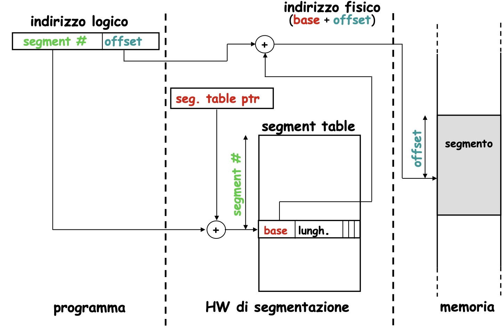

Una serie di strumenti che poi vengono però utilizzati principalmente dal sistema operativo, il quale è il vero responsabile della gestione

Fare ciò rende molto più efficiente l'esecuzione del programma
Per dare al sistema operativo la possibilità di fare ciò dobbiamo suddividere la memoria ram così che possa contenere il maggior numero di programmi possibile
Per fare ciò ci sono diversi metodi:
- paginazione
- segmentazione
- paginazione con memoria virtuale
- segmentazione con memoria virtuale

### Paginazione
La CPU utilizza 32 bit (indirizzi logici)
Ma molto spesso la memoria non è necessariamente a 32 bit, magari è a 30 bit
Tradurre gli indirizzi logici in indirizzi fisici è il compito dell'MMU (mapping and management unit)

Si divide la memoria in blocchi (pagine), ognuna con un suo indirizzo (offset)

La paginazione inoltre aiuta a risolvere il problema della frammentazione
Infatti grazie alla page table posso avere indirizzi consecutivi per elementi fisicamente lontani in memoria

Il problema della paginazione è che l'unità di misura è la pagina e posso associare solo una pagina per volta

### Segmentazione
I segmenti possono avere una dimensione variabile
Viene creata una segment table che specifica
- L'indirizzo iniziale del segmento
- La dimensione del segmento
- bit di controllo
- bit di protezione

Ora per trasformare un indirizzo logico in uno fisico basta usare l'indirizzo logico come un offset da applicare all'indirizzo iniziale scritto nella segment table
È necessario effetture un controllo affinché l'indirizzo richiesto non superi il segmento corrente, altrimenti si arriva ad un errore

### Memoria virtuale
Caricare i contenuti più usati di un programma in RAM, e usare il disco per il resto, caricando solo ciò che è necessario.
In un meccanismo simile alla cache, utilizziamo la RAM come memoria veloce e il disco per la memoria lenta ma capiente. Scegliendo i blocchi con gli stessi criteri di località temporale e spaziale.

Per fare questo ci deve essere una page table che traduce gli indirizzi della cpu a indirizzi della memoria (in questa page table viene anche specificato se l'indirizzo si trova in RAM oppure no)

Accedere alla page table può essere dispendioso (servono 2 richieste alla memoria, uno per la page table e uno per il dato) quindi c'è un'altra cache (TLB, Translation Lookaside buffer) che accelera questo processo.
Nella TLB viene salvato un indice di memoria ram e un indice di memoria fisica, che permette di collegare l'uno all'altro

