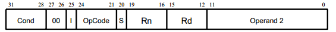
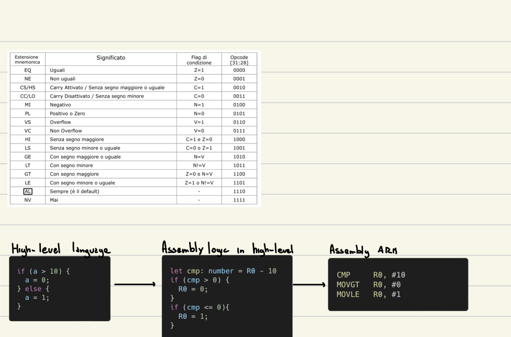

# I linguaggi assembly

Le istruzioni del linguaggio asembly devono essere contenute in 32 bit, 1 word

-   Condizione: 3 bit che indicano in quale caso l'operazione dovrebbe essere eseguita
-   bit 27 e 26 a 0
-   I: se 1 l'operando 2 è descritto da shift (8bit) + registro (4 bit)
    se 2 l'operando 2 è descritto da rotate (4bit) + valore immediato (8bit)
-   OpCode: 4 bit per identificare l'istruzione (ADD, SUB, ...)
-   S: se 1 altera i bit di stato
-   Rn: Primo operando (registro)
-   Rd: Destinazione (registro)
-   Secondo operando

### Condizione

### Simboli

label: utile per indicare l'indirizzo in memoria di una specifica istruzione o di un vettore creato nella sezione .bss
Le label devono iniziare dal primo carattere della riga assembly

### Direttive

Indicano al compilatore delle sezioni di codice
`.global main` indica al complilatore di iniziare l'esecuzione dall'istruzione con label main

> Si possono trovare sul foglio di referece molte altre direttive come (.bss, .space, ...)
