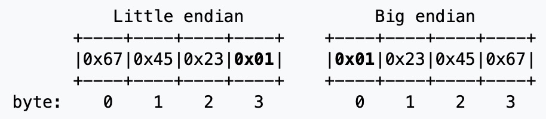
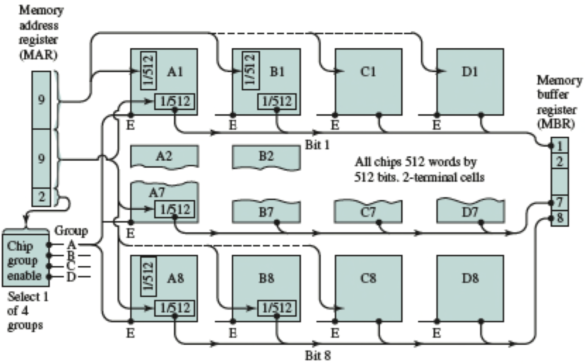

La memoria viene divisa in locazioni, ogniuna individuata da un indirizzo
Ogni locazione contiene L bits (di solito L = 8, 1 Byte per locazione di memoria)

Quindi per salvare in memoria 32 bit _(es. 0x01234567)_ ho 2 modi

## Tipi di memoria
- ROM: Read Only Memory (memoria non volatile)
	- PROM: Programmable ROM (solo in fabbrica)
	- EPROM: Eresable PROM (eresable by uv light)
	- EEPROM: Electronically Eresable PROM (si possono riscrivere byte a byte)
	- Flash Memory: Eresable Electronically (block level)
- RAM: Random Access Memory (volatile)
- DRAM: Dynamic RAM
  I valori vengono memorizzati in un condensatore (il quale perde naturalmente la carica nel tempo, il valore va refrestato)
  Alta densità, limitata velocità di accesso (20-35ns) (usato nelle memorie principale)
- SRAM: Static RAM
  I valori vengono salvati tramite memore flip-flop
  Bassa densità, alte velociti di accesso (2-3ns) (cache e registri)

#### Organizzazione in moduli e banchi

I bit più significativi selezionano il banco
I bit nel mezzo la colonna
I bit meno significativi selezionano la colonna
