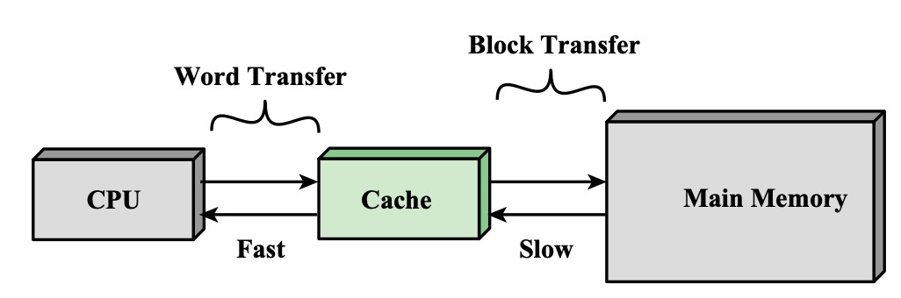
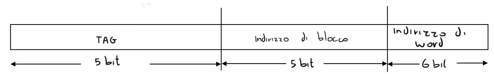
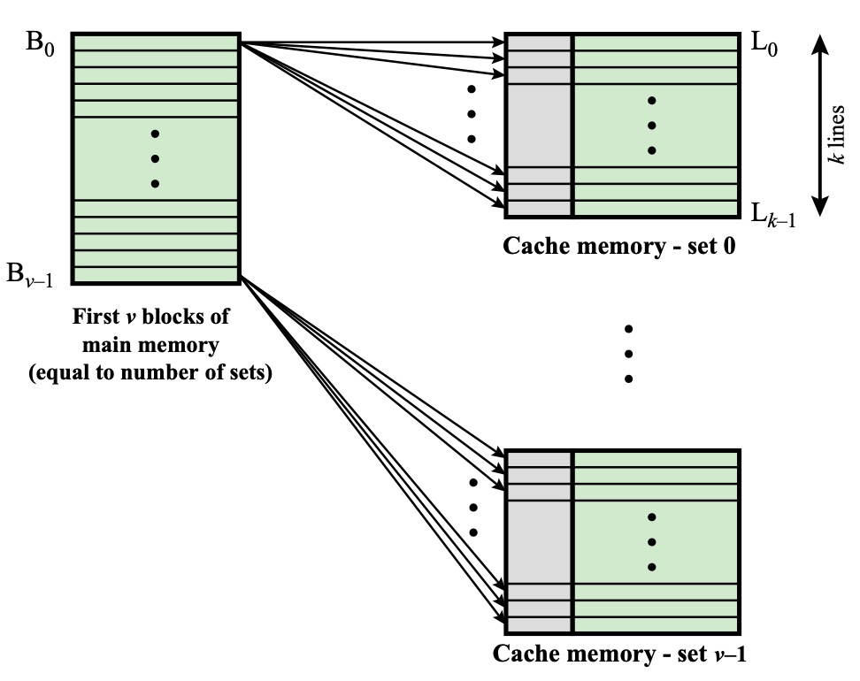

# Memoria Cache

Un modo per risolvere il bottleneck dell'architettura di Von Neumann.

Una soluzione è utilizzare memorie cache estremamente veloci (di dimensioni limitate, un paio di megabyte) dove è possibile salvare:

1. I dati più utilizzati (_località temporale_)
2. Per richiedere alla memoria un blocco (64-128 byte) al posto di un semplice word.
   
   Caricare un block può tornare utile perché spesso è necessario leggere i word successivi a quello appena recuperato (_località spaziale_)

|              |                                                                                 |
| ------------ | ------------------------------------------------------------------------------- |
| Cache Hit    | quando il byte richiesto è nella cache                                          |
| Cache Miss   | quando è necessario richiedere alla memoria                                     |
| Hit Rate = p | percentuale di richieste viene soddisfatto dalla cache (80% è un buon hit rate) |

$T = T_{cache} \cdot p + T_{memoria} \cdot (1-p)$

### Cache a mappatura diretta

![[cache_mappatura_diretta.jpg| 500]]
Gli indirizzi di memoria vengono divisi, partendo dai bit meno significativi in:

-   indirizzo dell'elemento nel blocco
-   indirizzo di blocco
-   tag

Con questa tecnica si ottengono più blocchi che condividono uno stesso tag, quindi dopo aver cercato il blocco nella memoria cache viene confrontato il tag, se i due non concordano allora l'intero blocco deve essere rimpiazzato

Per esempio di una memoria con $2^5$ block di $2^6$ byte
Quindi su un indirizzo di 16 bit i primi 10 individuano il blocco (solo i primi 5 sono il tag questo significa che ci sono $2^5$ blocchi con lo stesso tag) e gli altri 6 individuano la word nel blocco

Questa tecnica è semplice da implementare a lato hardware, ma spesso è inefficiente, lasciando parte della cache libera

### Cache completamente associativa

Quando leggo un blocco lo inserisco direttamente dove c'è un posto libero, salvadone un indirizzo completo di blocco

Il problema è che per cercare devo andare controllare ogni singolo tag, questo viene fatto in parallelo, ma il circuito per farlo è complicato
Serve implementare anche una politica di rimpiazzo, il cui circuito è ancora una volta complicato

### Cache set-associativa a k vie

È un misto tra la memoria a mappatura diretta e quella completamente associativa
al posto di aver un singolo elemento per ogni tag, si ha una serie di elementi che vengono gestiti in modo completamente associativo

Per esempio sia una memoria associativa con linee di $2^6$ byte e $2^5$ set, allora il suo indirizzo sarà:

È un buon compromesso con le altre cache

### Algoritmi di rimpiazzo

In alcuni casi è necessario sostitutire un blocco dalla cache

1. FIFO, first in first out, si sostituisce il blocco che è stato inserito per primo
2. Least Recently used, più efficiente, ma è necessario tenere traccia del tempo trascorso dall'ultimo utilizzo

Quando voglio sovrascrivere un blocco devo assicurarmi che non siano state effettuate delle modifiche mentre esso era in cache

-   c'è un bit che segnala questo, detto dirty bit, se è 1 è necessario prima copiare il blocco in RAM e poi
-   un'altra soluzione è quella di scrivere sia in cache che in ram, sia istantaneamente, sia più tardi grazie ad un write buffer

### Bit di controllo della cache

-   Dirty bit
-   Bit per il 'Least Recently used'
-   Bit di validità (lo vedremo)

`Dimensione cache = numero linee * (dimensione blocco + dimensione TAG + numero bit di controllo)`
