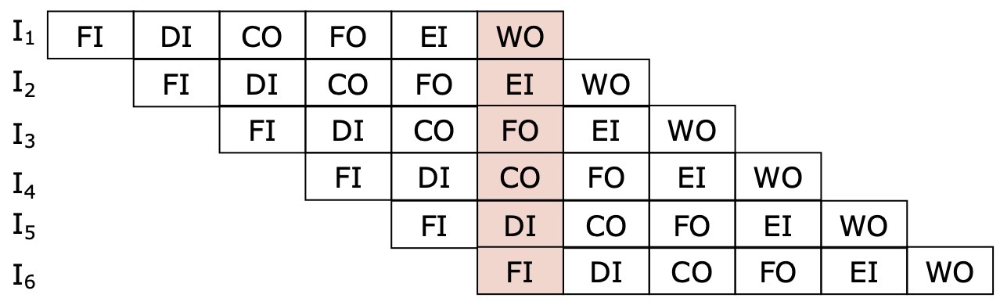

# Pipeline

1. Fetch instruction
   legge l'istruzione
2. Decode instruction
   Determina l'opcode e il tipo di operandi
3. Calculate operands
   Calcola l'indirizzo effettivo di ogni operando  
   Gestione degli indirizzamenti: con offset, diretto, indiretto di
4. Fetch operands
   Recupera gli operandi dalla memoria  
   Operandi nei registri non richiedono il fetch
5. Execute instruction
   Esegui l'istruzione indicata
6. Write operand
   Scrivi il risultato in memoria o in un registro

Tutte queste fasi sono eseguite da componenti hardware separate, è quindi eseguirle tutte in parallelo, la pipeline

Il tempo di esecuzione per N operazioni:
(k = numeri di fasi dell'operazione, t = tempo di esecuzione)
senza pipeline $t_1 = N \cdot k \cdot t$
con pipeline $t_2 = k \cdot t + (N - 1)\cdot t$

È però possibile che ci siano dei ritardi (_hazard_) causati da vari motivi

-   cache miss
    Gli unici che non dipendono dal pipeline, dipendono solamente dall'ordine con cui accedo agli elementi in memoria, quindi il ritardo da loro causato è costante
-   Resource hazard
    Quando due fasi richiedono lo stesso componente condiviso tra loro (RAM)
-   DMA
-   Data hazard
    Quando un'istruzione richiede il risultato di un'altra
-   Control hazard
    Quando avviene un salto condizionato il pipeline ne viene a conoscenza solo quando completa l'elaborazione del comando, quindi in questo caso vengono sprecate delle risorse perché è necessario pulire la pipeline

#### Speed-up factor

$$S_k = \frac{N \cdot k \cdot t}{ k \cdot t + (N - 1)\cdot t} =\frac{N \cdot k}{ k + (N - 1)}$$
$$\lim_{N \to \infty} S_k = \lim_{N \to \infty} \frac{N \cdot k}{ k + (N - 1)}= k$$
