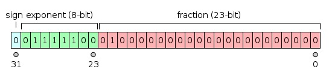
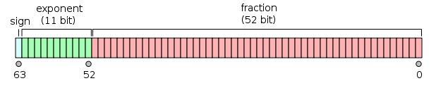

Un numero binario a 32 bit può avere molteplici significati:
- Un istruzione
- Un numero
	- Naturale
	- Intero
	- Reale
- Una striga

## Numeri in binario
**Naturali**
Un numero naturale si può rappresentare semplicemente in rappresentazione posizionale

**Interi**
- Ampiezza e segno (inutilizzato)
  il bit più significativo viene usato per il segno e il resto per l'ampiezza
- Eccesso P (poco usato)
  Sommo ad ogni numero in decimale un certo valore e poi lo converto in binario
  se ho 4 bit aggiungo 8 al numero
- Complemento a 2 (usato ovunque)
  Per ottenere i numeri negativi prendo il numero binario es. `0101`, faccio il complemento a 1, `1010` e sommo 1, `1011`

> In complemento a 2 è anche semplice trovare l'overflow, se presente, infatti se sommo due numeri positivi, che iniziano per `0` e ottengo un numero negativo, che inizia per `1` allora so che l'operazione ha generato overflow

> in complemento a 2 per estendere il numero basta prendere il bit più significativo e estenderlo
> quindi `0110` diventa `0000 0110` 
> mentre `1001` diventa `1111 1011`

**Reali**
Numeri floating point seguono uno standard _(IEEE 754)_

Il bit di segno è 1 se e solo se il numero è negativo
L'esponente è scritto in eccesso P, quindi per 32bit si tratta di sommare (o sottrarre) 127
La mantissa è la parte decimale del numero, per ritornare al numero completo è necessario scrivere 1._mantissa_

La precisione della notazione floating point diminuisce all'aumentare del valore assoluto del numero

> Per convertire un numero da M * 2^e a X * 10^Y è sufficiente usare la seguente formula
> segno(1+ 2^-1 + 2^-2 + 2^-3) * 2^e dove 2^-1, 2^-2, 2^-3 vengono inseriti solo se i corrispettivi elementi nella mantissa sono = 1

## Codifica ASCII
Una tabella per codificare i caratteri in binario
Inizialmente ogni carattere veniva rappresentato da 7 bit, poi 8 bit

Lo standard UNICODE invece utilizza fino a 32 bit per codificare tutte le lingue del mondo, anche quelle estinte)
