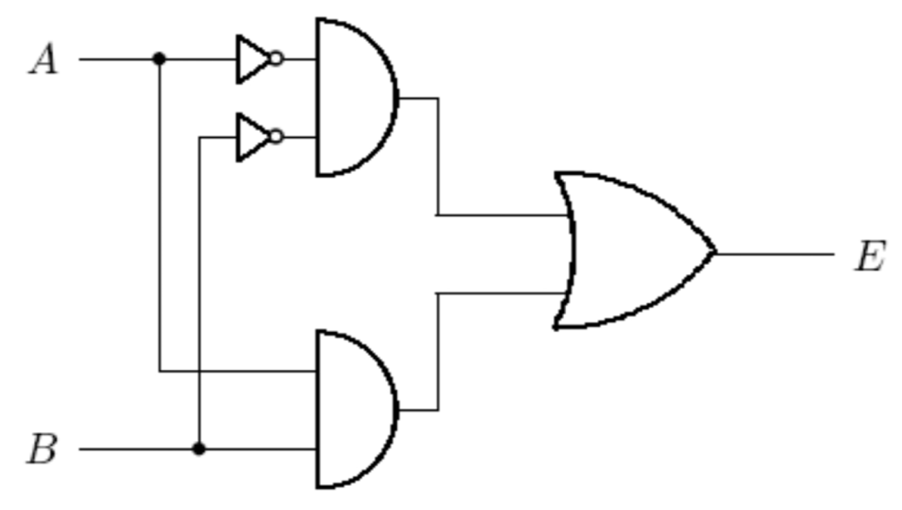
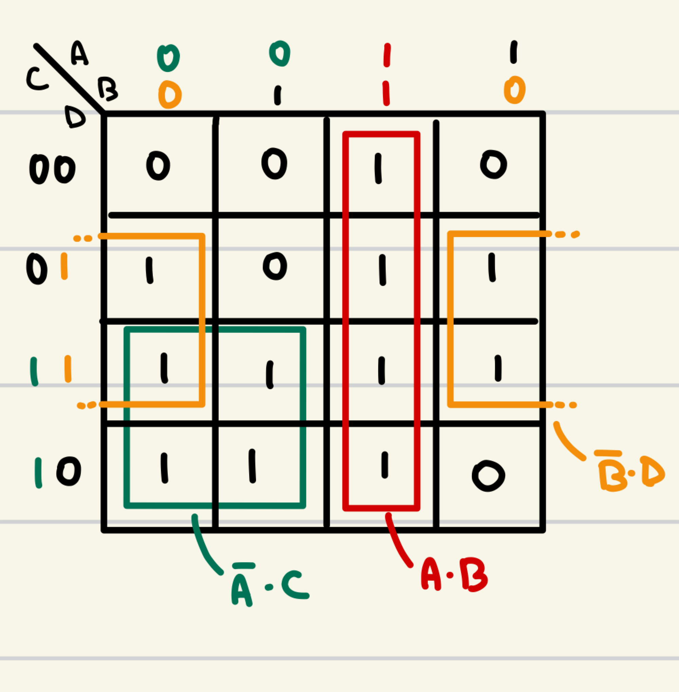

# Reti logiche

Al contrario delle porte logiche può avere più di un solo output, ma non può avere uno stato

Il nostro obiettivo nel creare una rete logica è convertire una tablella di verità in forma matematica

### Somma di Prodotti

-   Uso NOT e AND per ottenere gli uno
-   Sommo

_Esempio_
Data la tablella di verità
| A | B | Y |
|---|---|---|
| 0 | 0 | 1 |
| 0 | 1 | 1 |
| 1 | 0 | 0 |
| 1 | 1 | 1 |

Prima riga: $\overline{A \cdot B}$
Seconda riga: $\overline{A} \cdot B$
Quarta riga: $A \cdot B$

In totale $Y = \overline{A \cdot B} + \overline{A} \cdot B + A \cdot B$

### Mappe di Karnaugh

Data la mappa:

$Y = \overline{A} \cdot C + A \cdot B + \overline{B} \cdot D$

### ROM

In modo meno complicato è semplicemente possibile memorizzare in memoria gli output indicizzandoli con gli input

> Per implementare queste reti logiche è possibile usare dei PLA, Programmable Logic Array, contengono una serie di AND e OR che possono essere programmati per formare un gran numero di configurazioni

> Una rete logica sequenziale è una rete logica che implementa anche degli elementi di memoria
