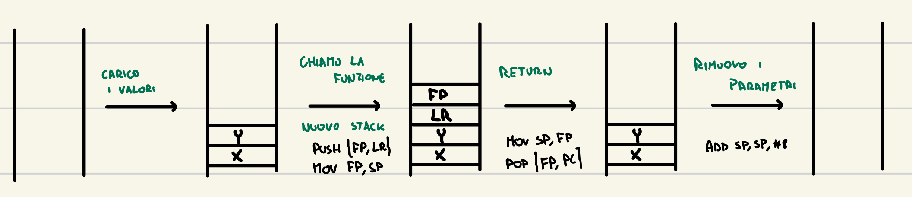

# Subroutine

Una subroutine sono una serie di istruzioni che vengono eseguite da un'altro segmento di codice

Ci sono più modi per implementare una funzione in assembly.

1. Si possono utilizzare i registri per salvare i parametri: passando per esempio gli input in R1 ed R2 e poi ritornare gli output in R0 (ritornare usando l'indirizzo LR)
2. Utilizzando lo stack frame

    ```arm-asm
    main:
    	PUSH {FP, LR}    @inizializzazione stack
    	MOV FP, SP

    	PUSH { R0 }      @salva il valore di R0

    	MOV R0, #2       @carica il valore da elevare al quadrato
    	PUSH { R0 }
    	SUB SP, SP, #4   @spazio per il risultato

    	BL pow           @chiama la funzione che eleva al quadrato

    	LDR R0, [FP, #-12]@recupera il valore del risultato

    	ADD SP, SP, #8   @rimuove dallo stack gli argomenti della funzione

    	POP { R0 }       @ripristina R0

    	MOV SP, FP       @rimuove il call stack e ritorna controllo
    	POP {FP, PC}

    pow:
    	PUSH {FP, LR}    @nuovo stack
    	MOV FP, SP

    	PUSH {R0}        @salva il valore di R0

    	LDR R0, [FP, #12]@recupera il valore della variabile
    	MUL R0, R0, R0   @esegue il calcolo
    	STR R0, [FP, #8] @carica il valore

    	POP {R0}         @ripristina il valore di R0

    	MOV SP, FP       @ritorna controllo alla funzione chiamante
    	POP {FP, PC}
    ```


