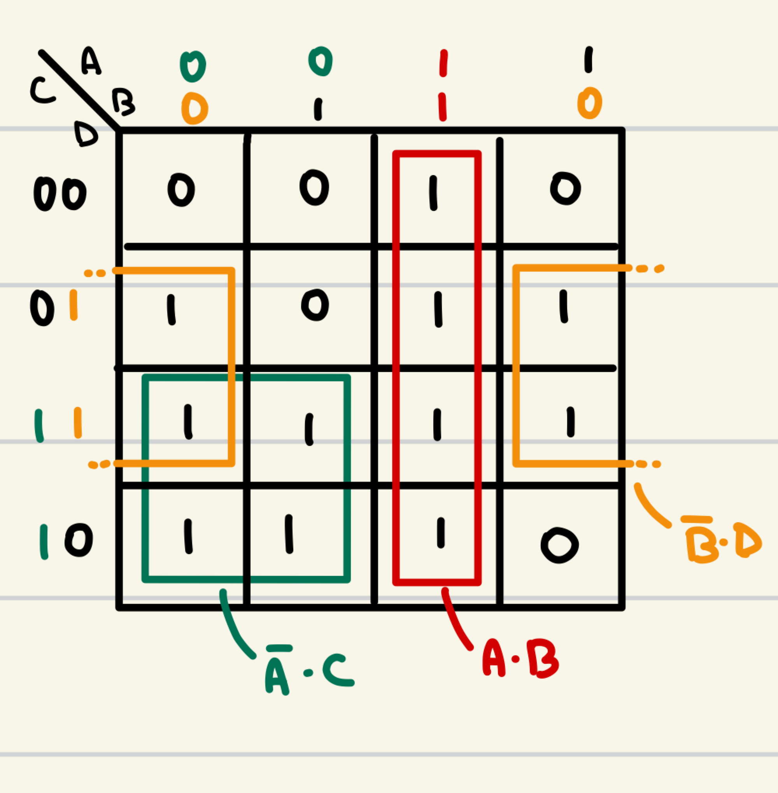
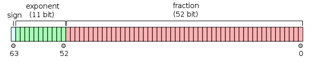
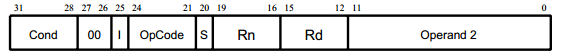
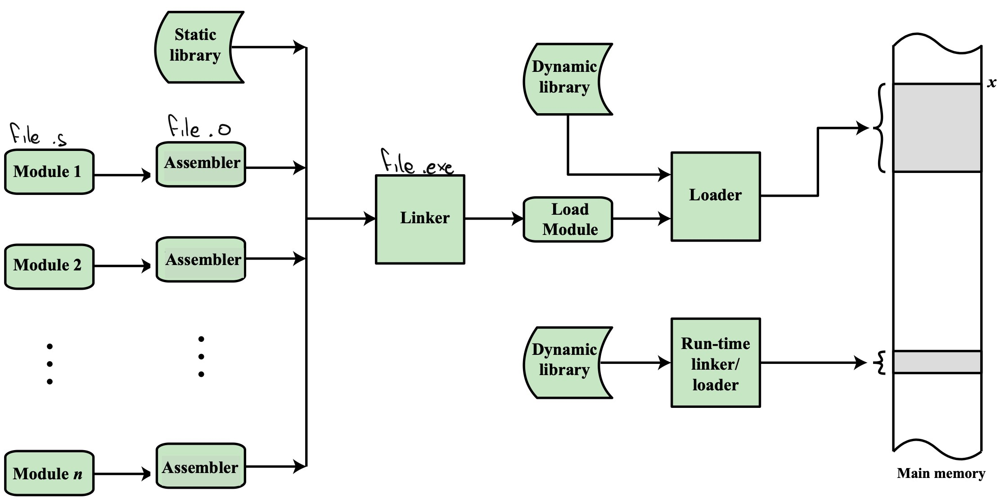
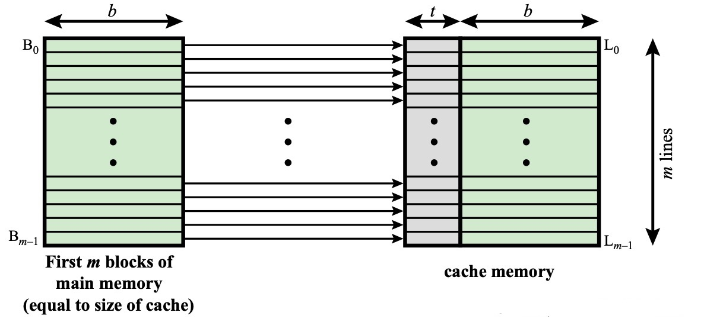
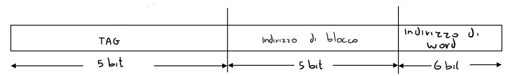
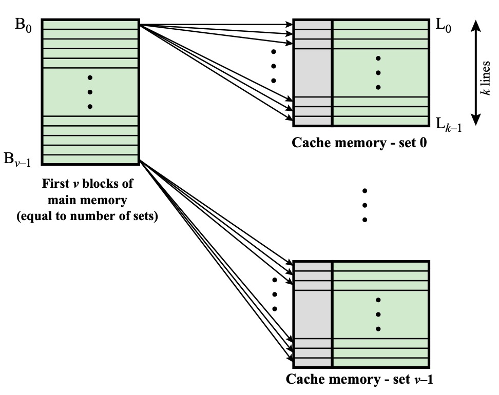
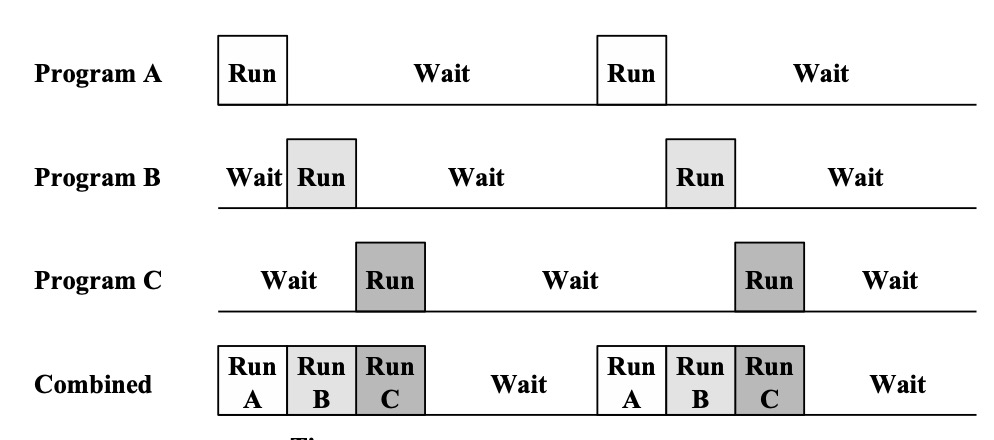
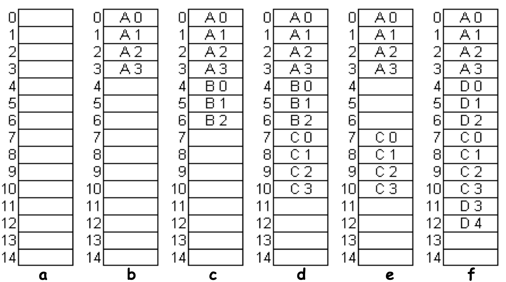
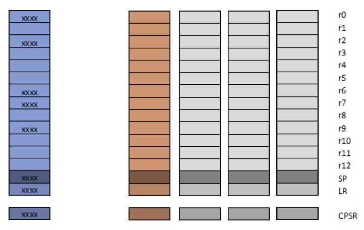

-   [Gli Elaboratori](#gli-elaboratori)
    -   [1. Storia degli Elaboratori](#1-storia-degli-elaboratori)
    -   [2. Elementi di Elettronica](#2-elementi-di-elettronica)
        -   [2.1 Porta logica](#21-porta-logica)
        -   [2.2 Reti logiche](#22-reti-logiche)
            -   [2.2.1 Somma di Prodotti](#221-somma-di-prodotti)
            -   [2.2.2 Mappe di Karnaugh](#222-mappe-di-karnaugh)
            -   [2.2.3 ROM](#223-rom)
        -   [2.3 Registri](#23-registri)
        -   [2.4 Il bus](#24-il-bus)
    -   [2. Rappresentazione delle informazioni](#2-rappresentazione-delle-informazioni)
        -   [2.1 Numeri in binario](#21-numeri-in-binario)
        -   [2.3 Codifica ASCII](#23-codifica-ascii)
-   [Programmazione in Assembly](#programmazione-in-assembly)
    -   [3. I linguaggi assembly](#3-i-linguaggi-assembly)
        -   [3.1 Condizione](#31-condizione)
        -   [3.2 Simboli](#32-simboli)
        -   [3.3 Direttive](#33-direttive)
    -   [4. Assembler](#4-assembler)
        -   [4.1 Assemblatore](#41-assemblatore)
        -   [4.2 Linker](#42-linker)
    -   [4. Strutture dati](#4-strutture-dati)
        -   [4.1 Vettori (array)](#41-vettori-array)
        -   [4.2 Matrici](#42-matrici)
        -   [4.3 Matrice con array ausiliario di puntatori](#43-matrice-con-array-ausiliario-di-puntatori)
        -   [4.4 Matrice con array ausiliario di offset](#44-matrice-con-array-ausiliario-di-offset)
        -   [4.5 Stack](#45-stack)
        -   [4.6 Liste concatenate](#46-liste-concatenate)
    -   [5. Subroutine](#5-subroutine)
-   [Gestione della memoria](#gestione-della-memoria)
    -   [6. Memoria Cache](#6-memoria-cache)
        -   [6.1 Cache a mappatura diretta](#61-cache-a-mappatura-diretta)
        -   [6.2 Cache completamente associativa](#62-cache-completamente-associativa)
        -   [6.3 Cache set-associativa a k vie](#63-cache-set-associativa-a-k-vie)
        -   [6.4 Algoritmi di rimpiazzo](#64-algoritmi-di-rimpiazzo)
        -   [6.5 Bit di controllo della cache](#65-bit-di-controllo-della-cache)
    -   [7. Gestione della cache](#7-gestione-della-cache)
        -   [7.2 Paginazione](#72-paginazione)
        -   [7.3 Segmentazione](#73-segmentazione)
        -   [7.4 Memoria virtuale](#74-memoria-virtuale)
    -   [8. Dispositivi I᜵O](#8-dispositivi-io)
        -   [8.1 Altre applicazioni](#81-altre-applicazioni)
    -   [9. DMA](#9-dma)
    -   [10. Pipeline](#10-pipeline)
        -   [10.1 Speed-up factor](#101-speed-up-factor)

# Gli Elaboratori

## 1. Storia degli Elaboratori

**Generazione -1: Preistoria**

-   Al-Khwarizimi\
    nel XI secolo definisce l'algoritmo
-   Leonardo da Vinci\
    descrive il Codex Madrid, una macchina in grado di computare semplici operazioni aritmetiche, non è però in grado di costruirlo

**Generazione 0: Meccanica**

-   Charles Babbage\
    costruisce una macchina per automatizzare i conti di sin, cos e tan così da non dover usare libri con i calcoli svolti.
    Lavora anche all'Analytical Engine il primo vero computer multi-purpose, non riesce però a portare a termine la costruzione, tuttavia alcuni programmi vengono già scritti per essere elaborati da questo computer

**Generazione 1: Elettromagnetica**

-   Howard Aiken\
    costruisce il primo elaboratore multi purpose, e su questa macchina si troverà il primo "bug", uno scarafaggio incastratosi negli ingranaggi
-   Alan Turing\
    dà la definizione di computabilità con la sua macchina di Turing

**Generazione 2: Valvole**

Una valvola è un dispositivo che permette/blocca il passaggio di corrente

-   John Von Neumann\
    Descrive un'architettura che usa una memoria per dati e programmi, sostituendo le schede perforate
    Da questo nasce un problema, ancora oggi non risolto: la CPU è molto più veloce della memoria
-   In questo periodo nasce anche il primo compilatore e con esso il primo linguaggio High-level (FORTRAN)

**Generazione 3: Transistor**

**Generazione 4: Miniaturizzazione**

**Generazione 5: Più elaboratori in un singolo chip**

## 2. Elementi di Elettronica

Ci sono solo 2 valori che il computer è in grado di interpretare:

-   Vero, 1, alto, +5V
-   Falso, 0, basso, 0V

### 2.1 Porta logica

Una porta logica è un dispositivo con n ingressi e una sola uscita


Nota che ogni porta può essere ottenuta come combinazione di altre porte (per esempio ogni porta si può ricostruire combinando _OR e NOT_, _OR e AND_, _NOR_ o _NAND_)

### 2.2 Reti logiche

Al contrario delle porte logiche può avere più di un solo output, ma non può avere uno stato

Il nostro obiettivo nel creare una rete logica è convertire una tablella di verità in forma matematica

#### 2.2.1 Somma di Prodotti

-   Uso NOT e AND per ottenere gli uno
-   Sommo

_Esempio_
Data la tablella di verità
| A | B | Y |
|---|---|---|
| 0 | 0 | 1 |
| 0 | 1 | 1 |
| 1 | 0 | 0 |
| 1 | 1 | 1 |

Prima riga: $\overline{A \cdot B}$
Seconda riga: $\overline{A} \cdot B$
Quarta riga: $A \cdot B$

In totale $Y = \overline{A \cdot B} + \overline{A} \cdot B + A \cdot B$


#### 2.2.2 Mappe di Karnaugh

Data la mappa:



$Y = \overline{A} \cdot C + A \cdot B + \overline{B} \cdot D$

#### 2.2.3 ROM

In modo meno complicato è semplicemente possibile memorizzare in memoria gli output indicizzandoli con gli input

> Per implementare queste reti logiche è possibile usare dei PLA, Programmable Logic Array, contengono una serie di AND e OR che possono essere programmati per formare un gran numero di configurazioni

> Una rete logica sequenziale è una rete logica che implementa anche degli elementi di memoria

### 2.3 Registri


Un registro è in grado di memorizzare il valore X e mantenerlo in output Y
w è il segnale di controllo, se w è `1` il registro memorizza il valore di X, se `0` lo ignora


Si possono mettere più registri in serie per ottenere un "registro a scorrimento"
ad ogni input i valori scorrono da sinistra verso destra

Se X = `0` si può effettuare la divisione per 2 del numero contenuto nel registro ad ogni iterazione

### 2.4 Il bus


Trasferisce n elementi da un punto all'altro dell'elaboratore

## 2. Rappresentazione delle informazioni

Un numero binario a 32 bit può avere molteplici significati:

-   Un istruzione
-   Un numero
    -   Naturale
    -   Intero
    -   Reale
-   Una striga

### 2.1 Numeri in binario

**Naturali**
Un numero naturale si può rappresentare semplicemente in rappresentazione posizionale

**Interi**

-   Ampiezza e segno (inutilizzato)
    il bit più significativo viene usato per il segno e il resto per l'ampiezza
-   Eccesso P (poco usato)
    Sommo ad ogni numero in decimale un certo valore e poi lo converto in binario
    se ho 4 bit aggiungo 8 al numero
-   Complemento a 2 (usato ovunque)
    Per ottenere i numeri negativi prendo il numero binario es. `0101`, faccio il complemento a 1, `1010` e sommo 1, `1011`

> In complemento a 2 è anche semplice trovare l'overflow, se presente, infatti se sommo due numeri positivi, che iniziano per `0` e ottengo un numero negativo, che inizia per `1` allora so che l'operazione ha generato overflow

> in complemento a 2 per estendere il numero basta prendere il bit più significativo e estenderlo
> quindi `0110` diventa `0000 0110`
> mentre `1001` diventa `1111 1011`

**Reali**
Numeri floating point seguono uno standard _(IEEE 754)_




Il bit di segno è 1 se e solo se il numero è negativo
L'esponente è scritto in eccesso P, quindi per 32bit si tratta di sommare (o sottrarre) 127
La mantissa è la parte decimale del numero, per ritornare al numero completo è necessario scrivere 1._mantissa_

La precisione della notazione floating point diminuisce all'aumentare del valore assoluto del numero

> Per convertire un numero da M _ 2^e a X _ 10^Y è sufficiente usare la seguente formula
> segno(1+ 2^-1 + 2^-2 + 2^-3) \* 2^e dove 2^-1, 2^-2, 2^-3 vengono inseriti solo se i corrispettivi elementi nella mantissa sono = 1

### 2.3 Codifica ASCII

Una tabella per codificare i caratteri in binario
Inizialmente ogni carattere veniva rappresentato da 7 bit, poi 8 bit

Lo standard UNICODE invece utilizza fino a 32 bit per codificare tutte le lingue del mondo, anche quelle estinte

# Programmazione in Assembly

## 3. I linguaggi assembly

Le istruzioni del linguaggio asembly devono essere contenute in 32 bit, 1 word



-   Condizione:\
    3 bit che indicano in quale caso l'operazione dovrebbe essere eseguita
-   bit 27 e 26 a 0
-   I:\
    se 1 l'operando 2 è descritto da shift (8bit) + registro (4 bit)\
    se 2 l'operando 2 è descritto da rotate (4bit) + valore immediato (8bit)
-   OpCode: 4 bit per identificare l'istruzione (ADD, SUB, ...)
-   S: se 1 altera i bit di stato
-   Rn: Primo operando (registro)
-   Rd: Destinazione (registro)
-   Secondo operando

### 3.1 Condizione


### 3.2 Simboli

label: utile per indicare l'indirizzo in memoria di una specifica istruzione o di un vettore creato nella sezione .bss
Le label devono iniziare dal primo carattere della riga assembly

### 3.3 Direttive

Indicano al compilatore delle sezioni di codice
`.global main` indica al complilatore di iniziare l'esecuzione dall'istruzione con label main

> Si possono trovare sul foglio di referece molte altre direttive come (.bss, .space, ...)

## 4. Assembler

1. Text Editor
   Scrittura del codice ARM in formato .s
2. Assemblatore
   Traduzione in modulo oggetto, formato .o
3. Linker
   Costruzione del programma eseguibile .exe
4. Loader
   Caricare in memoria il programma e imposta il PC in modo che l'elaboratore inizi l'esecuzione
5. Debugger



### 4.1 Assemblatore

comando: `arm-linux-gnueabi-as`
Nel file sorgente ci sono istruzioni macchina (es: ADD, SUB)
Istruzioni per l'assemblatore (es: .text, .bss)
Ci sono anche label... che vanno gestite separatamente

L'assemblatore legge carattere per carattere il codice assembly e lo traduce in istruzioni macchina, esegue le istruzioni per l'assemblatore (.word, .skip), sostituisce i simboli (.equ, label)

Per poter gestire anche le foward label devono essere esegute 2 scansioni
Le label esterne vengono salvate separatamente così che il linker possa poi gestirle e aggiungere i dati ove necessario (il linker gestisce anche simboli utilizzati tra segmenti diversi, l'assembler lavora separatamente per .text, .data, .bss)

### 4.2 Linker

comando: `arm-linux-gnueabi-ld`

1. Calcola l'estensione di memoria occupata da ciascun modulo, così da poter impostare gli indirizzi delle label
2. Risolve i riferimenti esterni

**Librerie**

-   Libreria statica:\
    Viene fornita già in fase di assemblaggio (moduli .o), e fornisce funzioni utili al programmatore, però essendo statica se si vuole aggirnarla è necessario ricompilare
-   Libreria dinamica:\
    Contiene istruzioni i cui simboli vengono caricati solamente dal loader, rendendo questo indipendente dall'eseguibile

## 4. Strutture dati

### 4.1 Vettori (array)

Sono definiti da un indirizzo iniziale (V), una lunghezza di ciascun elemento(L) e il numero di elementi (N)

```
.bss
V:   .skip N*L
```

Il primo elemento è in V, il secondo è in V+L, il terzo è in V+2L, .....

Quindi `V[i] = V + (i \* L), 0 <= i < L`.
Gli indirizzi degli elementi partono da zero

_esempio_
Copiare in R3 il valore di V[i], L = 4, i è in R1

```
LDR R0, =V
MOV R1, #i
LSL R1, R1, #2      @ Logic shift left, moltiplica per 4 (2^2) R1
LDR R3, [R0, R1]    @ Copia in R3 il contenuto dell'indirizzo R0 + R1
```

Oppure

```
LDR R0, =V
MOV R1, #i
LDR R3, [R0, R1, LSL #2] @ Non modifica R0 e R1, con il ! aggiorno R0
```

Oppure

```
LDR R0, =V
MOV R1, #i
MOV R2, #L
MUL R1, R1, R2
LDR R3, [R0, R1]
```

### 4.2 Matrici

Un vettore di vettori, immaginiamo una matrice di `m` righe e `n` colonne. Vettori di lunghezza L\
Rappresento ora M[riga, colonna]\
In memoria:\
M[0, 0]\
M[0, 1]\
...\
M[0, n - 1]\
M[1, 0]\
...\
M[m - 1, n - 1]

Per inizializzare:

```
.bss
M: m*n*L
```

Per ottenere l'elemento
M[i, j] = M + (i _ n _ L) + (j _ L) = M + (i _ n + j) \* L

```
MOV R1, #i
MOV R2, #j
LDR R4, =M
MOV R3, #n
MUL R3, R1, R3
ADD R3, R3, R2
LSL R3, R3, #2
LDR R0, [R4, R3]
```

### 4.3 Matrice con array ausiliario di puntatori

Per accedere più facilmente, senza dover fare la moltiplicazione, posso usare un array di puntatori.\
Ogni elemento i dell'array punta all'indirizzo dell'i-esima riga

Per dichiararlo:

```
.bss
M: .skip m*n*L
.data
P: .word M, M+n*L, M+2*n*L, ...
```

Per accedere:

```
MOV R1, #i
MOV R2, #j
LDR R4, =P
LSL R3, R1, #2
LDR R3, [R4, R3]           @ Accedo a P in R4 + R3, R3 ora ha l'indirizzo della colonna i nella matrice
ADD R3, R3, R2, LSL #2
STR R0, [R3]               @ Accedo alla matrice
```

### 4.4 Matrice con array ausiliario di offset

Uguale a quanto visto prima ma

```
.data
P: .word 0, n*L, 2*n*L
```

### 4.5 Stack

Una struttura last in first out dotato di due operazioni, PUSH e POP\
Per realizzarla serve uno STACK POINTER (SP)
SP decresce con il push e punta all'ultimo elemento inserito

Per dichiararlo:

```
.bss
		.skip 4096
stack:  .skip 4

.text
.global main
main:   LDR SP, =stack

push:   SUB SP, #4
		STR R0, [SP]

pop:    LDR R0, [SP]
		ADD SP, #4
```

### 4.6 Liste concatenate

Due valori consecutivi in memoria, un puntatore e un valore
Un elemento di HEAD senza valore, con un puntatore verso il primo valore.\
Un elemento finale con puntatore NIL e l'ultimo valore della lista

Permette di aggiungere o rimuovere elementi dal mezzo della lista facilmente

## 5. Subroutine

Una subroutine sono una serie di istruzioni che vengono eseguite da un'altro segmento di codice

Ci sono più modi per implementare una funzione in assembly.

1. Si possono utilizzare i registri per salvare i parametri: passando per esempio gli input in R1 ed R2 e poi ritornare gli output in R0 (ritornare usando l'indirizzo LR)
2. Utilizzando lo stack frame

    ```arm-asm
    main:
    	PUSH {FP, LR}    @inizializzazione stack
    	MOV FP, SP

    	PUSH { R0 }      @salva il valore di R0

    	MOV R0, #2       @carica il valore da elevare al quadrato
    	PUSH { R0 }
    	SUB SP, SP, #4   @spazio per il risultato

    	BL pow           @chiama la funzione che eleva al quadrato

    	LDR R0, [FP, #-12]@recupera il valore del risultato

    	ADD SP, SP, #8   @rimuove dallo stack gli argomenti della funzione

    	POP { R0 }       @ripristina R0

    	MOV SP, FP       @rimuove il call stack e ritorna controllo
    	POP {FP, PC}

    pow:
    	PUSH {FP, LR}    @nuovo stack
    	MOV FP, SP

    	PUSH {R0}        @salva il valore di R0

    	LDR R0, [FP, #12]@recupera il valore della variabile
    	MUL R0, R0, R0   @esegue il calcolo
    	STR R0, [FP, #8] @carica il valore

    	POP {R0}         @ripristina il valore di R0

    	MOV SP, FP       @ritorna controllo alla funzione chiamante
    	POP {FP, PC}
    ```


# Gestione della memoria

## 6. Memoria Cache


Un modo per risolvere il bottleneck dell'architettura di Von Neumann.

Una soluzione è utilizzare memorie cache estremamente veloci (di dimensioni limitate, un paio di megabyte) dove è possibile salvare:

1. I dati più utilizzati (_località temporale_)
2. Per richiedere alla memoria un blocco (64-128 byte) al posto di un semplice word.
   
   Caricare un block può tornare utile perché spesso è necessario leggere i word successivi a quello appena recuperato (_località spaziale_)

|              |                                                                                 |
| ------------ | ------------------------------------------------------------------------------- |
| Cache Hit    | quando il byte richiesto è nella cache                                          |
| Cache Miss   | quando è necessario richiedere alla memoria                                     |
| Hit Rate = p | percentuale di richieste viene soddisfatto dalla cache (80% è un buon hit rate) |

\
$T = T_{cache} \cdot p + T_{memoria} \cdot (1-p)$

### 6.1 Cache a mappatura diretta



Gli indirizzi di memoria vengono divisi, partendo dai bit meno significativi in:

-   indirizzo dell'elemento nel blocco
-   indirizzo di blocco
-   tag

Con questa tecnica si ottengono più blocchi che condividono uno stesso tag, quindi dopo aver cercato il blocco nella memoria cache viene confrontato il tag, se i due non concordano allora l'intero blocco deve essere rimpiazzato

Per esempio di una memoria con $2^5$ block di $2^6$ byte
Quindi su un indirizzo di 16 bit i primi 10 individuano il blocco (solo i primi 5 sono il tag questo significa che ci sono $2^5$ blocchi con lo stesso tag) e gli altri 6 individuano la word nel blocco



Questa tecnica è semplice da implementare a lato hardware, ma spesso è inefficiente, lasciando parte della cache libera

### 6.2 Cache completamente associativa

Quando leggo un blocco lo inserisco direttamente dove c'è un posto libero, salvadone un indirizzo completo di blocco

Il problema è che per cercare devo andare controllare ogni singolo tag, questo viene fatto in parallelo, ma il circuito per farlo è complicato
Serve implementare anche una politica di rimpiazzo, il cui circuito è ancora una volta complicato

### 6.3 Cache set-associativa a k vie

È un misto tra la memoria a mappatura diretta e quella completamente associativa
al posto di aver un singolo elemento per ogni tag, si ha una serie di elementi che vengono gestiti in modo completamente associativo

Per esempio sia una memoria associativa con linee di $2^6$ byte e $2^5$ set, allora il suo indirizzo sarà:


È un buon compromesso con le altre cache



### 6.4 Algoritmi di rimpiazzo

In alcuni casi è necessario sostitutire un blocco dalla cache

1. FIFO, first in first out, si sostituisce il blocco che è stato inserito per primo
2. Least Recently used, più efficiente, ma è necessario tenere traccia del tempo trascorso dall'ultimo utilizzo

Quando voglio sovrascrivere un blocco devo assicurarmi che non siano state effettuate delle modifiche mentre esso era in cache

-   c'è un bit che segnala questo, detto dirty bit, se è 1 è necessario prima copiare il blocco in RAM e poi
-   un'altra soluzione è quella di scrivere sia in cache che in ram, sia istantaneamente, sia più tardi grazie ad un write buffer

### 6.5 Bit di controllo della cache

-   Dirty bit
-   Bit per il 'Least Recently used'
-   Bit di validità (lo vedremo)

`Dimensione cache = numero linee * (dimensione blocco + dimensione TAG + numero bit di controllo)`

## 7. Gestione della cache

Una serie di strumenti che poi vengono però utilizzati principalmente dal sistema operativo, il quale è il vero responsabile della gestione



Fare ciò rende molto più efficiente l'esecuzione del programma
Per dare al sistema operativo la possibilità di fare ciò dobbiamo suddividere la memoria ram così che possa contenere il maggior numero di programmi possibile
Per fare ciò ci sono diversi metodi:

-   paginazione
-   segmentazione
-   paginazione con memoria virtuale
-   segmentazione con memoria virtuale

### 7.2 Paginazione

La CPU utilizza 32 bit (indirizzi logici)
Ma molto spesso la memoria non è necessariamente a 32 bit, magari è a 30 bit
Tradurre gli indirizzi logici in indirizzi fisici è il compito dell'MMU (mapping and management unit)

Si divide la memoria in blocchi (pagine), ognuna con un suo indirizzo (offset)


La paginazione inoltre aiuta a risolvere il problema della frammentazione
Infatti grazie alla page table posso avere indirizzi consecutivi per elementi fisicamente lontani in memoria



Il problema della paginazione è che l'unità di misura è la pagina e posso associare solo una pagina per volta

### 7.3 Segmentazione

I segmenti possono avere una dimensione variabile
Viene creata una segment table che specifica

-   L'indirizzo iniziale del segmento
-   La dimensione del segmento
-   bit di controllo
-   bit di protezione

Ora per trasformare un indirizzo logico in uno fisico basta usare l'indirizzo logico come un offset da applicare all'indirizzo iniziale scritto nella segment table
È necessario effetture un controllo affinché l'indirizzo richiesto non superi il segmento corrente, altrimenti si arriva ad un errore


### 7.4 Memoria virtuale

Caricare i contenuti più usati di un programma in RAM, e usare il disco per il resto, caricando solo ciò che è necessario.
In un meccanismo simile alla cache, utilizziamo la RAM come memoria veloce e il disco per la memoria lenta ma capiente. Scegliendo i blocchi con gli stessi criteri di località temporale e spaziale.

Per fare questo ci deve essere una page table che traduce gli indirizzi della cpu a indirizzi della memoria (in questa page table viene anche specificato se l'indirizzo si trova in RAM oppure no)

Accedere alla page table può essere dispendioso (servono 2 richieste alla memoria, uno per la page table e uno per il dato) quindi c'è un'altra cache (TLB, Translation Lookaside buffer) che accelera questo processo.
Nella TLB viene salvato un indice di memoria ram e un indice di memoria fisica, che permette di collegare l'uno all'altro


## 8. Dispositivi I᜵O

Le istruzioni necessarie per leggere e scrivere dai dispostivi di input e output

Ogni dispositivo ha della logica di controllo che permette di tradurre quanto arriva dal sensore e standardizzarlo secondo degli standard di I/O

Poi queste informazioni standardizzate vengono inviate all'elaboratore tramite il modulo I/O che è collegato direttamente al bus

Se il modulo I/O è di tipo programmed allora il processore può eseguire direttamente delle istruzioni di I/O quali:

-   Controllo
-   Test
-   Lettura\
    Si divide in 3 operazioni
    -   Controllo dispositivo
    -   Test: controlla se il dispositivo è pronto ad accettare operazioni di lettura
    -   Lettura: La CPU legge i dati dal data register del modulo
-   Scrittura
    Uguale al processo di lettura, ma la cpu scrive sul data register

Per dare accesso alla cpu ai data register del modulo si possono utilizzare 2 metodi:

-   Usare dei normali indirizzi, trattando il dispositivo come una memoria
-   Utilizzare un altro bus da collegare separatamente alla CPU, dovendo così implementare delle altre istruzioni

Problema:
In questo modo la cpu deve attendere che il test vada a buon fine e questo può richiedere molto tempo, i dispositivi I/O sono quasi sempre più lenti della cpu

Per risolvere questo problema è possibile usare gli I/O interrupt

-   Il processore notifica il dispositivo I/O che vuole svolgere una determinata operazione
-   Quando l'operazione è completa, il dispositivo invia un interrupt alla cpu per notificarla che i dati sono pronti
-   Solo a questo punto la cpu interrompe le sue operazioni ed esegue quella di I/O
    Quando il processore riceve un interrupt (IRQ)
    -   Interrompere quello che sta facendo (Salvataggio Contesto)
    -   Passare velocemente a leggere il dato pronto (RSI)
    -   Ritornare a quelle che stava facendo (Ripristino Contesto)

Questo significa che non vengono persi cicli nell'attesa che il dispositivo sia pronto

-   IRQ (Interrupt ReQuest)
    Viene trasmessa attraverso una linea separata alla cpu, tutti i dispositivi I/O si collegano alla cpu utilizzando un OR logico


È necessario ottenere i dati dal dispositivo velocemente perché altrimenti quei dati potrebbero essere persi

-   Salvataggio Contesto
    Viene salvato il PC e altri registri di stato
    Commuta il valore in un registro che blocca ulteriori interrupt
    carica nel PC il RSI

    Per fare ciò si possono anche utilizzare i banked registers, ovvero avere più set di registri, e si può selezionare il gruppo di registri da utilizzare in base alla situazione

      

-   RSI (Routine di Servizio)
    Si può implementare via software oppure via hardware
    Preambolo:

    1.  Capire chi ha generato l'IRQ
        software polling: chiedo ad uno ad uno ai dispositivi se hanno generato l'interrupt
        via hardware: utilizzare più linee per i IRQ, una per device
    2.  Ordinare gli interrupt se sono arrivati più interrupt nello stesso istante
        L'ordine viene dato dall'ordine in cui viene chiesto ai dispositivi se hanno generato l'interrupt
        È anche possibile gestire la priorità utilizzando i registri IM, quando sto gestendo un interrupt imposto a 0 gli IM dei device che non possono interromperla, mentre ad 1 gli IM dei device più importanti
    3.  Inizializzare l'RSI
        Ogni modulo di I/O ha un IVN identificativo, e una tabella fa il link tra questi valori e degli indirizzi di memoria, i quali contengono le istruzioni per l'RSI che gestisce quel dispositivo

      


### 8.1 Altre applicazioni

Gli interrupt vengono utilizzati anche per gestire molti altri processi del processore

-   Program: cose come la divisione per zero
-   Timer: interrupt generato da un timer che permette al computer di eseguire specifiche azioni in momenti specifici
-   Hardware failure: errori di memoria o di energia

ARM gestisce 6 livelli di interrupt
Utilizza Interrupt vettorizzati e banked registers (solo da R7-R14)

## 9. DMA

Per alcuni dispositivi la gestione ad interrupt non è consigliabile, in particolare per dispositivi con un alto "data rate"

In casi particolari, con data rate che eccedono il tempo che il processore impiega a processare il dato, si può avere una perdita di alcuni dati
Anche se questo non accade è possibile che la cpu debba usare una gran parte del tempo nel processare dati da dispositivi di I/O invece che lavorare alle elaborazioni

Per risolvere questo problema si può dare _Direct Memory Access_ al dispositivo, così che esso possa scrivere direttamente i dati in memoria

Il processore quindi deve solo indicare:

-   il device da cui leggere/scrivere
-   l'indirizzo da cui iniziare
-   quanti dati vanno trasferiti
-   Dare il comando di start

Tutto il resto viene gestito dal DMA che si occupa del trasferimento usando la tecnica del busy waiting
Alla fine del processo di trasferimento invia un interrupt alla cpu

La memoria è collegata alla cpu ed al dma attraverso il bus
In questo caso si dà la precedenza al dma, il quale manda un segnale di HOLD alla cpu

Nel peggiore dei casi viene svolto un accesso dal dma e uno dalla cpu, alternativamente, quindi il ritardo massimo generato dal dma è un ciclo di accesso.
Questo viene chiamato _cycle stealing_

## 10. Pipeline

1. Fetch instruction
   legge l'istruzione
2. Decode instruction
   Determina l'opcode e il tipo di operandi
3. Calculate operands
   Calcola l'indirizzo effettivo di ogni operando  
   Gestione degli indirizzamenti: con offset, diretto, indiretto di
4. Fetch operands
   Recupera gli operandi dalla memoria  
   Operandi nei registri non richiedono il fetch
5. Execute instruction
   Esegui l'istruzione indicata
6. Write operand
   Scrivi il risultato in memoria o in un registro

Tutte queste fasi sono eseguite da componenti hardware separate, è quindi eseguirle tutte in parallelo, la pipeline


Il tempo di esecuzione per N operazioni:
(k = numeri di fasi dell'operazione, t = tempo di esecuzione)
senza pipeline $t_1 = N \cdot k \cdot t$
con pipeline $t_2 = k \cdot t + (N - 1)\cdot t$

È però possibile che ci siano dei ritardi (_hazard_) causati da vari motivi

-   cache miss\
    Gli unici che non dipendono dal pipeline, dipendono solamente dall'ordine con cui accedo agli elementi in memoria, quindi il ritardo da loro causato è costante
-   Resource hazard\
    Quando due fasi richiedono lo stesso componente condiviso tra loro (RAM)
-   DMA
-   Data hazard\
    Quando un'istruzione richiede il risultato di un'altra
-   Control hazard\
    Quando avviene un salto condizionato il pipeline ne viene a conoscenza solo quando completa l'elaborazione del comando, quindi in questo caso vengono sprecate delle risorse perché è necessario pulire la pipeline

### 10.1 Speed-up factor

$$S_k = \frac{N \cdot k \cdot t}{ k \cdot t + (N - 1)\cdot t} =\frac{N \cdot k}{ k + (N - 1)}$$
$$\lim_{N \to \infty} S_k = \lim_{N \to \infty} \frac{N \cdot k}{ k + (N - 1)}= k$$
