-   [1. Introduction](#1-introduction)
    -   [1.1 Attributes of Good Software](#11-attributes-of-good-software)
    -   [1.2 General Issues of Software](#12-general-issues-of-software)
    -   [1.3 Software Process Activities](#13-software-process-activities)
    -   [1.4 Application Types](#14-application-types)
    -   [1.5 Software Engineering Ethics](#15-software-engineering-ethics)
-   [2. Software processes](#2-software-processes)
    -   [2.1 Software process models](#21-software-process-models)
        -   [2.1.1 Waterfall model](#211-waterfall-model)
        -   [2.1.2 Incremental development](#212-incremental-development)
        -   [2.1.3 Reusable Software](#213-reusable-software)
        -   [2.1.4 V-model](#214-v-model)
    -   [2.2 Process activities](#22-process-activities)
        -   [2.2.1 Requirements](#221-requirements)
        -   [2.2.2 Software Design](#222-software-design)
        -   [2.2.3 Validazione e testing](#223-validazione-e-testing)
    -   [2.3 Coping with change](#23-coping-with-change)
        -   [2.3.1 Reducing costs](#231-reducing-costs)
    -   [2.4 Process improvement](#24-process-improvement)
-   [3. Requirements Engineering](#3-requirements-engineering)
    -   [3.1 Requirements elicitation](#31-requirements-elicitation)
    -   [3.2 Requirements specification](#32-requirements-specification)
    -   [3.3 Requirements Validation](#33-requirements-validation)
    -   [3.4 Requirements changes](#34-requirements-changes)
-   [4. System Modeling](#4-system-modeling)
    -   [4.1 Model-driven engineering](#41-model-driven-engineering)
-   [5. Design Patterns](#5-design-patterns)
    -   [5.1 GRASP](#51-grasp)
        -   [5.1.1 Information Expert](#511-information-expert)
        -   [5.1.2 Creator](#512-creator)
        -   [5.1.3 Controller Pattern](#513-controller-pattern)
        -   [5.1.4 Low Coupling Pattern](#514-low-coupling-pattern)
        -   [5.1.5 High Cohesion](#515-high-cohesion)
    -   [5.2 Responsability Driven Design](#52-responsability-driven-design)
    -   [5.3 GoF Design Patterns](#53-gof-design-patterns)
        -   [5.3.1 Creation Pattern: Factory Pattern](#531-creation-pattern-factory-pattern)
        -   [5.3.2 Creation Pattern: Singleton Pattern](#532-creation-pattern-singleton-pattern)
        -   [5.3.3 Structural Pattern: Adapter Pattern](#533-structural-pattern-adapter-pattern)
-   [6. Testing](#6-testing)
    -   [6.1 Stages of Testing](#61-stages-of-testing)
        -   [6.1.1 Development Testing](#611-development-testing)
        -   [6.1.2 Release testing](#612-release-testing)
        -   [6.1.3 User testing](#613-user-testing)
    -   [6.2 Test Driven Development](#62-test-driven-development)
    -   [6.3 JUnit](#63-junit)
        -   [6.3.1 Assertion](#631-assertion)
        -   [6.3.2 Installazione](#632-installazione)

# 1. Introduction

Il Software ha sempre più una posizione centrale nelle economie dei paesi sviluppati.

L'ingegneria del software si occupa di sviluppare **teorie**, **metodi** e **strumenti** per lo sviluppo di software a livello professionale. Si applica le tecniche tipiche dell'ingegneria non alla logica del codice, ma alla scrittura del software.

Questo è particolarmente importante in quanto molto spesso si spende di più per il software che per l'hardware dei computer moderni.
Inoltre, se il software viene mantenuto ci si ritrova a fronteggiare dei costi che sono molto maggiori dei costi di sviluppo iniziale. Spesso quindi è conveniente investire per costruire del codice facile da mantenere e modificare nel futuro

Quindi c'è una grande richiesta per strumenti e metodi in grado di accelerare lo sviluppo di software di alta qualità.

## 1.1 Attributes of Good Software

Ciò che il software dovrebbe avere e che un buon ingegnere del software dovrebbe essere in grado di fornire ad ogni progetto.

-   **Maintainability**
    Il software dovrebbe essere semplice da mantenere, in modo da rendere semplice l'adattamento a nuove richieste da parte di un cliente.
-   **Dependability and security**
    Il codice dovrebbe essere sicuro e si dovrebbe poter dipendere da esso. Questo significa che nel caso di un problema inaspettato il software non deve provocare danni fisici o economici.
    Inoltre individui malintenzionati non dovrebbero poter accedere o danneggiare il sistema.
-   **Efficiency**
    Il software non deve sprecare risorse di memoria o di energia.
-   **Acceptability**
    Il software deve poter essere accettato dai suoi utenti, il che significa che deve essere comprensibile e compatibile con gli altri sistemi che utilizzano

Spesso applicare sin da subito tecniche avanzate di software engineering è più costoso nella prima scrittura. Tuttavia nel lungo periodo, quando è necessario che il software si evolva al passo con i requisiti, diventa addirittura più economico in quanto il costo delle modifiche successive si abbassa notevolmente.

## 1.2 General Issues of Software

-   **Heterogeneity**
    Spesso viene richiesto che il software possa essere eseguito su più sistemi, diversi tipi di computer e telefoni devono spesso essere considerati.
-   **Business and social change**
    Le aziende e la società cambiano con estrema rapidità e hanno quindi necessità di costruire e modificare il software con altrettanta rapidità.
-   **Security and trust**
    Dato che il software gestisce tutti gli aspetti della nostra vita è importante che sia sicuro in modo tale da poterci fidare di esso.
-   **Scale**
    È possibile sviluppare software su scale estremamente diverse, da sistemi estremamente piccoli come quelli degli smartwatch fino a sistemi enormi che hanno il compito di gestire gli utenti di un'area estremamente vasta.

## 1.3 Software Process Activities

Questi sono i passaggi per la scrittura di software di qualità, verranno analizzati uno ad uno all'interno del corso:

-   **Software specification**
    I clienti e gli ingegneri definiscono il software che deve essere costruito, le sue capacità ed i suoi limiti.
-   **Software development**
    Quando il software viene sviluppato.
-   **Software validation**
    Qui avvengono i test per assicurarsi che il software sia conforme a quanto richiesto dal cliente.
-   **Software evolution**
    Quando il software deve essere modificato per riflettere le necessità del cliente o del mercato.

## 1.4 Application Types

Tipologie di applicazioni che possono essere create, ognuna ha le sue necessità e anche l'ingegneria del software si deve adattare:

-   Stand-alone applications
    Queste sono applicazioni che verranno eseguite in locale su un computer, includono tutte le funzionalità e non necessitano di una connessione ad internet.
-   Interactive transaction-based applications
    Applicazioni che vengono eseguite in remoto e alle quali gli utenti accedono semplicemente tramite il proprio computer.
    Queste includono le webapp come i siti di e-commerce.
-   Embedded control systems
    Questi software controllano i sistemi che controllano dispositivi hardware, sono il tipo più diffuso di sistemi e hanno svariate applicazioni.
    #es Il termostato
-   Batch processing systems
    Sistemi che hanno il compito di processare i dati a blocchi, processando un gran numero di input e creando i corrispettivi output.
-   Entertainment systems
    Sistemi creati per l'uso personale e con lo scopo di intrattenere l'utente
-   Systems for modeling and simulation
    Sistemi creati da scienziati ed ingegneri per modellare situazioni fisiche difficili da calcolare tramite regole matematiche.
-   Data collection systems
    Sistemi che registrano i dati dall'ambiente utilizzando dei sensori e poi inviano i dati ad altri sistemi per essere poi processati.
-   Systems of systems
    Sistemi che sono a loro volta composti da altri sistemi.

## 1.5 Software Engineering Ethics

L'ingegneria del software richiede anche altre abilità oltre alla mera applicazione di conoscenze tecniche.

-   **Confidenzialità**
    Dovrebbe essere rispettata la confidenzialità rispetto ai clienti o ai datori di lavoro, a prescindere dal fatto che si sia firmato un NDA.
-   **Competenza**
    L'ingegnere non dovrebbe travisare i clienti rispetto al loro livello di competenza. Egli dovrebbe accettare un lavoro che è al di fuori delle proprie competenze.
-   **Diritti di proprietà intellettuale**
    È importante conoscere le regole del governo riguardo al copyright per assicurarsi di proteggere la proprietà intellettuale dei clienti.
-   **Utilizzo improprio delle conoscenze**
    Gli ingegneri non dovrebbero utilizzare le loro conoscenze per utilizzare impropriamente il computer di altri, questo significa anche non diffondere virus

Nel 1997 viene pubblicato il Code of ethics per l'ingegnere del software il quale può essere riassunto in questi 8 punti:

1. Pubblico – Gli sviluppatori software devono agire in linea con l'interesse pubblico.
2. Cliente – e datore di lavoro. Gli sviluppatori software devono agire in un modo conforme agli interessi del loro cliente e datore di lavoro, restando in accordo con l'interesse pubblico.
3. Prodotto – Gli sviluppatori software devono assicurare che i loro prodotti e le modifiche che vi applicano siano al livello di standard professionale più elevato possibile.
4. Giudizio – Gli sviluppatori software devono mantenere integrità ed indipendenza nel loro giudizio professionale.
5. Management – Manager e leader degli sviluppatori software devono sottoscrivere e promuovere un approccio etico al management dello sviluppo e della manutenzione del software.
6. Professione – Gli sviluppatori software devono far progredire l'integrità e la reputazione della professione, restando in accordo con l'interesse pubblico.
7. Colleghi – Gli sviluppatori software devono essere leali e di supporto nei confronti dei loro colleghi.
8. Se stessi – Gli sviluppatori software devono, per tutta la durata della loro attività lavorativa, continuare la propria formazione sulla pratica della professione, e devono promuovere un approccio etico ad essa.

# 2. Software processes

Il processo per scrivere codice in modo tale che esso risulti strutturato e pensato.
"Il bello dello standard è che ce n'è sempre uno per te" non vince lo standard migliore, vince quello che viene accettato di più.

Ci sono molti standard di scrittura del codice ma hanno tutti questi punti in comune:

-   Specification
    Definire quello che il programma dovrebbe fare prima di scrivere il codice
-   Design and implementation
-   Validation
    Controllare che il programma faccia quanto richiesto dal cliente
-   Evolution
    Applicare modifiche su risposta delle richieste del cliente

## 2.1 Software process models

I processi **_plan driven_** sono processi dove tutte le attività sono pianificate e solo dopo si programma e si può misurare il progresso confrontandosi con il piano.

In quelli **_agile_** si pianifica una parte e poi si costruisce quella parte, in questa situazione manca in parte la visione di insieme.

Il processo _agile_ produce, durante il suo processo, il minimum viable product. Ed è perfetto quando non si sa precisamente a cosa si vuole arrivare, bisogna seguire il mercato anche in fase di sviluppo

Mentre quello _plan driven_ è da utilizzare per progetti _misson critical_, è l'unico modo che si può utilizzare per questo tipo di progetti.
Può essere utilizzato solo quando i requisiti non cambiano in corso d'opera.

Nella pratica la maggior parte dei casi si utilizza un processo che è un misto tra un plan driven e un agile.

### 2.1.1 Waterfall model

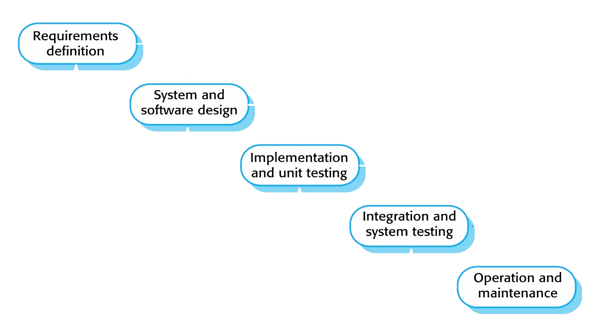

Modello plan driven con la possibilità di modificare successivamente il prodotto.

-   Una volta che inizia non si può aggiustare il tiro, è importante definire le specifiche e poi arrivare al termine di quel progetto.

> Poco utile nel caso di prodotti che devono andare sul mercato e dove spesso ci sono modifiche da apportare. È un modello solamente teorico, non viene usato nella realtà

### 2.1.2 Incremental development

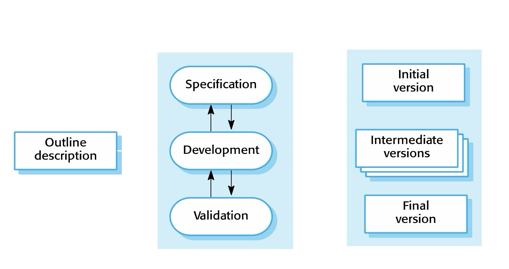
Il costo per le possibili modifiche in corso d'opera è molto ridotto.
È quindi più semplice prendere in considerazione il feedback del cliente.

> Permette di costruire rapidamente un minimum viable product, che i clienti possono già iniziare ad utilizzare e su cui possono fare commenti.

-   È difficile vedere a che punto del progresso si è arrivati, ed è difficile capire se ci si trova in una palude dove ci si è impantanati.
    Essere il product manager con questo sistema di sviluppo è problematico.
-   La struttura tende a degradarsi col tempo, spesso si devono investire delle risorse su dei refactor.

### 2.1.3 Reusable Software

Un modo per sviluppare codice velocemente è possibile sfruttare parti di codice già costruite.
Configurandole per adattarsi alle necessità dell'utente ed è una procedura standard per la maggior parte dei sistemi.

-   Il problema è che ci si apre a vulnerabilità, c'è moltissimo codice che rimane inutilizzato, questo codice rimane non testato per la maggior parte ed ha funzionalità non usate dal sistema che potrebbero introdurre inutili rischi sulla vulnerabilità.

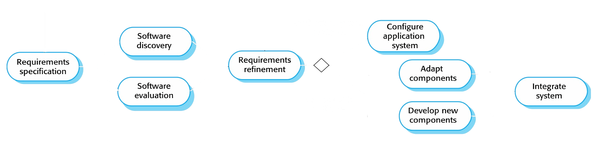

-   Software discovery è estremamente importante nel processo.
-   Dopo aver trovato un software che non fa esattamente quello di cui ho bisogno, ma può essere che sia ugualmente soddisfacente.
-   L'evaluation, il testing, sempre centrale nello sviluppo.

Bisogna anche porre attenzione a tanti aspetti dei componenti che si utilizzano:

-   Licenze (GPLv2 richiede che i software creato sia tutto open source)
-   Il software viene mantenuto? Se l'ultimo aggiornamento è di 5 anni fa può essere che il software sia perfetto, ma più probabilmente diventerò io il mantenitore.
-   Si perde parte del controllo sull'evoluzione dei sistemi.

### 2.1.4 V-model

Uno modello di sviluppo plan-driven e con importanti fasi di test

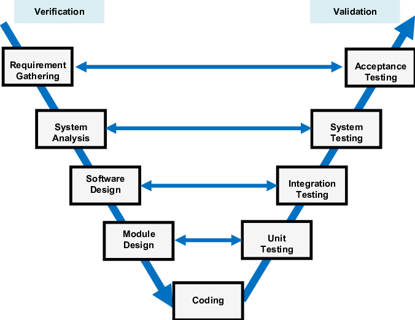

## 2.2 Process activities

Abbiamo descritto i vari processi nel loro complesso, guardando a come essi si integrano tra loro, scendiamo ora nei particolari.

### 2.2.1 Requirements

Possono essere semplici da ottenere, come quando si sviluppa del software per un cliente, ma può essere anche particolarmente complicato ottenerli.
Quando si costruisce software per lanciare un prodotto sul mercato è particolarmente complicato ottenere i requisiti.

> Spesso è necessario trovare quella cosa di cui utenti hanno bisogno, prima ancora che ne abbiano bisogno, perché c'è bisogno del tempo di sviluppo.

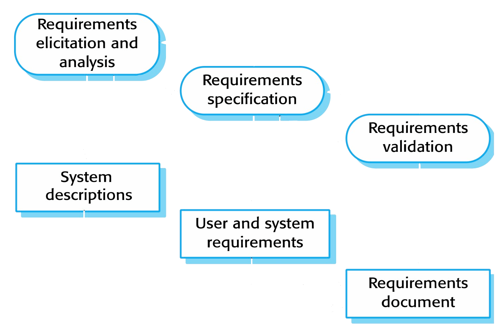

-   **Requirements elicitation and analysis**
    Sono i requisiti ad alto livello, il problema spesso è convertire tra specifiche tecniche e quanto viene capito e richiesto da un possibile manager.
    #es "IP" può essere _internet protocol_ oppure _intellectual property_, e su questo bisogna essere precisi altrimenti il sistema può non fare quanto richiesto.
-   **Requirements specification**
    Requisiti specifici per la costruzione del software.
    Devi chiedere a chi utilizzerà il software, non a chi lo utilizza ora. Perché il tuo software probabilmente cambierà il modo in cui si lavora, inducendo così diverse necessità.
-   **Requirements validation**
    Tutti i soggetti coinvolti dicono di sì
    I quadrati sono documentazione, alla fine si costruisce una documentazione completa dei requisiti

#oss
Il design del software deve adattarsi alle specifiche, non il contrario.
Non è spesso necessario ottimizzare ogni minima cosa, ma questo rende il codice meno leggibile e meno mantenibile.

### 2.2.2 Software Design

Il design del software è la descrizione della struttura del programma che deve essere implementato, le attività di design sono varie, ecco alcuni esempi:

-   **Design dell'architettura**
    Design della struttura in generale, dei principali componenti, delle loro relazioni e di come sono distribuiti.
-   **Design del Database**
    Dove si scrivono le strutture dati e il modo in cui esse vengono rappresentate in un database.
-   **Design dell'interfaccia (UI/UX)**
-   **Selezione e/o design dei componenti**
    Dove si cercano o si costruiscono i singoli componenti descritti nel design dell'architettura.
    #oss
    Nella maggior parte dei casi il design e l'implementazione sono un continuo, non avvengono in momenti separati.

### 2.2.3 Validazione e testing

Permette di verificare che il software sia conforme alle sue specifiche e a quanto il cliente si aspetta.
Il testing implica sottoporre al software problemi che dovrà risolvere nella sua applicazione e i casi limite.

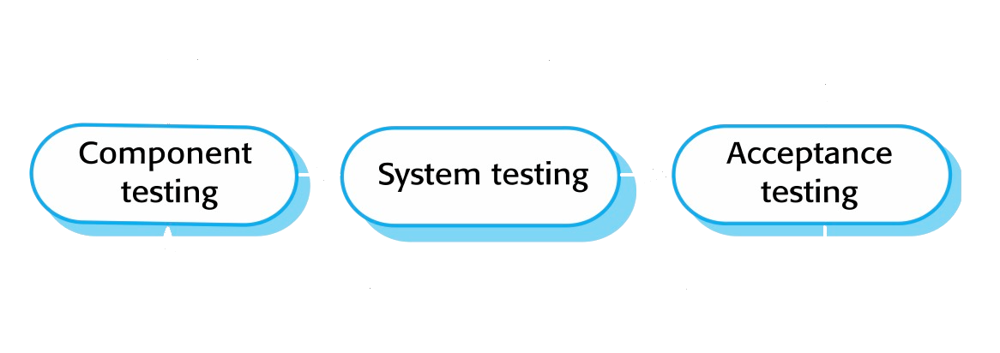

-   Component testing
    I singoli componenti vengono testati individualmente.
-   System testing
    Testing dell'intero sistema, questo è particolarmente importante in quanto questa è la configurazione che verrà poi usata dagli utenti.
-   Acceptance testing
    Il cliente ora deve controllare che il sistema sia conforme a quanto stava pensando.

## 2.3 Coping with change

I cambiamenti sono inevitabili quando si comincia a scrivere progetti grandi, è quindi necessario prendere in considerazione il fatto che avverranno.
Le modifiche non arrivano necessariamente del cliente o dal mercato, possono arrivare anche da nuove tecnologie che vengono introdotte e che sono game-changing.

Si può usare un sistema di dividi et impera, si fanno tanti piccoli task, così se ci sono delle modifiche non si perde troppo tempo.

-   Bisogna inoltre calcolare che la modifica spesso non riguarda solo quella feature, ma molto spesso anche le feature che le circondano.
-   Quando inizio a costruire una funzionalità i requisiti per quella funzione diventano congelati, gli altri possono cambiare e possono cambiare i requisiti per la funzione dopo che viene completata.

### 2.3.1 Reducing costs

Si può scrivere codice in modo da poter modificare facilmente alcune caratteristiche, senza richiedere necessariamente un rework.
Si possono inserire degli spazi di manovra, dove fare modifiche risulta essere molto semplice, ma questo può essere fatto fino ad un certo punto, non è possibile rendere il software un'ameba.

Alcuni software processes sono migliori a gestire i cambiamenti, altri molto meno.

Si può utilizzare un prototipo per mostrare al cliente le funzioni chiave ed assicurarsi che queste siano le stesse che sono chiave per il cliente.

Il modo migliore è quello ci sviluppare il software in modo incrementale, mostrando al cliente passo passo le funzioni per vedere se esse sono allineate con cosa viene chiesto.

È anche possibile costruire un prototipo throw-away, che prende delle enormi scorciatoie e poi non verrà utilizzato per costruire il sistema di production.

## 2.4 Process improvement

Come migliorare il processo di sviluppo software in un'azienda
È importante che i dipendenti apprendano veramente le procedure per scrivere software di qualità, altrimenti appariranno sempre come delle cose artificiose.

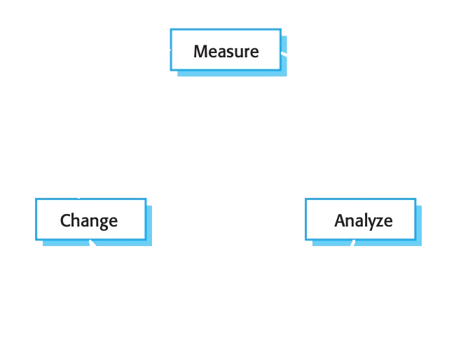

# 3. Requirements Engineering

Il processo nel quale si stabilisce cosa il cliente si aspetta, un requisito è una richiesta che il sistema deve rispettare.
Sui requisiti si firmano anche i contratti, ed è spesso complicato arrivare ad un totale, spesso infatti si usano contratti a tempo (12 mesi) perché risulta difficile sapere che direzione prenderà il progetto.

I requisiti ed il documento dell'architettura dovrebbero essere separati, dovrebbero definire cosa fa e non come lo fa. Questo per far sì che ogni azienda possa dare la sua offerta, implementando poi la soluzione.

I requisiti dovrebbero essere completi e consistenti, ma questo in pratica risulta essere molto difficile o impossibile.

**Requisiti per l'utente**
Si elicitano i requisiti richiesti dall'utente finale o da chi li scrive per esso.

**Requisiti di sistema**
Una descrizione dettagliata dei requisiti di sistema e della sua architettura.

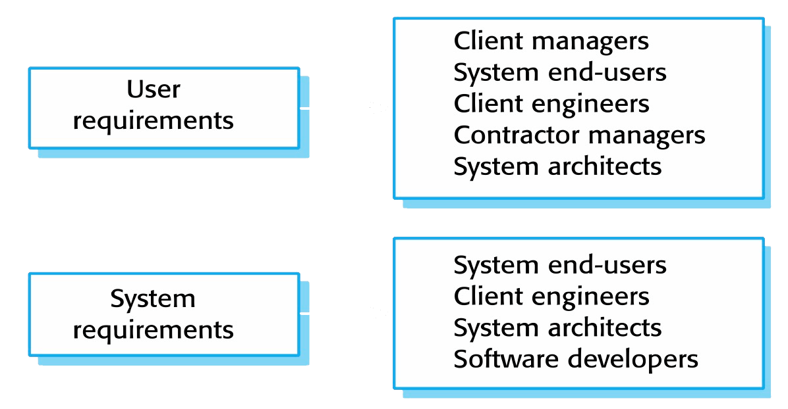

**Requisiti agile**
Quando i requisiti cambiano in modo estremamente rapido risulta difficile scrivere dei requisiti che abbiano senso per un periodo "lungo". È quindi conveniente dividere il progetto, così è possibile costruire una parte che posso consegnare, e quindi fatturare.
Se i requisiti cambiano troppo velocemente e non riesco a completare mai nulla non vengo pagato per nulla.

Vediamo ora le tipologie di requisiti che si possono incontrare in un progetto:

-   **Requisiti funzionali**
    Sono quelli più comuni, ovvero come il sistema deve comportarsi e come deve rispondere a specifici input.

-   **Requisiti non funzionali**
    Riguardano spesso l'intero sistema e definisco dei limiti che il software deve rispettare. Ad esempio dei tempi massimi di risposta, degli standard, dei requisiti sul processo di sviluppo.
    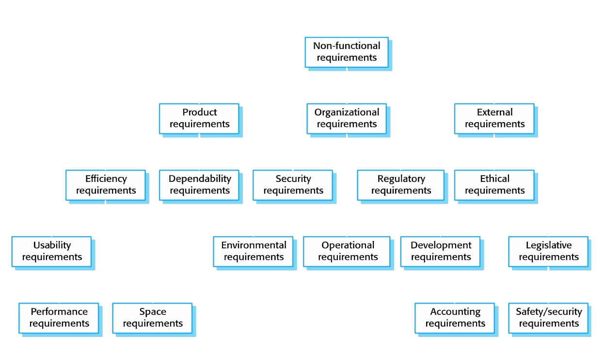
-   **Goals**
    Sono dei requisiti più vaghi, definiscono appunto uno scopo del progetto in senso generale, ad esempio la semplicità di utilizzo per l'utente finale.

## 3.1 Requirements elicitation

Lo staff tecnico deve lavorare con i clienti per arrivare ad ottenere il documento dei requisiti.
Definiremo uno _stakeholder_ come ogni persona che ha un interesse al sistema che stiamo sviluppato e quindi una persona il cui punto di vista deve essere ascoltato prima di iniziare a scrivere il software.

I processi di questa operazione sono:

-   **Definizione dei requisiti**:
    Questo significa comunicare con gli stakeholders per comprendere i loro requisiti.
    Questo viene fatto con dei colloqui nei quali prima si chiede allo stakeholder di parlare liberamente e poi si scende nei dettagli con delle domande via via più specifiche.
-   **Classificazione e Organizzazione dei requisiti**
-   **Assegnazione delle priorità** e risoluzione dei conflitti
-   **Requirements specification**: documentazione dei requisiti

I problemi che affliggono questo passaggio sono:

-   Gli stakeholder non sanno cosa vogliono veramente e lo esprimono nel loro linguaggio
-   Stakeholder differenti hanno requisiti differenti
-   Fattori esterni, quali la politica dell'azienda, possono influire sul processo
-   Nuovi requisiti possono apparire durante questo processo, assieme a nuovi stakeholders.

## 3.2 Requirements specification

Il processo che porta alla scrittura dei requisiti degli utenti e del sistema su un documento. Il documento finale dovrebbe essere comprensibile agli utenti senza un background tecnico.

L'utilizzo anche di immagini e altre grafiche è consigliato. Viene invece sconsigliato l'uso di linguaggio matematico, anche se esso è perfettamente inequivocabile, si rischia che il cliente sia riluttante nell'accettare un contratto che non comprende perfettamente.

Esistono diversi standard per scrivere delle specifiche, è anche possibile inventarne uno nuovo, è però importante la consistenza.

-   **Natural Language:** Il modo più immediato è quello di scrivere nel linguaggio naturale, supportato da grafiche.
    Questo è di facile comprensione, ma può generare della confusione in quanto spesso pecca in chiarezza.
-   **Strucutred Specifications:** Si utilizza un form standard per ogni requisito, i campi possono variare e al loro interno si usa il linguaggio naturale
-   **Tables:** Per supplementare le altre strategie si possono usare delle tabelle, particolarmente utili per definire il comportamento di una funzione nelle varie casistiche.

Il documento finale è una descrizione completa del sistema, per quanto possibile dovrebbe definire COSA il sistema è in grado di fare e non COME lo fa.
Verrà utilizzato da diverse figure professionali, è importante tenerlo a mente quando lo si scrive:
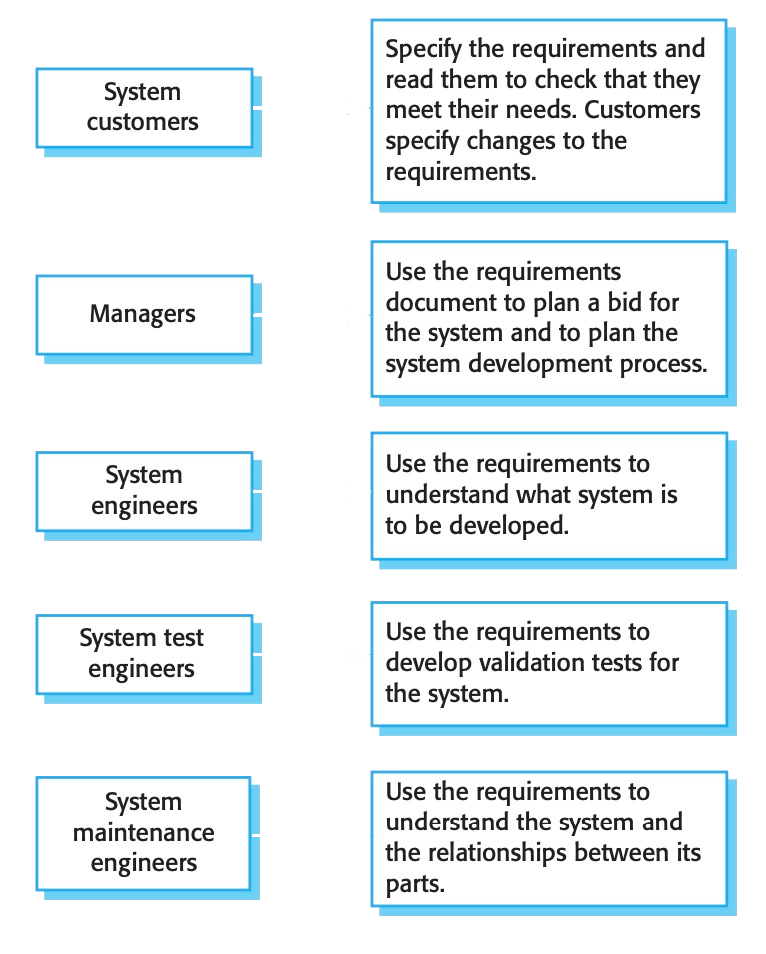

| Capitolo                             | Descrizione                                                                                                                                                  |
| ------------------------------------ | ------------------------------------------------------------------------------------------------------------------------------------------------------------ |
| Preface                              | Descrive il pubblico di destinazione del documento, assieme ad una storia delle versioni precedenti                                                          |
| Introduction                         | Descrive il motivo dietro alla creazione del software, una breve descrizione delle sue funzionalità ed il modo in cui si inserisce nella struttura aziendale |
| Glossary                             | Definisce i termini tecnici che verranno utilizzati nel resto del documento                                                                                  |
| User requirements<br>definition      | Si descrivono i servizi che il sistema fornisce agli utenti assieme a tutti i requisiti non funzionali.                                                      |
| System architecture                  | Una descrizione ad alto livello dell'architettura del sistema descrivendo la distribuzione dei vari moduli.                                                  |
| System requirements<br>specification | Maggiore dettaglio sui requisiti, sia quelli funzionali che quelli non funzionali. Qui vengono anche definite le interfacce tra vari sistemi.                |
| System models                        | Mostra la relazione tra il software e il suo ambiente                                                                                                        |
| System evolution                     | Stabilisce i prerequisiti su cui il software è costruito, in modo che non vengano prese delle scelta che limiteranno il software nel futuro.                 |
| Appendices                           |                                                                                                                                                              |
| Index                                |                                                                                                                                                              |

## 3.3 Requirements Validation

Ha il compito di verificare che quanto definito nei requisiti e quanto compreso dal personale tecnico sia veramente quello che il cliente vuole.
Il testing in questa fase è estremamente importante, in quanto i costi di un'errore in questa fase sono altissimi.

1. **Validity checks:** Verifica che i requisiti riflettano i bisogni degli utenti, questi possono essere anche cambiati da quando sono stati originariamente elicitati.
2. **Consistency checks:** I requisiti nel documento non devono avere conflitti.
3. **Completeness checks:** I requisiti nel documento devono includere tutti i requisiti e le limitazioni imposte dal cliente.
4. **Realism checks:** È necessario verificare che il sistema possa essere implementato rimanendo nel budget e nei tempi stabiliti.

## 3.4 Requirements changes

I requisiti di un grande sistema verranno modificati spesso, per questo è importante gestire correttamente i cambiamenti ad ogni livello.

-   **Problem analysis and change specification:** Il problema o la proposta di modifica viene analizzata per verificarne la validità, questa analisi fornisce un feedback al cliente che può rispondere con dei requisiti più specifici o può decidere di rimuovere la richiesta.
-   **Change analysis and costing:** L'effetto delle modifiche viene compreso, sia dal lato del software che da quello monetario.
-   **Change Implementation:** L'implementazione della modifica sul documento dei requisiti e sul design del sistema. Il documento dovrebbe essere organizzato in modo tale da renderne facile la modifica.

# 4. System Modeling

Il processo di sviluppo di modelli astratti di un sistema, ovvero di visualizzazioni che astraggano il funzionamento del sistema.
Strettamente collegato al requirements engineering, per comprendere il sistema attuale e come il nuovo sistema si inserisce nell'azienda.

Possono essere creati più tipi di modelli per ogni sistema, ognuno con il suo obiettivo:

-   **Prospettiva esterna**, mostrando il contesto e l'ambiente in cui si inserisce il sistema
-   **Prospettiva interna**, dove il modello descrive le interazioni tra l'ambiente e le componenti del sistema.
-   **Prospettiva strutturale**, dove si modella l'organizzazione del sistema e la struttura dei dati che vengono processati.
    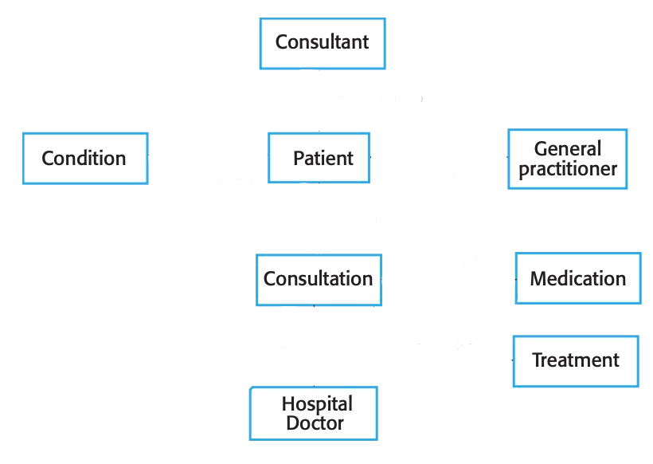
-   **Prospettiva del comportamento**, dove si modella il comportamento dinamico del sistema quando risponde agli eventi o ai dati.
    I sistemi possono avere una filosofia _data-driven_, sono sistemi che rispondono ad un input di dati. Mentre i modelli _event-driven_ rispondono a degli eventi che possono modificare lo stato del sistema.
-   **Prospettiva Completa**, il caso più importante, dove si mostra il sistema nel suo contesto, permettendo così di definire cosa rientra nel sistema e come interagisce col mondo esterno.
-   **Prospettiva delle Interazioni** sia tra utente e sistema che tra diversi sistemi. Questo step permette di verificare se la struttura è in grado di implementare i requisiti.
-   **Prospettiva dei casi di utilizzo**, può essere utile modellare i possibili casi nei quali viene utilizzato il sistema. Per fare questo si possono usare dei grafici di sequenza.
    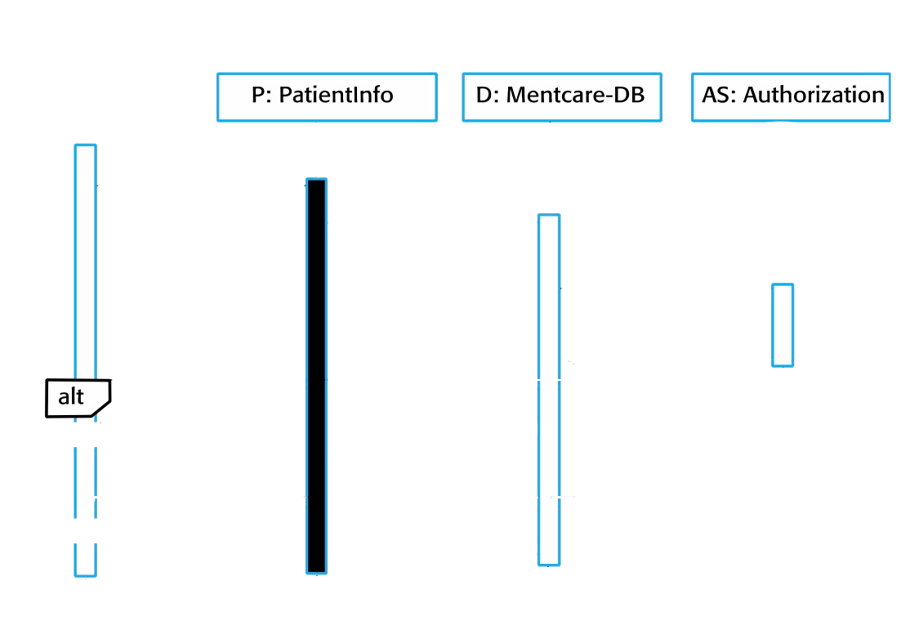

## 4.1 Model-driven engineering

È un approccio allo sviluppo software dove i modelli sono i principali risultati del processo di sviluppo, i programmi sono poi generati da questi modelli.
Questo eleva il livello di astrazione a cui lavorano i programmatori, rimuovendo lo step di programmazione.

Questo significa che per il developer c'è un grosso investimento iniziale per la creazione dei modelli, ma dopo ciò le modifiche dovrebbero essere semplici da implementare.
Nella realtà però c'è l'enorme rischio che i modelli debbano essere modificati, andando quindi a vanificare il lavoro fatto inizialmente.

# 5. Design Patterns

Definiamo un pattern come il principio grazie al quale è possibile risolvere un problema standard, vengono lasciate le specifiche all'ingegnere affinché la adatti caso per caso.

> Questa tecnica è largamente utilizzata nell'ingegneria, vengono spesso utilizzati gli _handbooks_ in modo da non dover risolvere problemi già incontrati.
> Le soluzioni che ogni ingegnere trova sono sempre diverse, ma non per questo sbagliate.

Nello sviluppo software sono di particolare importanza in quanto creare un progetto da zero risulta difficile e costoso, i pattern permettono il riutilizzo di alcuni segmenti di codice.

È importante dare dei nomi a questi pattern, così che essi possano essere ricordati e comunicati.

## 5.1 GRASP

È acronimo per "General Responsibility Assignment Software Patterns", è un design pattern che si concentra sugli elementi fondamentali della programmazione ad oggetti.
I 5 pattern di GRASP:

-   Information Expert
-   Creator
-   Controller
-   Low Coupling
-   High Cohesion

### 5.1.1 Information Expert

Risponde alla domanda, "Quale classe deve avere questa responsabilità?"
La risposta è "La classe che ha l'informazione necessaria per completare la task"

Facilita l'information hiding ed incoraggia la creazione di classi coese.
Potrebbe però contraddire i principi di _Low Coupling_ e _High Cohesion_

### 5.1.2 Creator

Risponde alla domanda, "Chi deve creare l'istanza di A?"
La classe che deve creare A è:

-   Quella che contiene o aggrega oggetti di A
-   Registra e tiene traccia di oggetti di A
-   Utilizza strettamente A
-   Ha le informazioni per inizializzare A

Questo pattern può non essere ideale nel caso in cui A richiede particolari risorse per essere inizializzata, in questo altri pattern possono tornare utili.

### 5.1.3 Controller Pattern

Il controller è l'oggetto che fa da intermediario tra l'UI e la logica dell'applicazione, è responsabile della gestione degli eventi dell'UI
Ci sono due modi per gestire gli eventi:

-   Rappresentare il sistema in modo completo (sistema a facciata, atemporale)
-   Rappresenta uno specifico caso nel quale avviene uno specifico evento (sessione, temporale)

### 5.1.4 Low Coupling Pattern

Assegna le responsabilità in modo che il _coupling_ rimanga basso.
Questo significa che è necessario ridurre le interdipendenze tra le classi.

Può sembrare banale ma non lo è all'atto pratico. Se tutti gli elementi sono strettamente intrecciati allora è facile che una piccola modifica ad un oggetto richieda grandi modifiche al sistema.
Le classi risultano inoltre essere più facilmente comprensibili e mantenibili.

### 5.1.5 High Cohesion

La coesione misura quanto sono correlate le responsabilità di un elemento.
Non conviene assegnare ad una singola classe tutte le responsabilità.

Si complementa con il Low Coupling. Rende le classi comprensibili e mantenibili.
Va sempre fatto un compromesso con le prestazioni, se ho un grande overhead nello switching ad un'altra classe forse è conveniente unire più classi in una.

## 5.2 Responsability Driven Design

La responsabilità è un contratto o obbligazione di una classe:

-   Cosa deve "sapere" la classe?
    -   Sono attributi, associazioni al dominio del modello
-   Cosa deve "fare" la classe? - Fare un'azione - Inizializzare un'azione in altri oggetti - Controllare/coordinare le azioni in altri oggetti
    Esse vengono assegnate nella fase di design.

Le responsabilità sono implementate tramite i metodi

## 5.3 GoF Design Patterns

Gangs of Four (GoF): Erich Gamma, Richard Helm, Ralph Johnson, John Vlissides

Hanno creato 23 pattern come soluzione a problemi comuni della programmazione e li hanno scritti in un libro, il quale risulta essere ora molto datato, ma rimane valido quanto viene scritto.
Ogni pattern è composto da 4 elementi essenziali:

-   Nome del pattern
-   Spiegazione del problema che risolve
-   Soluzione (in UML e pseudocodice)
-   Conseguenze (pro-contro)

Tipi di Pattern nel libro:

-   Pattern di creazione (5)
    `Inizializzazione e configurazione degli oggetti`
    -   Abstract Factory
    -   Builder
    -   Factory Method
    -   Prototype
    -   Singleton
-   Pattern strutturali (7)
    `Separa interfaccia ad implementazione degli oggetti`
    -   Adapter
    -   Bridge
    -   Composite
    -   Decorator
    -   Facade
    -   Flyweight
    -   Proxy
-   Pattern di comportamento (11)
    `Interazioni dinamiche tra oggetti`
    -   Chain of Responsibility
    -   Command
    -   Iterator
    -   Interpreter
    -   Mediator
    -   Memento
    -   Observer
    -   State
    -   Strategy
    -   Template Method
    -   Visitor

Noi ne vedremo solo alcuni:

### 5.3.1 Creation Pattern: Factory Pattern

Sappiamo che non è possibile creare un oggetto da un'interfaccia, ma solo classi che poi possono istanziare oggetti.
Però se ho diverse implementazioni che derivano da un'interfaccia e una classe che ne sceglie una arrivo ad un problema perché la classe ora dipende da tutte le implementazioni.
La soluzione è quella di creare una Factory.

#es
Inizialmente abbiamo PizzaStore, che dipende da CheesePizza, GreekPizza e PepperoniPizza

```java
public class PizzaStore {
	Pizza orderPizza(String type) {
		Pizza pizza;

		if (type.equals("cheese")) {
			pizza = new CheesePizza();
		} else if (type.equals("greek")) {
			pizza = new GreekPizza();
		} else if (type.equals("pepperoni")) {
			pizza = new PepperoniPizza();
		}

		pizza.prepare();
		pizza.bake();
		pizza.box();

		return pizza;
	}
}
```

Utilizzando le factory diventa:

```java
public class PizzaFactory {
	public Pizza createPizza(String type) {
		if (type.equals("cheese")) {
			pizza = new CheesePizza();
		} else if (type.equals("greek")) {
			pizza = new GreekPizza();
		} else if (type.equals("pepperoni")) {
			pizza = new PepperoniPizza();
		}
	}
}

public class PizzaStore {
	private PizzaFactory factory;

	public pizzaStore(PizzaFactory factory) {
		this.factory = factory
	}

	Pizza orderPizza(String type) {
		Pizza pizza = factory.createPizza(type)

		pizza.prepare();
		pizza.bake();
		pizza.box();

		return pizza;
	}
}
```

Aggiungendo le reflections a PizzaFactory è possibile rendere il tutto ancora più semplice. In questo modo per aggiungere un nuovo tipo di pizza sarà solo necessario scrivere e compilare la nuova implementazione di Pizza, non sarà nemmeno necessario riavviare il sistema.

```java
public class PizzaStore {
	protected abstract createPizza(String type)

	Pizza orderPizza(String type) {
		Pizza pizza = createPizza(type)

		pizza.prepare();
		pizza.bake();
		pizza.box();

		return pizza;
	}
}

public class NYPizzaStore extends PizzaStore {
	public Pizza createPizza(String type) {
		if (type.equals("cheese")) {
			pizza = new NYCheesePizza();
		} else if (type.equals("greek")) {
			pizza = new NYGreekPizza();
		} else if (type.equals("pepperoni")) {
			pizza = new NYPepperoniPizza();
		}
	}
}

```

Questo è un modo per invertire il principio delle dipendenze.
Solitamente le classi "high-level" dipendono da quelle "low-level", in questo caso PizzaStore dipende da delle classi astratte, non da delle sottoclassi.

Le guidelines per ottenere l'inversione delle dipendenze sono:

-   Nessuna variabile dovrebbe avere una reference ad una classe concreta
-   Nessuna classe dovrebbe derivare da una classe concreta
-   Nessun metodo dovrebbe fare l'override di un metodo della classe base
    Sono solo delle guidelines, non vanno seguiti alla lettera altrimenti risulta impossibile creare codice nella realtà.

### 5.3.2 Creation Pattern: Singleton Pattern

Esistono alcune situazioni in cui al più un oggetto di una classe può essere inizializzato.
Immaginiamo per esempio un database, se creiamo più istanze è possibile avere delle race condition all'accesso.

Una classe con soli metodi statici è di fatto un singleton, ma questo è solamente un esempio, l'implementazione non è sempre questa.

Possiamo creare una classe il cui compito sia quello di inizializzare e gestire l'accesso al singleton.
L'inizializzazione può avvenire in modo _eager_, ovvero quando viene avviata la programmazione, oppure in modo _lazy_ ovvero quando è necessaria.

**Implementazione**

```java
public class ChocolateBoiler {
	private boolean empty;
	private boolean boiled;
	private static ChocolateBoiler uniqueInstance = null;

	private ChocolateBoiler() {
		empty = true;
		boiled = false;
	}

	//lazy initialization
	public static syncronized ChocolateBoiler getInstance() {
		if (uniqueInstance == null) {
			uniqueInstance = new ChocolateBoiler();
		}
		return uniqueInstance;
	}

	//eager initialization
	static {
		uniqueInstance = new ChocolateBoiler();
	}
}
```

#oss è necessario porre attenzione nel caso di multiprogrammazione, se più thread richiedono getInstance allo stesso tempo è possibile che più istanze vengano create.

#oss La syncronization è costosa, quindi se sono certo che verrà solo eseguito un thread, posso non mettere il check e lasciare solo un avviso che quel codice non è thread-safe.
Altrimenti si fa una eager initialization, che risolve il problema della sincronizzazione al costo di un aumento dell'occupazione della memoria.

### 5.3.3 Structural Pattern: Adapter Pattern

La necessità di un adattatore avviene anche nel mondo reale: una spina elettrica che richiede un adattatore per essere collegata ad una presa.
Un altro nome è wrapper, fascia l'oggetto in un'altro.

Il requisito è che i due sistemi siano simili, è impossibile adattare un frigo ad una macchina.
Viene spesso utilizzato per un toolkit o una classe, oppure per creare una classe riutilizzabile che coopera con altre classi con interfacce incompatibili.

**Terminologia**
La classe _Adaptee_ attraverso l'_adapter_ diventa conforme all'interfaccia _Target_, la quale è richiesta dal _Client_.

**Tipologia di adattatori**

-   Class Adapter:
    Ho già le funzionalità, ma non sono mappate correttamente.
    Semplicemente creo una sottoclasse che implementa il Target.

    Una modifica all'adaptee può rompere tutto, per ogni classe va creato un adapter.

-   Object Adapter:
    Classe che non estende l'adaptee, ma che contiene un'istanza.
    L'adapter può essere esteso e quindi posso mettere o la superclasse o le sue sottoclassi

> Esistono anche gli adattatori a due vie, quindi dove sono visibili sia i metodi dell'interfaccia target che quelli dell'interfaccia iniziale.

#es
Classe da adattare:

```java
public class NumberSorter {
	public List<Integer> sort(List<Integer> numbers) {
		//sort
		return numbers;
	}
}
```

Target:

```java
public interface Sorter {
	public int[] sort(int[] numbers)
}
```

```java
public class SortListAdapter implements Sorter {
	@Override
	public int[] sort(int[] numbers) {
		//convert array to list
		List<Integer> numberList = new ArrayList<Integer>();
		//call adaptee
		NumberSorter sorter = new NumberSorter();
		numberList = sorter.sort(numberList);
		//convert back the list
		return sortedNumbers;
	}
}
```

# 6. Testing

Il test di un programma ha lo scopo di mostrare che il programma fa ciò che è richiesto, e per scoprire possibili errori prima che avvengano.
Spesso si inseriscono nel programma dei valori di test, creati per questo scopo, e si verifica che il test ritorni quanto atteso, nel tempo atteso e nelle prestazioni attese.
Non è sempre necessario verificare ogni singolo caso, spesso è sufficiente un test per ogni tipologia di input.

#oss
Risulta semplice dimostrare la presenza di un problema (nel caso in cui il programma fallisca), mentre è difficile dimostrare che non è presente un problema.

Dei test possono essere rivolti alla verifica dei requisiti, quindi un test per ogni requisito. Altri test possono essere creati per verificare che, nel caso di input non corretti, il sistema porti ad un risultato accettabile (senza corruzione di dati o crash)

**Verification vs Validation**
La verifica è il controllo che il software sia conforme alle sue specifiche, la validazione è il controllo che il sistema faccia quanto l'utente si aspetta.

L'obiettivo della verifica e validazione è creare un software che sia giusto per il suo utilizzo:

-   Più un software è critico ad un'organizzazione più deve essere testato
-   Alcune volte gli utenti hanno basse aspettative rispetto al software (algoritmo dello struzzo per i deadlock)
-   Essere sul mercato con qualche bug è meglio che non essere sul mercato (microsoft)

**Static vs Dynamic Testing**

-   **ispezioni statiche**
    riguardano l'analisi diretta del codice, possono essere aiutati da dei tool, ma richiedono sempre tempi estremamente lunghi.
    -   Ha però il vantaggio che può essere applicata a tutti i passaggi (requisiti, architettura del sistema, database).
    -   Può essere utilizzata anche quando il codice non è completo
    -   Verifica anche la conformità agli standard e la manutenibilità
-   **analisi dinamica**
    verifica solo il comportamento del software in esecuzione.

Le due tipologie di testing sono complementari

**Automated Testing**
Il testing è una procedura che può essere automatizzata grazie a dei framework, come Junit.

-   Parte di setup
-   Parte di call
-   Parte di assertion

## 6.1 Stages of Testing

### 6.1.1 Development Testing

I test case vengono scritti durante lo sviluppo per cercare bug e difetti

**Unit Testing**
Vengono verificate le unità, che molto spesso sono una o più classi (metodi)

La copertura completa di una classe riguarda il testing di tutti i metodi di un oggetto, sia nel caso standard che nei casi problematici (vanno verificati tutti i possibili stati).

-   Vanno verificate tutte le strade del programma, anche quelle di errore.
-   Vanno verificati i buffer overflow, possono intaccare la safety
-   Ripetere lo stesso input più volte (per assicurarsi che il sistema ritorni allo stato zero)
-   Verificare computazioni troppo grandi o troppo piccole

> Quando si arriva ad un punto in cui il numero di stati possibili è troppo ampio è necessario spezzare le responsabilità dell'unità che si sta verificando.

I test possono seguire due metodologie:

-   Partition Testing
    Si prendono i gruppi dei possibili input e si verifica un elemento per gruppo.
-   Guideline-Based Testing
    Si scrivono delle guideline rispetto ai test case da utilizzare.

**Component Testing**
I componenti sono delle collezioni di unità, tutte accessibili al resto del sistema mediante un'interfaccia. (interfacce di funzioni, ma non solo, anche di memoria, di comunicazioni...)
Cerchiamo errori nelle interfacce, non nelle unità inferiori, le quali dovrebbero essere già state testate.

I problemi comuni che affliggono i component sono:

-   Utilizzo errato dell'interfaccia
-   Incomprensione dell'interfaccia (piedi anziché metri)
-   Problemi di timing

Testing Guidelines:

-   Verificare cosa avviene in caso di fallimento
-   Verificare i valori estremi dei parametri
-   Verificare i puntatori con nullptr
-   Fare stress test dei sistemi di scambio dei messaggi
-   In sistemi a memoria condivisa, cambiare l'ordine in cui i componenti sono attivati

**System Testing**
L'intero sistema viene verificato. Si vogliono verificare le interazioni tra i componenti.
Si prova a far eseguire questa fase di testing ad un'altro team di sviluppo.

### 6.1.2 Release testing

Fatto quando il software viene rilasciato, possibilmente da un team diverso.
Ha il principale obiettivo di verificare con il cliente che il software sia conforme alle richieste.

Vengono inoltre verificati tutti i requisiti e le interazioni tra di essi.
Vanno verificate anche le prestazioni del sistema, uno stress test deve essere svolto per portare il prodotto al punto di cedimento e verificare che questi siano inferiori a quelli attesi.

### 6.1.3 User testing

Gli utenti verificano il software e segnalano gli errori, questo è sempre uno step fondamentale, anche quando gli step precedenti di testing sono stati svolti correttamente.

-   Alpha Testing:
    L'utente viene nel luogo dello sviluppo per fare un primo test del software
-   Beta Testing:
    Il software viene portato sul campo, con le dovute avvertenze
-   Acceptance Testing:
    Si decide se il software può essere implementato ed utilizzato dal cliente

## 6.2 Test Driven Development

Con test driven development si intende la strategia di sviluppo che prevede la creazione dei test prima del codice.
Superare i test diventa l'obiettivo principale dello sviluppo, quando un set di test sono superati si passa ai successivi.

Vantaggi:

-   Copertura dei testi completa
-   Dopo una modifica è possibile eseguire di nuovo tutti i test, verificando di non aver fatto breaking changes
-   Il debugging è semplificato, ci si accorge subito delle criticità ed è evidente dove esse si trovano
-   I test da soli formano una specie di documentazione rispetto a come il codice dovrebbe comportarsi

## 6.3 JUnit

Junit è un framework open source per Java, incluso in molto IDEs (Eclipse).
Va inserito il suo `.jar` nella struttura del progetto.

Definizioni:

-   **Test Case:** Java class che contiene dei test method
-   **Test Method:** un metodo senza argomenti annotato con `@Test`
-   **Fixture:** Lo stato inziale da cui parte il test
-   **assertions:** Verifica che il risultato sia uguale a quello atteso.
-   **Test Suite:** Collezione di test case

Se la fixture è sempre uguale, si utilizza il metodo con `@Before` (solo uno) che inizializza la fixture prima di ogni test. `@After` funziona allo stesso modo ma esegue dopo il test, a prescindere dal successo del test.

Esistono anche degli inizializzatori a livello della suite: `@BeforeClass` `@AfterClass`

### 6.3.1 Assertion

Ne esistono di diversi tipi:

-   `assertEquals()`
-   `assertNull()`, `assertTrue()`
-   `assertSame()`: verifica l'uguaglianza tra puntatori, come l'uguaglianza tra oggetti su cui non è definita la classe equals
-   `Assert.fail()`: se viene eseguito, faila il test

```java
import org. junit.Assert;
import org. junit. Test;

public class TestCase {
	@Test
	public void myTest () {
		List<Customer> customers = customerService.getAllCustomers();
		Assert.assertEquals(12, customers.size());

		Customer customer = customerService.getById("123");
		Assert.assertNotNull("Customer not found", customer);

		boolean isActive = customerService.isActive(customer);
		Assert.assertTrue("Customer is not active", isActive);
	}
}
```

È possibile verificare che alcune operazioni ritornino una certa eccezione, il test fallisce se l'eccezione non viene lanciata

```java
@Test(expected=ArithmeticException.class)
public void divideByZero() {
	int n = 2 / 0;
}
```

È possibile verificare che i test rimangano entro un certo limite di tempo, se il timeout viene superato il test ritorna un errore.

```java
@Test(timeout=500)
public void retrieveAllElementsInDocument() {
	doc.query("//*");
}
```

È possibile ignorare alcuni test aggiungendo `@Ignored` prima di `@Test`

### 6.3.2 Installazione

Creare una cartella dentro al progetto, aggiungere alla cartella il `.jar` corrente. Da qui in poi i comandi vanno eseguiti nel contesto della cartella appena creata.
