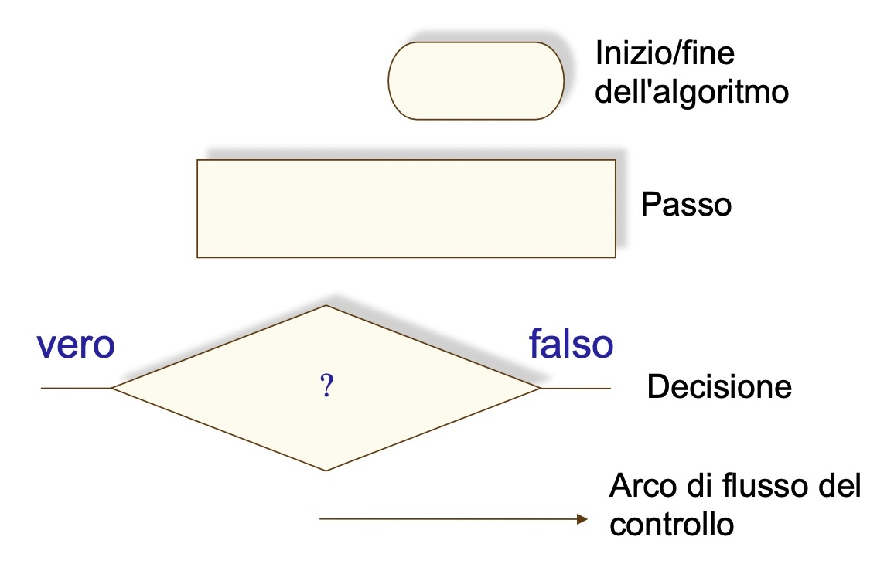
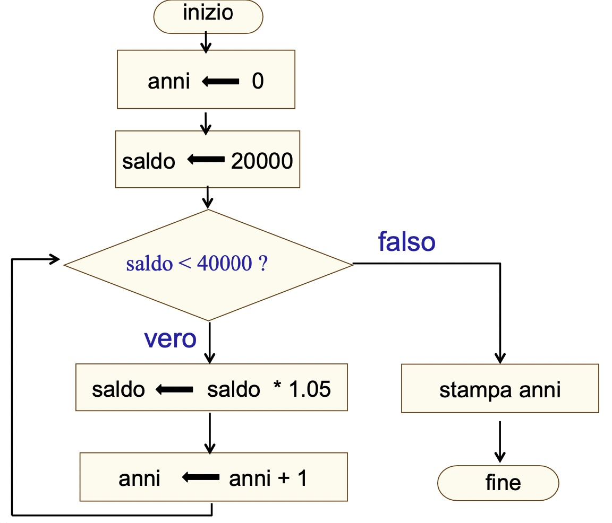

# Introduzione ai linguaggi

Diagrammi di Flusso (li utilizzeremo per descrivere semplici algoritmi)



-   Esempio di un algoritmo   
    Avendo depositato ventimila euro in un conto bancario che produce il 5% di interessi all’anno, capitalizzati annualmente, quanti anni occorrono affinché il saldo del conto arrivi al doppio della cifra iniziale?
    
    
    
    ```java
    int anni = 0;
    int saldo = 20000;
    
    while (saldo < 40000):
        saldo = saldo * 1.05;
        anni += 1;
    
    System.out.println(anni);
    ```

`Il computer è una macchina che memorizza dati, interagisce con i dispositivi ed esegue programmi`

**Cos’è la programmazione?**

`Una disciplina che ha come oggetto la definizione, progettazione e codifica di programmi per calcolatore`

---

`I programmi sono implementazioni di algoritmi in un linguaggio di programmazione`

Per essere corretto un programma deve essere:
-   sintatssi corretta (es. mettere il punto e virgola)
-   Correttezza semantica (es. usare system.out.println() per scrivere nella console)
-   Correttezza della soluzione (errori logici, che provocano un risultato errato)

Tre tipi di istruzioni elementari:
-   Istruzioni imperative (es. sommare due numeri, inizializzare una variabile)
-   Istruzioni condizionali (if)
-   cicli (iterazioni)

**Linguaggi di Programmazione**
Istruzioni macchina: Il livello più vicino all’hardware, ogni CPU ha un instruction set (es. “carica in un registro un valore”, controlla se esso è maggiore del valore contenuto in un’altro registro)

Il linguaggio macchina viene poi tradotto in configurazioni di bit che la cpu può comprendere:
LOAD (su un registro) e STORE (verso la memoria principale)
aritmetiche: ADD, SUB, MUL, DIV
logiche: AND, OR, NOT
JUMP (salto sul program counter) JZ (salta se valore è zero) JGZ (salta se il valore è > 0)

**L’assemblatore**
Traduce i nomi abbreviati in istruzioni binarie (es. LOAD=21)
Riescono a tradurre i _linguaggi assembly_ (anche questi diversi per ogni CPU, ci deve essere corrispondenza fra istruzioni assembly e instruction set del processore)
Permette anche di assegnare nomi agli indirizzi di memoria, rendendo il programma più leggibile

I linguaggi assembly rendono molto più comprensibile il codice, ma presentano ancora molti problemi:
-   servono molte istruzioni anche per programmi molto semplici
-   La sequenza di istruzioni cambia al cambiare della CPU, quindi supportare più CPU è costoso

**Linguaggi ad alto livello**
Permettono al programmatore di usare sitassi più vicina a quella inglese
-   Linguaggi formali
-   Devono essere
    -   Espressivi, per descrivere molti algoritmi
    -   comprensibili ai calcolatori, quindi non devono essere ambigui e devono essere efficienti
    -   comprensibili al programmatore umano
La sintassi dei programmi viene definita da EBNF (Extended Backus-Naur Form)

**Linguaggi compilati**
Legge il programma e genera il codice in linguaggio macchina specifico per la CPU
-   Codice universale, non va riscritto in base alla CPU
-   Va però compilato più volte in modo da poter supportare tutti i computer

**Linguaggi interpretati**
Il codice macchina viene prodotto “al volo”, senza creare un file separato
Questo ha il difetto di essere più lento, dobbiamo attendere la compilazione
Però è da notare che facendo così non è necessario compilare molte volte per supportare tutti i computer
La decisione tra interpretazione e compilazione si trova nelle necessità del programma
-   Se il programma deve essere più portabile è meglio optare per un linguaggio interpretato
-   Se le prestazioni sono il focus è meglio scegliere un linguaggio compilato, per spostare il lavoro sulla cpu del developer


---

**Compilatore**

Il compilatore segnala semplicemente gli errori, non tenta di capire e interpretare, perché altrimenti sarebbe un’altro punto dove nascono errori, è impossibile assicurarsi che il compilatore non interpreti nel modo sbagliato.

Di solito avvengono due step per arrivare al linguaggio macchina:

1.  Si parte dal linguaggio high-level e lo si traduce in un linguaggio assembly tramite il compilatore specifico al linguaggio di programmazione
2.  Con un’altro compilatore assembly, magari esterno e quindi comune a più linguaggi, si arriva al linguaggio macchina

---

**Storia dei linguaggi**

-   Anni ‘50: i primi linguaggi
    -   FORTRAN: primo “vero” linguaggio assieme a BASIC, COBOL
    -   Presenza di “salti” (spaghetti code)
-   Anni ’60 e ’70: programmazione strutturata
    -   Pascal (Niklaus Wirth, 1968), C (B. Kernigham e D. Ritchie, 1970-75)
    -   Strutture di controllo: sequenza-selezione-iterazione
    -   Un punto di ingresso, uno di uscita: componibilità
-   Anni ’80 e ’90: programmazione orientata agli oggetti
    -   C++ ( B. Stroustrup, 1979) , Java (J.Gosling e P. Naughton, 1991)
    -   Definisce “classi”: modelli astratti che descrivono dati e operazioni su esse (metodi). Gli oggetti sono istanze di una classe.


## Java

Nasce nel 1991, pensato per essere semplice e indipendente dalla CPU

-   Più semplice del C++ (in particolare nella gestione della memoria)
-   “compile once, execute anywhere”
    -   Viene dato un codice intermedio (bytecode) che viene poi interpretato dalla JVM (java virtual machine), per questo viene considerato un linguaggio ibrido
    -   Indipendente dalla CPU
-   Inizialmente venne introdotto nel progetto HotJava, un browser che permetteva di scaricare degli _applet_ che si potevano eseguire su tutte le piattaforme
-   L’esecuzione è lasciata alla JVM
    -   Carica sia il programma che le sue librerie in RAM
    -   Ciò che permette di eseguire codice ovunque
    -   Garantisce e ottimizza l’uso della memoria
-   Ricca libreria standard che mette a disposizione molte funzionalità
    -   Per le funzioni comuni, è già stata probabilmente scritta una funzione dagli autori del linguaggio
-   Gestione automatica della memoria, non bisogna preoccuparsi di riservarla e liberarla
-   Non è pensato per la didattica, creare programmi molto semplici non è molto semplice
-   estensione in `.java`
-   compilatore su `javac Hello.java`, questo crea un file Hello.class
-   Poi posso eseguire il codice con `java Hello`
-   Nome classe e nome file deve essere uguale

**Hello World**
```java
public class Hello {
		public static void main(String[] args) {
				System.out.println("Hello, world!")
		}
}
```

`public class [Hello]`
definisce una classe, public ci dice che la classe può essere usata anche da altre classi
-   `public` è una parola riservata, non si può utilizzare per altro (es. chiamare così la propria variabile)
-   Ciascun file può contenere solo una classe pubblica, il cui nome coincide con il nome del file
-   Per ora useremo le classi come contenitori di metodi
    -   Un metodo definisce una sequenza di istruzioni o enunciati, descrive come svolgere un determinato compito

`public static void main(String[] args)`
definisce un metodo
-   `static` ci indica che il metodo non modifica gli oggetti all’interno della classe (per poterli modificare devo omettere il termine)

`System.out.println("Hello, world!")`
-   La destinazione è l’output_standard, cosa che poi cambia per ogni sistema operativo, ma la libreria standard se ne occupa
-   Cerca l’oggetto out nell’oggetto system
-   Il punto ha qui più significati, in base al contesto, qui prima invoca un oggetto, poi un metodo
-   esiste anche il metodo `print`, ma non va a capo

**Errori**
-   errori di sintassi
    -   es. `System.aut.println(”Hello World!”)`
-   errori logici o di esecuzione
    -   Qui il compilatore non ci aiuta, possiamo non commettere errori sintattici, ma il programma non dà il risultato che ci aspettiamo

