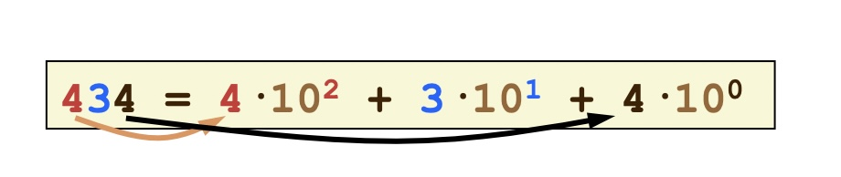
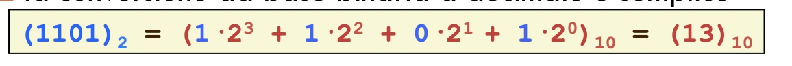
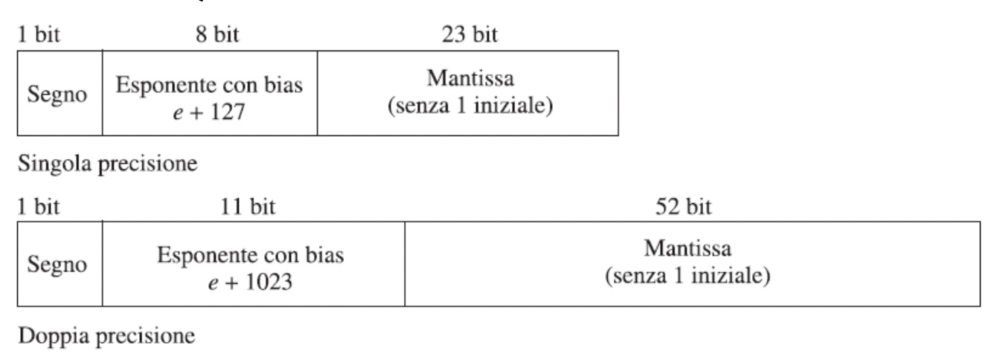

# Notazione Binaria

-   Al contrario di quanto facciamo noi, il computer può salvare in memoria solo i valori 0 e 1, quindi dobbiamo trovare un modo di convertire tutto in questo linguaggio
-   I numeri naturali sono infiniti, ma la memoria non lo è, dobbiamo salvare in memoria dei valori finiti

-   Notazione posizionale (decimale)
    Posizionale perché cifre uguali in posizioni diverse hanno valore diverso
    Salvare la cifra e la sua posizione, per poi moltiplicarla.
    
    In questo modo possiamo anche rappresentare facilmente la parte frazionaria (basta continuare con $10^{-1} 10^{-2} ...$)
-   Notazione binaria
    Funziona in modo simile a quella decimale
    

    Solo che i soli numeri possibili sono 1 o 0
    In questo caso la conversione è semplice
    è stata scelto questo modo per un motivo tecnologico, distinguere tra acceso e spento è molto più semplice che distinguere tra 10 diversi livelli

**Conversione da decimale a binario**
In questo caso la conversione è per noi più complessa
la parte intera e quella decimale vanno considerate separatamente
è possibile che numeri che in decimale hanno una rappresentazione esatta non ce l’abbiano in binario, ne è esempio il numero 4.35 che viene approssimato a 3.3499999. Questo può dare problemi con le operazioni

-   Convertire 75 in binario

    75/2 = 37 resto 1
    37/2 = 18 resto 1
    18/2 = 9 resto 0
    9/2 = 4 resto 1
    4/2 = 2 resto 0
    2/2 = 1 resto 0
    1/2 = 0 resto 1

    Leggo i resti dal basso verso l’alto e ottengo: 1001011

-   Convertire 0.703125 in binario

    0.703125 _ 2 = 1.40625 → 1
    0.40625 _ 2 = 0.8125 → 0
    0.8125 _ 2 = 1.625 → 1
    0.625 _ 2 = 1.25 → 1
    0.25 _ 2 = 0.5 → 0
    0.5 _ 2 = 1 → 1

    dall’alto verso il basso: 0.101101

-   Convertire 0.6 in binario

    0.6 _ 2 = 1.2 → 1
    0.2 _ 2 = 0.4 → 0
    0..4 _ 2 = 0.8 → 0
    0.8 _ 2 = 1.6 → 1
    0.6 \* 2 = 1.2 → 1

    dall’alto verso il basso: $0.\overline{1001}$

A questo punto possiamo creare i numeri con la virgola fissa, mettendo insieme una parte intera con una frazionaria (possiamo trattare i numeri come separati)

In un dato numero di bit n possiamo rappresentare i numeri naturali compresi tra [0,2n–1]∩Z \*Con 8 bit possiamo rappresentare 256 combinazioni, partendo da zero

##### Numeri negativi

La rappresentazione più intuitiva è quella con modulo e segno
Il primo bit della sequenza viene usato per ricordare il segno del numero (0 per positivo e 1 per negativo) e il resto dei bit rappresenta il modulo assoluto del numero

I problemi sono due:

1.  Abbiamo due zeri, 0+ e 0-, i quali sono uguali sprecando una configurazione
2.  l’algoritmo per l’addizione diventa più complesso (devono essere fatti più controlli, impatto sulle prestazioni)

##### Complemento a due

Questa è una rappresentazione più efficiente dei numeri negativi
I numeri negativi vengono rappresentati sommando il numero con $2^n$, dato n numero di bit

In questo modo possiamo rappresentare: $[–2^{n-1}$ ,$2^{n-1} -1$ ] ∩ Z Per convertire il numero così ottenuto in decimale possiamo usare questa formula

$$-a_{n-1}2^{n-1}+a_{n-2}2^{n-2} + ... + a_{1}2^{1} + a_{0}2^{0}$$

In pratica basta mettere un meno davanti al primo numero decimale e poi sommare gli altri.

**Proprietà**
Se il numero inizia con 0 possiamo dire che è positivo, se 1 è negativo
La parte restante NON è il valore assoluto del numero
Non ci sono configurazioni sprecate (+0 e -0)

**Somma in complemento a due**
Si usa la semplice somma in colonna, attenzione ad errori di overflow!!
Anche la sottrazione funziona allo stesso modo
Se un valore esce dal numero di bit impostato si può rimuovere ciò che rimane fuori
Si ottiene un errore di _overflow_ quando sommando due numeri con lo stesso segno si ottiene un risultato di segno opposto

##### Numeri in virgola mobile

Rappresentare i numeri tramite mantissa ed esponente
La mantissa è il numero con una sola cifra decimale, l’esponente è l’esponente con base 10 che va moltiplicato al numero per ritornare al numero originario
La lunghezza del numero in bit è definita da uno standard internazionale

Numeri “speciali”

-   Zero: esponente = -127 mantissa = 0
-   Infinito: exponente = + 128 mantissa = 0
-   NaN (not a number): exponente = + 128 mantissa ≠ 0
    Il difetto di questa rappresentazione è che la precisione si riduce all’aumentare del numero

**Base 16 e 8**
Raggruppo i bit (da destra verso sinistra) in gruppi di 4 e li converto in una singola cifra esadecimale

##### Rappresentazione di caratteri

Conversione dei caratteri in numeri naturali
Usiamo UNICODE come standard, il quale usa 16 bit per ogni carattere, quindi si possono esprimere 65536 caratteri
Prima si usava ASCII, il quale aveva solo 7 o 8 bit, i primi caratteri di UNICODE coincidono ancora con quei caratteri, per compatibilità
Noi useremo ASCII a 7 bit

-   I primi 32 sono caratteri di controllo
-   poi ci sono lettere e simboli
    ASCII esteso (8bit) contiene tutte le lettere degli alfabeti occidentali
