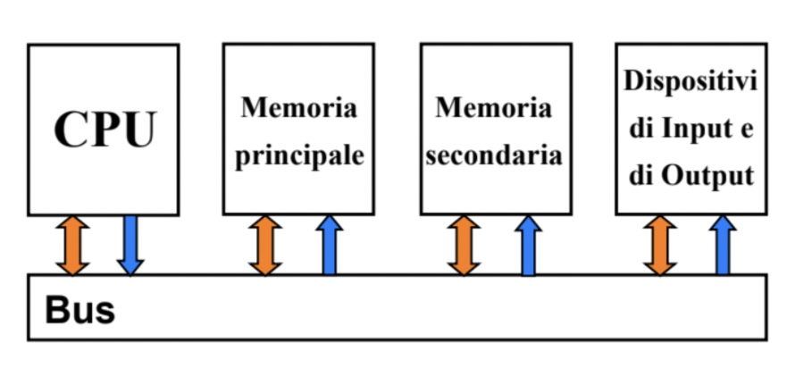
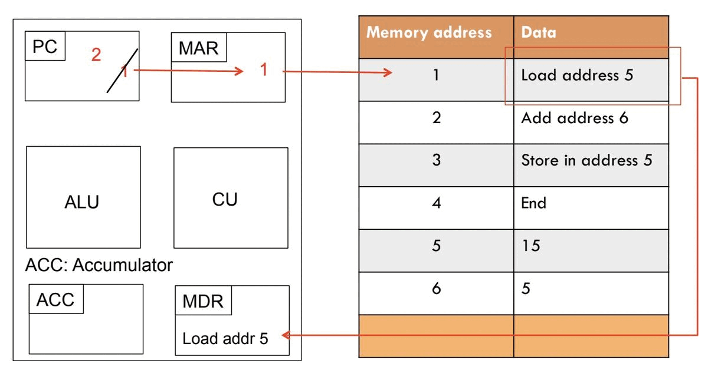

# Architettura degli elaboratori
Sistemi embedded: ci sono processori anche negli strumenti di tutti i giorni

Hanno una parte hardware e parte software

Alla base dei programmi ci sono sempre dei dati che permettono di rappresentare le informazioni
Tutta l’informazione viene sempre rappresentata in bit.

I programmi sono un insieme di istruzioni elementari eseguite in ordine stabilito ( algoritmo )

I primi computer erano formati da persone che passavano le giornate a svolgere calcoli manualmente

# Architettura di Von Neumann

-   Quattro blocchi (CPU, memoria principale, memoria secondaria e dispositivi di input/output)
-   Un bus che li collega 
	-  dati in arancione
	- blu bus degli indirizzi (nota che solo la CPU ha il compito di assegnare gli indirizzi)

-   CPU
    È composta a sua volta da più componenti
    -   ALU: Arithmetic Logic Unit, effettua elaborazioni aritmetiche
    -   Registers: memoria temporanea per gli indirizzi della memoria alla quale la CPU sta apportando modifiche
    -   Unità di controllo: Contiene il Program Counter (che ha lo scopo di tenere in memoria il numero dello step) e l’instruction Register (che contiene tutti gli step)
	
    Una delle caratteristiche più importanti della CPU è il Clock, il quale indica la velocità alla quale la CPU esegue le 3 seguenti fasi (fetch-decode-execute):
    -   Accesso: l’istruzione viene letta e memorizzata nell’instruction register e il program counter viene incrementato (con eccezione di salti condizionali (if) e subroutine)
    -   Decodifica: decodifica l’istruzione
    -   Esecuzione: esegue l’istruzione
	
	
	PC: Program Counter
    MAR: Memory address register
    CU: Control unit
    MDR: Memory Data Register
    ACC: accumulatore dei risultati
	
    Per migliorare le prestazioni posso:
    -   aumentare la frequenza di clock
    -   aumentare il numero di processori o di computer
        -   Multiprocessing: diverse CPU che operano sulla stessa memoria
        -   Multicalcolatori: diversi computer che lavorano collegati in vari modi
-   Memoria in generale
    -   Suddivisa in celle, a ognuna delle quali corrisponde un indirizzo
    -   ogni cella contiene un numero predefinito di bit
    -   Un insieme di otto bit si chiama byte
-   Memoria principale
    -   Veloce ma costosa
    -   ROM (Read Only Memory)
        -   Memoria non volatile, che non si perde al riavvio
        -   Può essere sovrascritta (non proprio solo lettura, es.BIOS)
    -   RAM (Random Access Memory)
        -   è volatile
        -   Stesso tempo di accesso per tutti gli elementi sulla memoria
        -   La ram ha indirizzi specifici (espressi in codice binario), quindi c’è un limite alla quantità di ram che può essere usata (per i dispositivi a 32bit è 4GB)
        -   Il numero di celle indirizzabili è detto spazio di indirizzamento
    -   Cache
        -   Quando accedo ad un determinato indirizzo è probabile che io debba leggere le istruzioni nelle celle vicine a quel determinato indirizzo
        -   Dopo aver fatto l’acceso a quell’indirizzo è probabile che io debba accederci di nuovo
        -   La cache permette l’accesso estremamente veloce a a questi indirizzi, essa è molto costosa e di conseguenza molto piccola
-   Memora secondaria
    -   meno costosa e più lenta (es. memory swap)
    -   hard disk o ssd
    -   chiavette usb, dvd, floppy disk, tape drive
    -   idee per il futuro: usare il dna per salvare i dati informatici
-   I/O
	-   Controllo da programma: CPU che chiede ad un input informazioni sullo stato
	-   Interrupt: dispositivo che invia dati alla CPU
	-   Direct Memory Access: La CPU dà l’incarico al DMA di trasferire dei dati che poi vengono trasferiti senza ulteriori interventi da parte della CPU
