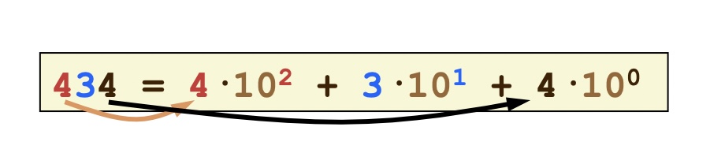

-   [1. Introduzione all'informatica](#1-introduzione-allinformatica)
    -   [1.1 Algoritmi](#11-algoritmi)
    -   [1.2 Computational Thinking](#12-computational-thinking)
-   [2. Architettura degli elaboratori](#2-architettura-degli-elaboratori)
    -   [2.1 Architettura di Von Neumann](#21-architettura-di-von-neumann)
-   [3. Introduzione ai linguaggi](#3-introduzione-ai-linguaggi)
    -   [3.1 Java](#31-java)
-   [4. Notazione Binaria](#4-notazione-binaria)
    -   [4.1 Numeri negativi](#41-numeri-negativi)
    -   [4.2 Complemento a due](#42-complemento-a-due)
    -   [4.3 Numeri in virgola mobile](#43-numeri-in-virgola-mobile)
    -   [4.4 Rappresentazione di caratteri](#44-rappresentazione-di-caratteri)
-   [5. Tipi di dato in Java](#5-tipi-di-dato-in-java)
    -   [5.1 Le variabili](#51-le-variabili)
    -   [5.2 Commenti](#52-commenti)
    -   [5.3 Costanti](#53-costanti)
    -   [5.4 Cast](#54-cast)
-   [6. Complessità computazionale](#6-complessità-computazionale)
    -   [6.1 Classi di Complessità](#61-classi-di-complessità)
-   [7. Algoritmi di Sorting](#7-algoritmi-di-sorting)
-   [8. Algoritmi di Ricerca](#8-algoritmi-di-ricerca)
    -   [8.1 Ricerca sequenziale](#81-ricerca-sequenziale)
    -   [8.2 Ricerca binaria (per bisezione)](#82-ricerca-binaria-per-bisezione)
-   [9. Strutture Dati](#9-strutture-dati)
    -   [9.1 Contenitore](#91-contenitore)
    -   [9.2 Pila](#92-pila)
    -   [9.3 Coda](#93-coda)
    -   [9.4 Deque](#94-deque)
    -   [9.5 Mappa](#95-mappa)

## 1. Introduzione all'informatica

Problemi di Hilbert (matematico di fine ‘800 che propone 23 problemi che dovranno essere risolti):

1.  La matematica è un sistema completo? Possiamo dimostrare qualsiasi verità partendo dai suoi assiomi?
2.  Esiste un procedimento passo-passo che richieda un tempo finito per risolvere tutti i problemi?

3.  Gobel nel 1931 dimostra che nella matematica, e in tutti i sistemi abbastanza complessi da contenere [l’aritmentica](https://it.wikipedia.org/wiki/Aritmetica), esistono affermazioni che non è possibile dimostrare né vere né false.
4.  Nemmeno questo è vero, esistono problemi che non possono essere risolti dalla macchina di Turing (1936). Il metodo di risoluzione passo-passo usato dalla macchina viene chiamato algoritmo.
    Bisogna notare che tutti i problemi che non possono essere risolti da una macchina di Turing non possono essere risolti nemmeno da un computer moderno, non importa quanto potente esso sia

### 1.1 Algoritmi

Un algoritmo per essere considerato tale deve avere delle determinate caratteristiche:

-   Deve essere eseguibile
-   Privo di ambiguità (per questo motivo i linguaggi di programmazione non contengono ambiguità -> hanno una sintassi molto rigorosa)
-   Arriva ad una conclusione in un tempo finito di passi

### 1.2 Computational Thinking

Conoscenza di tecniche di astrazione atte alla risoluzione di problemi
estende il pensiero matematico e ingegneristico

-   Saper stimare le risorse necessarie per risolvere un problema
-   Capire quale sia il miglior modo per risolverlo, anche magari accettando una soluzione approssimata, o un falso positivo/negativo per migliorare le prestazioni
-   Saper ridurre il problema in modo da renderlo trattabile
-   Progettare con modularità

## 2. Architettura degli elaboratori

Sistemi embedded: ci sono processori anche negli strumenti di tutti i giorni

Hanno una parte hardware e parte software

Alla base dei programmi ci sono sempre dei dati che permettono di rappresentare le informazioni
Tutta l’informazione viene sempre rappresentata in bit.

I programmi sono un insieme di istruzioni elementari eseguite in ordine stabilito ( algoritmo )

I primi computer erano formati da persone che passavano le giornate a svolgere calcoli manualmente

### 2.1 Architettura di Von Neumann


-   Quattro blocchi (CPU, memoria principale, memoria secondaria e dispositivi di input/output)
-   Un bus che li collega

    -   dati in arancione
    -   blu bus degli indirizzi (nota che solo la CPU ha il compito di assegnare gli indirizzi)

-   CPU
    È composta a sua volta da più componenti

    -   ALU: Arithmetic Logic Unit, effettua elaborazioni aritmetiche
    -   Registers: memoria temporanea per gli indirizzi della memoria alla quale la CPU sta apportando modifiche
    -   Unità di controllo: Contiene il Program Counter (che ha lo scopo di tenere in memoria il numero dello step) e l’instruction Register (che contiene tutti gli step)

    Una delle caratteristiche più importanti della CPU è il Clock, il quale indica la velocità alla quale la CPU esegue le 3 seguenti fasi (fetch-decode-execute):

    -   Accesso: l’istruzione viene letta e memorizzata nell’instruction register e il program counter viene incrementato (con eccezione di salti condizionali (if) e subroutine)
    -   Decodifica: decodifica l’istruzione
    -   Esecuzione: esegue l’istruzione

    

    PC: Program Counter
    MAR: Memory address register
    CU: Control unit
    MDR: Memory Data Register
    ACC: accumulatore dei risultati

    Per migliorare le prestazioni posso:

    -   aumentare la frequenza di clock
    -   aumentare il numero di processori o di computer
        -   Multiprocessing: diverse CPU che operano sulla stessa memoria
        -   Multicalcolatori: diversi computer che lavorano collegati in vari modi

-   Memoria in generale
    -   Suddivisa in celle, a ognuna delle quali corrisponde un indirizzo
    -   ogni cella contiene un numero predefinito di bit
    -   Un insieme di otto bit si chiama byte
-   Memoria principale
    -   Veloce ma costosa
    -   ROM (Read Only Memory)
        -   Memoria non volatile, che non si perde al riavvio
        -   Può essere sovrascritta (non proprio solo lettura, es.BIOS)
    -   RAM (Random Access Memory)
        -   è volatile
        -   Stesso tempo di accesso per tutti gli elementi sulla memoria
        -   La ram ha indirizzi specifici (espressi in codice binario), quindi c’è un limite alla quantità di ram che può essere usata (per i dispositivi a 32bit è 4GB)
        -   Il numero di celle indirizzabili è detto spazio di indirizzamento
    -   Cache
        -   Quando accedo ad un determinato indirizzo è probabile che io debba leggere le istruzioni nelle celle vicine a quel determinato indirizzo
        -   Dopo aver fatto l’acceso a quell’indirizzo è probabile che io debba accederci di nuovo
        -   La cache permette l’accesso estremamente veloce a a questi indirizzi, essa è molto costosa e di conseguenza molto piccola
-   Memora secondaria
    -   meno costosa e più lenta (es. memory swap)
    -   hard disk o ssd
    -   chiavette usb, dvd, floppy disk, tape drive
    -   idee per il futuro: usare il dna per salvare i dati informatici
-   I/O
    -   Controllo da programma: CPU che chiede ad un input informazioni sullo stato
    -   Interrupt: dispositivo che invia dati alla CPU
    -   Direct Memory Access: La CPU dà l’incarico al DMA di trasferire dei dati che poi vengono trasferiti senza ulteriori interventi da parte della CPU

## 3. Introduzione ai linguaggi

Diagrammi di Flusso (li utilizzeremo per descrivere semplici algoritmi)


-   Esempio di un algoritmo  
    Avendo depositato ventimila euro in un conto bancario che produce il 5% di interessi all’anno, capitalizzati annualmente, quanti anni occorrono affinché il saldo del conto arrivi al doppio della cifra iniziale?

    

    ```java
    int anni = 0;
    int saldo = 20000;

    while (saldo < 40000):
        saldo = saldo * 1.05;
        anni += 1;

    System.out.println(anni);
    ```

`Il computer è una macchina che memorizza dati, interagisce con i dispositivi ed esegue programmi`

**Cos’è la programmazione?**

`Una disciplina che ha come oggetto la definizione, progettazione e codifica di programmi per calcolatore`

---

`I programmi sono implementazioni di algoritmi in un linguaggio di programmazione`

Per essere corretto un programma deve essere:

-   sintatssi corretta (es. mettere il punto e virgola)
-   Correttezza semantica (es. usare system.out.println() per scrivere nella console)
-   Correttezza della soluzione (errori logici, che provocano un risultato errato)

Tre tipi di istruzioni elementari:

-   Istruzioni imperative (es. sommare due numeri, inizializzare una variabile)
-   Istruzioni condizionali (if)
-   cicli (iterazioni)

**Linguaggi di Programmazione**
Istruzioni macchina: Il livello più vicino all’hardware, ogni CPU ha un instruction set (es. “carica in un registro un valore”, controlla se esso è maggiore del valore contenuto in un’altro registro)

Il linguaggio macchina viene poi tradotto in configurazioni di bit che la cpu può comprendere:
LOAD (su un registro) e STORE (verso la memoria principale)
aritmetiche: ADD, SUB, MUL, DIV
logiche: AND, OR, NOT
JUMP (salto sul program counter) JZ (salta se valore è zero) JGZ (salta se il valore è > 0)

**L’assemblatore**
Traduce i nomi abbreviati in istruzioni binarie (es. LOAD=21)
Riescono a tradurre i _linguaggi assembly_ (anche questi diversi per ogni CPU, ci deve essere corrispondenza fra istruzioni assembly e instruction set del processore)
Permette anche di assegnare nomi agli indirizzi di memoria, rendendo il programma più leggibile

I linguaggi assembly rendono molto più comprensibile il codice, ma presentano ancora molti problemi:

-   servono molte istruzioni anche per programmi molto semplici
-   La sequenza di istruzioni cambia al cambiare della CPU, quindi supportare più CPU è costoso

**Linguaggi ad alto livello**
Permettono al programmatore di usare sitassi più vicina a quella inglese

-   Linguaggi formali
-   Devono essere - Espressivi, per descrivere molti algoritmi - comprensibili ai calcolatori, quindi non devono essere ambigui e devono essere efficienti - comprensibili al programmatore umano
    La sintassi dei programmi viene definita da EBNF (Extended Backus-Naur Form)

**Linguaggi compilati**
Legge il programma e genera il codice in linguaggio macchina specifico per la CPU

-   Codice universale, non va riscritto in base alla CPU
-   Va però compilato più volte in modo da poter supportare tutti i computer

**Linguaggi interpretati**
Il codice macchina viene prodotto “al volo”, senza creare un file separato
Questo ha il difetto di essere più lento, dobbiamo attendere la compilazione
Però è da notare che facendo così non è necessario compilare molte volte per supportare tutti i computer
La decisione tra interpretazione e compilazione si trova nelle necessità del programma

-   Se il programma deve essere più portabile è meglio optare per un linguaggio interpretato
-   Se le prestazioni sono il focus è meglio scegliere un linguaggio compilato, per spostare il lavoro sulla cpu del developer


---

**Compilatore**

Il compilatore segnala semplicemente gli errori, non tenta di capire e interpretare, perché altrimenti sarebbe un’altro punto dove nascono errori, è impossibile assicurarsi che il compilatore non interpreti nel modo sbagliato.

Di solito avvengono due step per arrivare al linguaggio macchina:

1.  Si parte dal linguaggio high-level e lo si traduce in un linguaggio assembly tramite il compilatore specifico al linguaggio di programmazione
2.  Con un’altro compilatore assembly, magari esterno e quindi comune a più linguaggi, si arriva al linguaggio macchina

---

**Storia dei linguaggi**

-   Anni ‘50: i primi linguaggi
    -   FORTRAN: primo “vero” linguaggio assieme a BASIC, COBOL
    -   Presenza di “salti” (spaghetti code)
-   Anni ’60 e ’70: programmazione strutturata
    -   Pascal (Niklaus Wirth, 1968), C (B. Kernigham e D. Ritchie, 1970-75)
    -   Strutture di controllo: sequenza-selezione-iterazione
    -   Un punto di ingresso, uno di uscita: componibilità
-   Anni ’80 e ’90: programmazione orientata agli oggetti
    -   C++ ( B. Stroustrup, 1979) , Java (J.Gosling e P. Naughton, 1991)
    -   Definisce “classi”: modelli astratti che descrivono dati e operazioni su esse (metodi). Gli oggetti sono istanze di una classe.

### 3.1 Java

Nasce nel 1991, pensato per essere semplice e indipendente dalla CPU

-   Più semplice del C++ (in particolare nella gestione della memoria)
-   “compile once, execute anywhere”
    -   Viene dato un codice intermedio (bytecode) che viene poi interpretato dalla JVM (java virtual machine), per questo viene considerato un linguaggio ibrido
    -   Indipendente dalla CPU
-   Inizialmente venne introdotto nel progetto HotJava, un browser che permetteva di scaricare degli _applet_ che si potevano eseguire su tutte le piattaforme
-   L’esecuzione è lasciata alla JVM
    -   Carica sia il programma che le sue librerie in RAM
    -   Ciò che permette di eseguire codice ovunque
    -   Garantisce e ottimizza l’uso della memoria
-   Ricca libreria standard che mette a disposizione molte funzionalità
    -   Per le funzioni comuni, è già stata probabilmente scritta una funzione dagli autori del linguaggio
-   Gestione automatica della memoria, non bisogna preoccuparsi di riservarla e liberarla
-   Non è pensato per la didattica, creare programmi molto semplici non è molto semplice
-   estensione in `.java`
-   compilatore su `javac Hello.java`, questo crea un file Hello.class
-   Poi posso eseguire il codice con `java Hello`
-   Nome classe e nome file deve essere uguale

**Hello World**

```java
public class Hello {
		public static void main(String[] args) {
				System.out.println("Hello, world!")
		}
}
```

`public class [Hello]`
definisce una classe, public ci dice che la classe può essere usata anche da altre classi

-   `public` è una parola riservata, non si può utilizzare per altro (es. chiamare così la propria variabile)
-   Ciascun file può contenere solo una classe pubblica, il cui nome coincide con il nome del file
-   Per ora useremo le classi come contenitori di metodi
    -   Un metodo definisce una sequenza di istruzioni o enunciati, descrive come svolgere un determinato compito

`public static void main(String[] args)`
definisce un metodo

-   `static` ci indica che il metodo non modifica gli oggetti all’interno della classe (per poterli modificare devo omettere il termine)

`System.out.println("Hello, world!")`

-   La destinazione è l’output_standard, cosa che poi cambia per ogni sistema operativo, ma la libreria standard se ne occupa
-   Cerca l’oggetto out nell’oggetto system
-   Il punto ha qui più significati, in base al contesto, qui prima invoca un oggetto, poi un metodo
-   esiste anche il metodo `print`, ma non va a capo

**Errori**

-   errori di sintassi
    -   es. `System.aut.println(”Hello World!”)`
-   errori logici o di esecuzione
    -   Qui il compilatore non ci aiuta, possiamo non commettere errori sintattici, ma il programma non dà il risultato che ci aspettiamo

## 4. Notazione Binaria

-   Al contrario di quanto facciamo noi, il computer può salvare in memoria solo i valori 0 e 1, quindi dobbiamo trovare un modo di convertire tutto in questo linguaggio
-   I numeri naturali sono infiniti, ma la memoria non lo è, dobbiamo salvare in memoria dei valori finiti

-   Notazione posizionale (decimale)
    Posizionale perché cifre uguali in posizioni diverse hanno valore diverso
    Salvare la cifra e la sua posizione, per poi moltiplicarla.
    
    In questo modo possiamo anche rappresentare facilmente la parte frazionaria (basta continuare con $10^{-1} 10^{-2} ...$)
-   Notazione binaria
    Funziona in modo simile a quella decimale
    

    Solo che i soli numeri possibili sono 1 o 0\
    In questo caso la conversione è semplice
    è stata scelto questo modo per un motivo tecnologico, distinguere tra acceso e spento è molto più semplice che distinguere tra 10 diversi livelli

**Conversione da decimale a binario**
In questo caso la conversione è per noi più complessa\
la parte intera e quella decimale vanno considerate separatamente
è possibile che numeri che in decimale hanno una rappresentazione esatta non ce l’abbiano in binario, ne è esempio il numero 4.35 che viene approssimato a 3.3499999. Questo può dare problemi con le operazioni

-   Convertire 75 in binario

    75/2 = 37 resto 1\
    37/2 = 18 resto 1\
    18/2 = 9 resto 0\
    9/2 = 4 resto 1\
    4/2 = 2 resto 0\
    2/2 = 1 resto 0\
    1/2 = 0 resto 1

    Leggo i resti dal basso verso l’alto e ottengo: 1001011

-   Convertire 0.703125 in binario

    0.703125 _ 2 = 1.40625 → 1\
    0.40625 _ 2 = 0.8125 → 0\
    0.8125 _ 2 = 1.625 → 1\
    0.625 _ 2 = 1.25 → 1\
    0.25 _ 2 = 0.5 → 0\
    0.5 _ 2 = 1 → 1

    dall’alto verso il basso: 0.101101

-   Convertire 0.6 in binario

    0.6 _ 2 = 1.2 → 1\
    0.2 _ 2 = 0.4 → 0\
    0..4 _ 2 = 0.8 → 0\
    0.8 _ 2 = 1.6 → 1\
    0.6 \* 2 = 1.2 → 1

    dall’alto verso il basso: $0.\overline{1001}$

A questo punto possiamo creare i numeri con la virgola fissa, mettendo insieme una parte intera con una frazionaria (possiamo trattare i numeri come separati)

In un dato numero di bit n possiamo rappresentare i numeri naturali compresi tra `[0,2n–1]∩Z` \
Con 8 bit possiamo rappresentare 256 combinazioni, partendo da zero

### 4.1 Numeri negativi

La rappresentazione più intuitiva è quella con modulo e segno\
Il primo bit della sequenza viene usato per ricordare il segno del numero (0 per positivo e 1 per negativo) e il resto dei bit rappresenta il modulo assoluto del numero

I problemi sono due:

1.  Abbiamo due zeri, 0+ e 0-, i quali sono uguali sprecando una configurazione
2.  l’algoritmo per l’addizione diventa più complesso (devono essere fatti più controlli, impatto sulle prestazioni)

### 4.2 Complemento a due

Questa è una rappresentazione più efficiente dei numeri negativi
I numeri negativi vengono rappresentati sommando il numero con $2^n$, dato n numero di bit

In questo modo possiamo rappresentare: $[–2^{n-1}$ ,$2^{n-1} -1$ ] ∩ Z Per convertire il numero così ottenuto in decimale possiamo usare questa formula

$$-a_{n-1}2^{n-1}+a_{n-2}2^{n-2} + ... + a_{1}2^{1} + a_{0}2^{0}$$

In pratica basta mettere un meno davanti al primo numero decimale e poi sommare gli altri.

**Proprietà**
Se il numero inizia con 0 possiamo dire che è positivo, se 1 è negativo\
La parte restante NON è il valore assoluto del numero
Non ci sono configurazioni sprecate (+0 e -0)

**Somma in complemento a due**\
Si usa la semplice somma in colonna, attenzione ad errori di overflow!!\
Anche la sottrazione funziona allo stesso modo\
Se un valore esce dal numero di bit impostato si può rimuovere ciò che rimane fuori\
Si ottiene un errore di _overflow_ quando sommando due numeri con lo stesso segno si ottiene un risultato di segno opposto

### 4.3 Numeri in virgola mobile

Rappresentare i numeri tramite mantissa ed esponente
La mantissa è il numero con una sola cifra decimale, l’esponente è l’esponente con base 10 che va moltiplicato al numero per ritornare al numero originario\
La lunghezza del numero in bit è definita da uno standard internazionale


Numeri “speciali”

-   Zero: esponente = -127 mantissa = 0
-   Infinito: exponente = + 128 mantissa = 0
-   NaN (not a number): exponente = + 128 mantissa ≠ 0
    Il difetto di questa rappresentazione è che la precisione si riduce all’aumentare del numero

**Base 16 e 8**\
Raggruppo i bit (da destra verso sinistra) in gruppi di 4 e li converto in una singola cifra esadecimale

### 4.4 Rappresentazione di caratteri

Conversione dei caratteri in numeri naturali\
Usiamo UNICODE come standard, il quale usa 16 bit per ogni carattere, quindi si possono esprimere 65536 caratteri\
Prima si usava ASCII, il quale aveva solo 7 o 8 bit, i primi caratteri di UNICODE coincidono ancora con quei caratteri, per compatibilità\
Noi useremo ASCII a 7 bit

-   I primi 32 sono caratteri di controllo
-   poi ci sono lettere e simboli
    ASCII esteso (8bit) contiene tutte le lettere degli alfabeti occidentali

## 5. Tipi di dato in Java

-   Tipi primitivi
    -   float (32 bit) double (64 bit) byte (8 bit) short (16 bit) int (32 bit) long (64 bit) char (8 bit) int e long possono essere anche unsigned facendo rappresentare interi più grandi
    -   La libreria standard java.lang ci permette di sapere i valori minimi e massimi dei vari tipi (byte, Byte.MIN_VALUE, Byte.MAX_VALUE)
    -   JVM non segnala gli errori di overflow, il risultato risulta semplicemente errato, errore di tipo logico
    -   L’unica operazione aritmetica che genera un errore è la divisione per zero (dividendo però un float otteniamo +/-infinito)
    -   Per assegnare un valore ad una variabile long bisogna aggiungere “L” alla fine `long l = 1345845486748064820L;`
-   Riferimenti ad un oggetto

### 5.1 Le variabili

Spazi di memoria, identificati da un _**nome**,_ che possono conservare _**valori**_ di un _determinato **tipo**_

-   Attributi
    -   visibilità: public, protected, private
    -   tipi particolari: static final
-   Si usa il camel case, variabili e metodi iniziano con la minuscola e le classi iniziano con la maiuscola
-   La dichiarazione riserva lo spazio nella memoria, ne fissa nome e tipo e definisce lo scope (in quale blocco può essere usata)
-   Prima di usare una determinata variabile è necessario inizializzarla

### 5.2 Commenti

// o / \* \* /

### 5.3 Costanti

Basta usare la keyword `final` prima del tipo di variabile

-   Questo aumenta la leggibilità
-   Per convenzione il nome della variabile finale dovrebbe essere tutto maiuscolo
-   Il vantaggio è che se lo stesso dato va usato più volte nello stesso programma lo possiamo modificare facilmente

I _literals_ sono i valori costanti (valori scritti direttamenta dall’utente nel programma), vengono sempre interpretati in int32, a meno che non venga specificato in modo diverso:

-   Se voglio assegnare un valore long ad una variabile long devo specificarlo aggiungendo `L` alla fine del numero `long numerone = 43877374218992932L`
-   Stessa cosa per i float `float number = 2.35f`
-   Per i char dobbiamo usare gli apici singoli (’), mentre per le stringhe quelli doppi (")

### 5.4 Cast

L’operazione di assegnare valori fra variabili di tipo diverso
Non è possibile assegnare un int in un byte, infatti si rischierebbe di tagliarne il contenuto, per questo otteniamo un errore dal compilatore, questo può essere sovrascritto in questo modo:
`byte i = (byte)variabile_int`

## 6. Complessità computazionale

Vedendo la ricorsione, abbiamo notato una netta differenza tra il metodo ricorsivo ed un ciclo while, possiamo ora ragionare sulle differenze prestazionali tra vari algortimi.

Un algoritmo si può analizzare

-   Sperimentalmente
-   Teoricamente
    -   Fare attenzione ai tempi esterni all'algoritmo, es. caricare la JVM richiede una certa quantità di tempo
    -   si può usare il metodo `System.currentTimeMillis()` che restituisce il timestamp attuale

Le #prestazioni si misurano in tempo impiegato e memoria occupata
spesso ridurre il tempo significa aumentare la quantità di memoria e vice versa.

L'analisi di complessità può farci scegliere un algoritmo piuttosto che un altro

Esprimiamo la complessità in n^b, per calcolare b usiamo il log-ratio (slide 13)

Anziché scrivere ogni singolo algoritmo può essere sufficiente farne una stima qualitativa

-   semplificare le operazioni primitive (assegnazioni di variabili), operazioni aritmetiche, operazioni di confronto, lettura/scrittura ad una cella di un array.\
    Queste hanno tutte tempo costante per i nostri scopi e possiamo non contarle nel calcolo
-   Indichiamo con n la lunghezza dell'input, indipendentemente dal suo tipo

### 6.1 Classi di Complessità

Polinomiali: problemi considerati "facili" che richiedono un tempo ragionevole\
Non Polinomiali: poblemi esponenziali che richiedono una gran quantità di tempo per raggiungere una soluzione

## 7. Algoritmi di Sorting

```java
public class Sorting {
    public static void main(String[] args) {
        //test array
        double[] array = new double[] {8, 3, 5, 7, 2};

        insertionSort(array);

        //print array
        for (int i = 0; i < array.length; i++) {
            System.out.print(array[i] + " ");
        }
        System.out.println();
    }

    public static void insertionSort(double[] a) {
        // il ciclo inizia da 1 perché il primo
        // elemento non richiede attenzione
        for (int i = 1; i < a.length; i++) {
            // nuovo elemento da inserire
            double temp = a[i];
            // la variabile di ciclo j va definita
            // fuori dal ciclo perché il suo valore
            // finale viene usato in seguito
            int j; // analizzare con cura il significato di j
            // durante il ciclo e alla fine del ciclo
            // vengono spostati a destra di un posto
            // tutti gli elementi a sinistra di temp
            // che sono maggiori di temp, procedendo
            // da destra a sinistra
            for (j = i; j > 0 && temp < a[j - 1]; j--)
                a[j] = a[j - 1];
            // temp viene inserito in posizione j
            a[j] = temp;
        }
    }

    public static void mergeSort(double[] array) {
        if (array.length < 2) return;
        int split = array.length / 2;
        double[] left = new double[split];
        double[] right = new double[array.length - split];
        System.arraycopy(array, 0, left, 0, left.length);
        System.arraycopy(array, split, right, 0, right.length);
        mergeSort(right);
        mergeSort(left);
        merge(array, right, left);
    }

    public static void merge(double[] array, double[] right, double[] left) {
        int ia = 0, ir = 0, il = 0;
        while (ir < left.length && il < right.length) {
            if (left[ir] < right[il]) {
                array[ia++] = left[ir++];
            } else {
                array[ia++] = right[il++];
            }
        }
        while (ir < left.length) array[ia++] = left[ir++];
        while (il < right.length) array[ia++] = right[il++];
    }

    public static void selectionSort(double[] array) {
        for (int i = 0; i < array.length; i++) {

            //search the position of the min, without looking at the already sorted positions
            int minPos = i;
            for (int j = i; j < array.length; j++) {
                if (array[minPos] > array[j]) {
                    minPos = j;
                }
            }

            //swapping the two positions
            double t = array[i];
            array[i] = array[minPos];
            array[minPos] = t;
        }
    }
}
```

## 8. Algoritmi di Ricerca

### 8.1 Ricerca sequenziale

inizializzo un booleano a false
Iterazione su tutto l'array
se trovo l'elemento la varibile va a true

controllo il risultato guardando la variabile.
Questo ha complessita O(n)

### 8.2 Ricerca binaria (per bisezione)

Funziona solo in un array ordinato e permette di cercare l'elemento estremamente veloce

## 9. Strutture Dati

Definizione: contenitori che organizzano i dati in un formato specifico

Nel scegliere una struttura dati va trovato un compromesso tra queste esigenze:

-   Tempo di costruzione della struttura
-   tempo di accesso
-   occupazione di spazio di memoria
    Conoscendo il funzionamento e l'impelementazione delle varie stutture dati ci dà la possibilità di scegliere meglio

-   Strutture dati

    -   Lineari: array, liste contcatenate
    -   non lineari: non le vedremo

-   Strutture dati astratte (Abstract data type)
    -   Pila, coda (es. undo/redo)
    -   Mappa, dizionario
    -   Tabella, hashtable
    -   insieme

Quasi tutte queste strutture possono essere implementate utilizzando un array, le strutture dati sono una costruzione di una classe che ne controlla l'accesso
In java useremo le interfacce per descrivere il comportamento della classe

### 9.1 Contenitore

Alla base di tutti i data type abbiamo il contenitore, il quale contiene solo pochissimi metodi e che verrà poi esteso in base alle necessità

```java
public interface Container {
	boolean isEmpty();
	void makeEmpty();
}
```

### 9.2 Pila

Last In - First out
possiamo rappresentare la pila in verticale o in orizzontale

`push` inserisce un elemento in cima alla pila\
`pop` rimuove l'ultimo elemento aggiunto (e lo restituisce)\
`top` restituisce l'ultimo elemento

```java
public interface Stack extends Container {
	void push(Object obj);
	Object pop();
	Object top();
}
```

Se viene chiamato pop() su una pila vuota va lanciata un'eccezzione (IllegalStateException può essere usata, oppure ne possiamo creare una nuova)

### 9.3 Coda

First In, First Out
si aggiunge dalla fine e si toglie dall'inizio

```java
public interface Queue extends Container {
	void enqueue(Object obj);
	Object dequeue();
	Object getFront();
}
```

### 9.4 Deque

pila + coda

```java
public interface Deque extends Container {
	void addFirst(Object obj);
	void addLast(Object obj);
	Object removeFirst() throws EmptyDequeException;
	Object removeLast() throws EmptyDequeException;
	Object getFirst() throws EmptyDequeException;
	Object getLast() throws EmptyDequeException;
}
```

### 9.5 Mappa

Come dict di python

```java
public interface Map extends Container {
	/** restituisce il valore al quale la chiave specificata e’ associata, o null se
	questa mappa non contiene associazione per la chiave. */
	Object get(Object key);

	/** rimuove l’associazione di chiave specificata se questa e’ presente nella
	mappa. Restituisce il valore associato (o null se non c’era associazione) */
	Object remove(Object key);

	/** Inserisce l’associazione di chiave e valore specificati in questa mappa. Se la
	mappa gia’ conteneva un’associazione con questa chiave (altrimenti null), il
	vecchio valore e’ sostituito con il valore specificato */
	Object put(Object key, Object value);

	/** restituisce un array contenente le chiavi di tutte le associazioni presenti
	nella mappa */
	Object[] keys();
}
```
