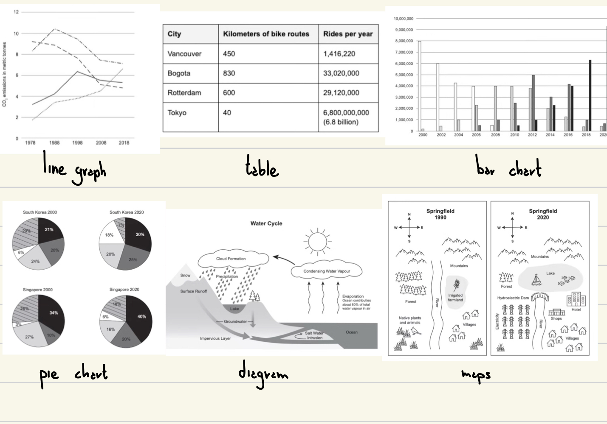

1 hour of time to do both, it can be organized as you wish.
IELTS on computer has the character count!
For reference, following this templates I got a 7.0 in the test.

# Writing Task 1

20 minutes, 150 words. Worth 1/3 of the exam.

There could be a:

Or any combination of them.

The request is:
"Summarise the information by selecting and reporting the main features and make comparisons where relevant."

Let's break it down:

-   "Summarise the information": This is **not** a creative task, its only assesses the ability to identify trends and to give a **well-organized** overview using an **academic language**.
    It's important to not give any opinions on what you see.
-   "select and report the main features": There is no space to report every single information, it's important to choose the main information and what should instead be ignored or mentioned quickly.

    #oss How to do this: for anything that evolves over time individuate its trend, increasing, decreasing, fluctuating (these trends may have some outliers). If there are two or more lines say which one is on top or the bottom and how this changes over time.

    You should also support your writing with important data taken from the chart.

-   "make comparisons where relevant": You don't always have to do this, but when the data shows a significant trend, comparing between two periods of time is possible.

In this task is particularly important to analyze the data and plan the writing.

> Writing the report is very similar for all types of charts except for #maps and #process diagrams, for this reason I added some notes to better show what you should do if you encounter them.

## Structure

#### introduction

the question paraphrased
The chart/table/pie graph/chart/diagram/map shows/illustrates/compares/presents ...
#oss If there are two charts they must be both introduced

#### overview

presents a clear overview of main trends, differences, or stages
Overall/ To summarise/ In summary/ In brief/ It can be clearly seen that ...
Possible overview topics:

-   overall increase, decrease, fluctuation
-   very high or very low points
-   more or less of something (e.g. more males, fewer females, more employed)

#oss If there are two charts you don't necessarily need to have two overviews, just one comparing the two is enough

#maps maps: - biggest changes (more or less of something)

#process process diagrams: - man made? or natural? - number of stages - what are start and end point? what is the result? what are the ingredients? (is it cyclical?) - if there are two processes, compare them and write the main differences

#### paragraphs

Go into more detail from what you wrote on the overview and USE DATA from the chart to support your ideas.

For maps, if there are two you can describe the first one in the first paragraph and the other one in the second.
if there are 3 maps then do 3 body paragraphs.
#maps In maps the number of houses is a number and should be used in the body paragraph

#process in process diagrams:

-   if there are two diagrams, compare the features of each (do not write one paragraph for the first process and another one for the other, too many words)
-   just describe the main steps of the process splitting them into two paragraphs at random.

> **Linking Words**
> comparing: similarly / likewise / in the same way
> contrasting: on the other hand / while / whereas
> sequencing: Firstly / Secondly / Thirdly / next / then
> reason: in order to / so that
> cause and result: so / therefore / thus / consequently / as a result

# Writing Task 2

40 minutes, more then 250 words. Worth 2/3 of the exam.

## essay types

Do you agree/disagree... OR To what extent do you agree...
In this case state your opinion in introduction and conclusion and write two paragraphs about why you agree/disagree.
"Firstly, ...yapping...
Secondly, ..more yapping...."
Discuss both sides and give your opinion OR what are di advantages/disadvantages....
In this case do 1 paragraph with one side and another with the other.
State your opinion in introduction/conclusion only if requested.
"On the one hand, ...yapping....
On the other hand, ...again yapping..."
Cause/Solution and Problem/Solution
causes in a paragraph, solutions in another.
if only solutions are requested, two paragraphs, two solutions
Direct Questions
Answer the questions in separate paragraphs, for one of the two answers you may use 2 paragraphs

## essay structure

#### introduction

-   paraphrase the question
-   state your opinion, "this essay agrees..." (if required by the question)

#### body paragraphs

2 body paragraphs

-   first sentence: topic sentence (a single phrase with the seed of your idea)
-   explain the sentence
-   example

To generate ideas think about having to persuade somebody else into agreeing/disagreeing with your position.

#### conclusion

reiterate the opinion (if required by the question) and summarize the two main ideas
