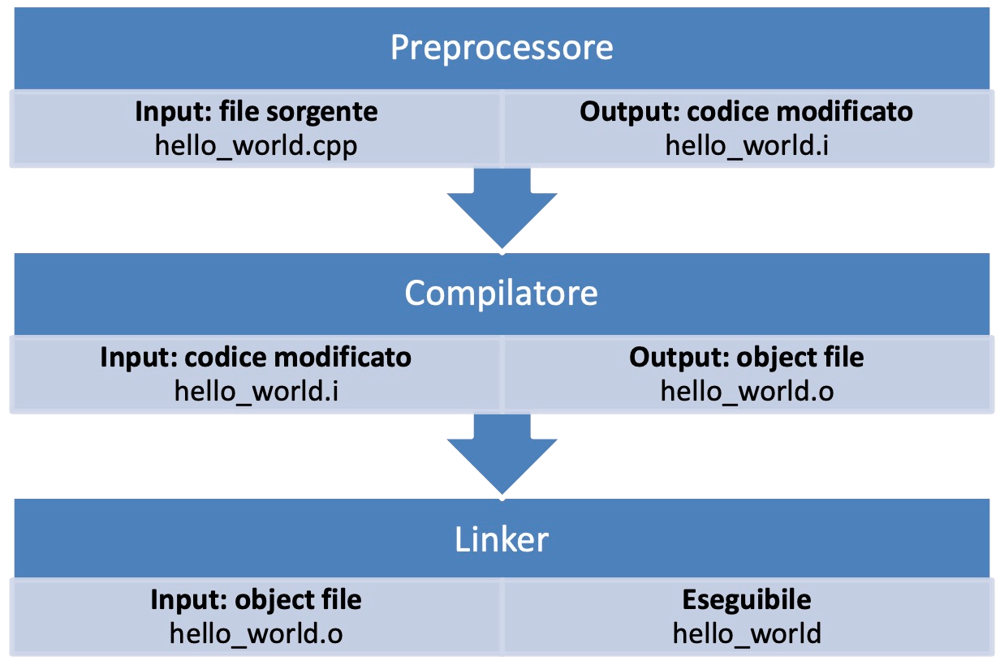
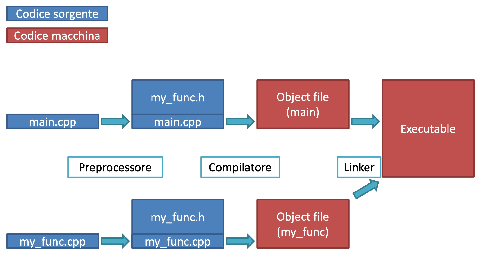
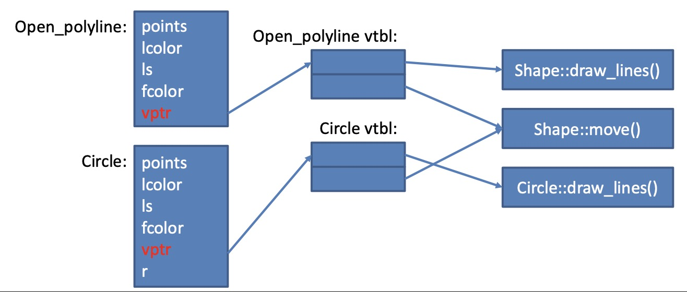
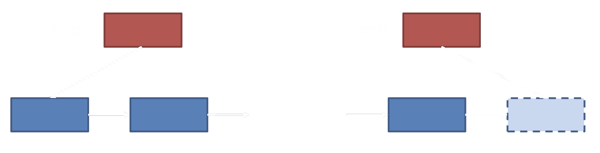
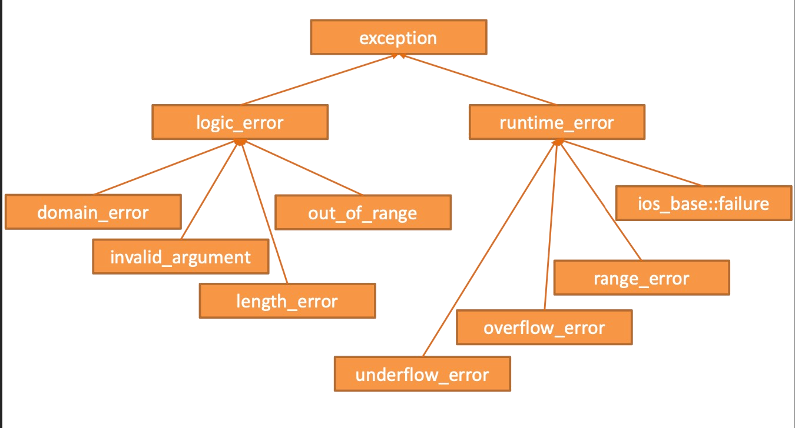

-   [The basics of C++](#the-basics-of-c)
    -   [1. Il Compilatore](#1-il-compilatore)
        -   [1.1 Librerie](#11-librerie)
    -   [2. Istruzioni](#2-istruzioni)
        -   [2.1 Operatori](#21-operatori)
        -   [2.2 Istruzioni](#22-istruzioni)
    -   [3. Variabili e tipi](#3-variabili-e-tipi)
        -   [3.1 Convenzioni](#31-convenzioni)
        -   [3.2 Type safety](#32-type-safety)
        -   [3.3 Variabili statiche e globali](#33-variabili-statiche-e-globali)
-   [Abstraction Mechanisms](#abstraction-mechanisms)
    -   [4. Scope](#4-scope)
    -   [5. Funzioni](#5-funzioni)
        -   [5.1 Argomenti per valore](#51-argomenti-per-valore)
        -   [5.1 Argomenti per reference](#51-argomenti-per-reference)
        -   [5.3 Chiamata a funzione](#53-chiamata-a-funzione)
    -   [6. Classi](#6-classi)
        -   [6.1 Interfaccia e Implementazione](#61-interfaccia-e-implementazione)
        -   [6.2 Stato e Invarianti](#62-stato-e-invarianti)
        -   [6.3 Definizioni delle funzioni membro](#63-definizioni-delle-funzioni-membro)
        -   [6.4 Costruttori e Distruttori](#64-costruttori-e-distruttori)
        -   [6.5 Overloading degli operatori](#65-overloading-degli-operatori)
        -   [6.6 Costruttore di copia](#66-costruttore-di-copia)
        -   [6.7 Costruttore Move](#67-costruttore-move)
    -   [7. Gestione del codice](#7-gestione-del-codice)
        -   [7.1 Header](#71-header)
        -   [7.2 Cmake](#72-cmake)
        -   [7.3 Git](#73-git)
    -   [8. Enumerazioni](#8-enumerazioni)
    -   [9. Polimorfismo](#9-polimorfismo)
    -   [10. Template](#10-template)
        -   [10.1 Classi](#101-classi)
        -   [10.2 Funzioni](#102-funzioni)
    -   [11. Ereditarietà](#11-ereditarietà)
        -   [11.1 Classi astratte](#111-classi-astratte)
        -   [11.2 Slicing](#112-slicing)
        -   [11.3 Virtual Pointer e Virtual Table](#113-virtual-pointer-e-virtual-table)
-   [Memory managment](#memory-managment)
    -   [12. Puntatori e Reference](#12-puntatori-e-reference)
        -   [12.1 Puntatori](#121-puntatori)
        -   [12.2 Puntatori vs Reference](#122-puntatori-vs-reference)
        -   [12.3 Cast](#123-cast)
    -   [13. Strutture dati](#13-strutture-dati)
        -   [13.1 Array](#131-array)
        -   [13.2 Stringhe](#132-stringhe)
    -   [14. Allocazione dinamica della memoria](#14-allocazione-dinamica-della-memoria)
        -   [14.1 Garbage Collector](#141-garbage-collector)
    -   [15. Smart Pointer](#15-smart-pointer)
        -   [15.1 unique_prt](#151-unique_prt)
        -   [15.2 shared_pointer](#152-shared_pointer)
-   [The Standard Library](#the-standard-library)
    -   [16. Standard Template Library](#16-standard-template-library)
    -   [16.1 Sequenze e iteratori](#161-sequenze-e-iteratori)
        -   [16.2 Contenitori STL](#162-contenitori-stl)
    -   [17. Algoritmi STL](#17-algoritmi-stl)
        -   [17.1 If predicato](#171-if-predicato)
        -   [17.2 Function object](#172-function-object)
        -   [17.3 Lambda expression](#173-lambda-expression)
    -   [18. Standard Exception](#18-standard-exception)
        -   [18.1 Custom exceptions](#181-custom-exceptions)
        -   [18.2 Gestione delle risorse dopo un'eccezione](#182-gestione-delle-risorse-dopo-uneccezione)

# The basics of C++

## 1. Il Compilatore

-   Traduce il codice sorgente in codice macchina
-   Verifica la sintassi e la correttezza
-   Segnala eventuali errori



-   Preprocessore\
    Espande il file sorgente leggendo le istruzioni che iniziano con `#`
    Ci sono diversi comandi che può eseguire.
    L'azione più importante è la gestione delle librerie da importare e, più in generale la gestione di pezzi di codice che vengono inclusi in modo condizionato (ad es. in base al sistema operativo).

-   Compilatore\
    Il compilatore traduce il codice in c++ in codice macchina

-   Linker\
    Crea l'eseguibile a partire dal codice, includendo le varie librerie

### 1.1 Librerie

Ogni libreria ha un file header (`.h`) che dichiara le entità contenute in essa, ad esempio funzioni e classi

Gli header possono essere poi inclusi dall'utente in vari modi:

-   `#include <iostream>` per gli header di sistema
-   `#include "board.h"` per gli header definiti dall'utente
    Questa struttura permette di raggruppare dichiarazioni e definizioni in due posti separati, rendendo più leggibile il codice.


Le librerie vengono poi linkate dal preprocessore e inserite dal linker nello stesso eseguibile.
Questa strategia permette di ottenere file che portano con sé tutte le necessarie librerie.

Tuttavia se molti eseguibili includono le stesse librerie c'è il rischio di occupare eccessivo spazio in memoria per salvare più volte le stesse librerie. Per questo esistono le librerie dinamiche, che vengono salvate solo una volta in memoria e poi vengono linkate dagli eseguibili.
Sono chiamate SO (Shared Object) sotto Linux e DLL (Dynamic Linking Library) sotto Windows.

## 2. Istruzioni

### 2.1 Operatori

Ogni operatore ha 1, 2, 3 operandi e un risultato.

Da un punto di vista prestazionale è conveniente lasciare libertà al compilatore di eseguire le istruzioni nell'ordine migliore, questo però significa che l'ordine non è noto al programmatore.

Alcuni operatori hanno un _side effect_, ovvero modificano gli operandi su cui operano (es. `i++;`)

È sbagliato usare la stessa variabile più di una volta se su essa sono applicati operatori con side effect. (es. `v[i] = ++i;`), questo proprio perché non è noto l'ordine di esecuzione.

### 2.2 Istruzioni

Un'istruzione è una parte di codice che specifica un'azione (termina con `;`)
(non contano come istruzioni le direttive al preprocessore)
#esempio Dichiarazioni, if, for, while, ..

**Dichiarazioni**\
possono essere di variabili, di funzioni. Più in generale ogni nome deve essere dichiarato prima che possa essere usato\
Una dichiarazione può avere effetto sulla memoria, ma non è certo

**Definizioni**\
Una dichiarazione che specifica completamente l'oggetto

```cpp
double sqrt(double) //dichiarazione
double sqrt(double d) { return d*d; } //definizione E dichiarazione
```

Questa differenza è utile per sapere l'entità prima dell'implementazione

## 3. Variabili e tipi

**Tipo:** Definisce una tipologia di contenuto, un range di valori e un insieme di operazioni per l'oggetto.\
**Oggetto:** Una regione di memoria con un tipo.\
**Valore:** L'elemento posto nella variabile.\
**Variabile:** Un oggetto con un valore, un oggetto nel concreto.

### 3.1 Convenzioni

-   Nomi significativi, ma allo stesso tempo non troppo lunghi
-   evitare acronimi
-   nomi brevi sono accettati se usati in ambito ristretto (es. `i` in un for loop)
-   anche nomi eccessivamente lunghi non sono i migliori

Utilizzo di snake_case per le variabili e PascalCase per classi/funzioni
[Google Style Guide](https://google.github.io/styleguide/cppguide.html)

<code style="color : gold">OSS</code>
Regole degli identificatori in C++:

-   Possono iniziare SOLO con una lettera o un underscore `_`
-   Non possono contenere spazi o caratteri speciali come !, #, %, etc.

### 3.2 Type safety

Il motivo per cui implementiamo la tipizzazione degli oggetti è per poter ricevere degli avvisi nel caso in cui la conversione che stiamo cercando di fare sia problematica.

Una conversione da `int` a `double` è considerabile type safe.
Mentre una conversione da `int` a `bool` non dovrebbe essere permessa senza considerazione, dei dati vengono persi.

Da c++ 11 è possibile usare parentesi graffe per controllare di non incappare nel `type narrowing`

```cpp
double x {2.7};    // OK
int y {x};         // errore: narrowing conversion
```

<code style="color : gold">OSS</code> Non è type safe utilizzare una variabile non inizializzata:

```cpp
double x;
double y = x;
```

Non inizializzando rimangono i valori precedenti nella memoria (_questo non vale per variabili globali o statiche che vengono inizializzate a 0_)

### 3.3 Variabili statiche e globali

```cpp
string program_name = "silly";

void f() {
	static int i;
	int j;
}
```

-   Variabili Globali\
    Inizializzate prima del main, esistono fino al termine del programma
    Sono sempre statiche.
    Nell'esempio, `program_name` è una variabile globale statica
-   Variabili Statiche\
    Vengono inizializzate solo la prima volta, mantengono il loro valore al di fuori dell scope
    Possono essere sia globali che locali
    Nell'esempio `i` è una variabile statica.
-   Variabili locali automatiche\
    Classiche variabili, vengono eliminate all'uscita dallo scope

**Lvalue e Rvalue**\
l'operatore che si trova alla sinistra (o a destra) dell'operatore uguale
Alcune espressioni possono essere sia usate come lvalue che come rvalue, altre no.\
Si possono pensare gli rvalue come dei valori costanti che non variano nell'espressione, mentre gli lvalue sono quelli che stanno venendo modificati.

**Costanti**\
Si possono fare usando `constexpr` se il valore è noto in compilazione.
Si può usare `const` se il valore è noto solo in esecuzione.

# Abstraction Mechanisms

## 4. Scope

Una _regione del testo_ di un programma, evidenziata dalle parentesi graffe.
Così da rendere locali le variabili, ciascuna variabile è valida solamente all'interno del suo scope.

Il nome delle variabili dovrebbe rispecchiare la loro località, nomi più descrittivi sono adatti a variabili con uno scope più grande.

-   Scope Globale\
    al di fuori di ogni altro scope, vale all'interno di tutto il file\
    Le **funzioni** sono spesso definite nello scope globali, ma è problematico farlo per le **variabili**:
    -   rende difficile la protezione (tutte le funzioni del file possono potenzialmente modificarla)
    -   rende quasi impossibile il debug
-   scope di classe
-   scope locale
    all'interno di un blocco {}
-   scope di statement
    ad es. in un loop for
-   namespace
    uno scope con un nome, permettono di organizzare classi, funzioni, ... usati spesso per le librerie

    ```cpp
    namespace TextLib {
    	class Text { /* ... */ };
    	class Line { /* ... */ };
    }

    TextLib::Text //namespace::membro -> fully qualified name
    ```

    Purtroppo l'uso di namespace può appesantire il codice, bisogna sempre specificare `TextLib`\
    Per risolvere si può usare la keyword `using`

    ```cpp
    using namespace TextLib;
    Text;
    ```

## 5. Funzioni

Le funzioni prendono dei valori in input e ne ritornano altri in output.

```cpp
int fct(int a, int b) { return a*b; } // Qui a e b sono argomenti formali o parametri
int c = fct(a, b); //qui a e b sono argomenti
```

Il passaggio di valori tra uno scope e un'altro può essere fatto in diversi modi.

### 5.1 Argomenti per valore

Viene creata una copia dell'oggetto nel nuovo scope.
Questo significa che i dati originali non vengono modificati dalla funzione, ma allo stesso tempo significa che vengono duplicati dei dati della memoria.
Ci sono quindi dei potenziali problemi di efficienza nel caso di argomenti di grandi dimensioni.

### 5.1 Argomenti per reference

Per evitare la copia possiamo passare solamente una reference al dato.
È sufficiente aggiungere una & al tipo, da `print(int v)` a `print(int& v)`, il resto del codice rimane uguale, la differenza sintattica è minima.

Dal punto di vista fisico ora la funzione si deve salvare solo una quantità fissa di memoria e può gestire argomenti di qualsiasi dimensione.

Bisogna però porre attenzione perché ora è possibile scrivere sulla variabile originale.
Per proteggere questo si può passare l'argomento per const reference `print(const int& v)`.

### 5.3 Chiamata a funzione

La chiamata a funzione viene gestita, in modo simile a quanto fatto manualmente in assembly, da una struttura dati, chiamata _function activation record_:
Essa è uno stack (pila) che contiene i parametri, le eventuali variabili locali e l'indirizzo a cui ritornare quando la funzione ha completato l'esecuzione.

-   Text segment:\
    Contiene il codice del programma, viene copiato in memoria dal file eseguibile, è spesso read-only
-   Initialised data segment:\
    Contiene variabili globali e statiche
-   Uninitialized data segment:\
    Viene inizializzato a 0 dal sistema, contiene variabili globali e statiche non inizializzate
-   Stack = Activation record
-   Heap:\
    Regione di memoria gestita in modo dinamico, tramite `new` e `delete`

## 6. Classi

Le classi sono utili per esprimere idee in codice.
C++ ha un forte focus sui tipi, è possibile usare:

-   Tipi built-in (int, char, bool, ...)
-   _User defined types_ (std::string, std::vector, ...)

Una classe comprende

-   Dati di tipo built-in
-   Dati di tipo UDT
-   Funzioni

All'interno della classe si può usare il puntatore this, una reference all'oggetto

<code style="color : gold">OSS</code> `this` è immutabile, non può essere riassegnato

### 6.1 Interfaccia e Implementazione

L'interfaccia è _public_ e definisce l'entità della classe, accessibile agli utenti

-   L'Interfaccia deve essere completa
-   Deve essere minimale, tutto ciò che può essere una helper function deve essere helper function
-   Deve fornire costruttori
-   La copia deve essere supportata o proibita (Con il costruttore di copia E con l'assegnamento di copia)
-   Lo spostamento deve essere supportato o proibito (Con il costruttore di move E con l'assegnamento di move)
-   Usare tipi adeguati per controllare gli argomenti
-   Identificare le funzioni membro costanti
-   Liberare tutte le risorse nel distruttore

L'implementazione è _private_, accessibile solo tramite l'interfaccia

_(Di default i membri di una class sono privati.)_

### 6.2 Stato e Invarianti

Lo stato di una classe descrive i valori correnti dei dati dell'oggetto
Gli invarianti sono una serie di regole che definiscono quali sono gli stati validi e quali sono invalidi per l'oggetto.

L'utilizzo di helper function per la lettura e la scrittura dei dati nell'oggetto è necessario per mantenere sempre valido lo stato dell'oggetto.

### 6.3 Definizioni delle funzioni membro

Le funzioni membro devono sempre essere dichiarate dentro la classe, ma l'implementazione si può inserire sia nella classe che all'esterno della classe.
Questo per semplificare l'organizzazione del codice e per non appesantire la definizione della classe con i dettagli implementativi.

È possibile farlo direttamente inline nel caso di funzioni particolarmente brevi per comodità.
Questo tuttavia è solo un consiglio al compilatore che può decidere quale strada prendere.

```cpp
class Date{
public:
	int getMonth() const {} //indica che non modifica gli elementi
	const int& getMonth() const {} // non modifica gli elementi e la reference non                                          può essere modificata
}

Date::getMonth(){}; //implementazione
```

### 6.4 Costruttori e Distruttori

Un costruttore si definisce creando una funzione con lo stesso nome della classe.
Dato che spesso i costruttori servono semplicemente ad inizializzare l'oggetto c++ ci fornisce una sintassi appositamente creata per questo utilizzo.

```cpp
Date::Date(int yy, int mm, int dd): y{yy}, m{mm}, d{dd} { };

Date next {2014, 2, 14};
```

<code style="color : gold">OSS</code> Il costruttore di default viene disabilitato appena si costruisce un'altro costruttore
Per questo spesso è necessario reimplementarlo.

<code style="color : gold">OSS</code> Possiamo aggiungere la keyword `explicit` sul file `.h` per bloccare le chiamate implicite al costruttore con gli annessi possibili cast impliciti.

Il distruttore è necessario per liberare la memoria nel free store.
Uno di default viene creato dal compilatore se non ne viene scritto uno, ma va sovrascritto in tutti i casi in cui si usa direttamente l'allocazione dinamica della memoria
`~NomeClasse(){};`

### 6.5 Overloading degli operatori

Gli operatori sono degli elementi fondamentali nelle espressioni, come +, =, +=, ...
È possibile ridefinirli per i tipi UDT in due modi:

-   Funzione membro (`d.operator++()`)
-   Helper function (`operator++(d)`) (_preferibile_)

### 6.6 Costruttore di copia

Il costruttore di copia viene chiamato quando usiamo l'operatore `=`, per esempio `MyVector v2 = v;`
Di default fa la copia membro a membro, questo però è un problema con il free store in quanto copia solo il puntatore alla memoria, che rimane invariata.

Il costruttore di copia ci permette di ridefinire questo comportamento.

```cpp
class vector {
public:
	// costruttore di copia
	vector(const vector& v) : length{v.length} {
		//è necessario qui inizializzare tutte le variabili
		arr = new int[length];
		std::copy(v.arr, v.arr + length, arr)
	};

	//copy assignment
	vector& operator=(const vector& v) {
		if (this == &b) return *this; //self assignment check
		length = v.length;
		cost = new int[length];
		std::copy(v.cost, v.cost + v.length, cost);

		return *this;
	}
}
```

Va gestito anche l'assegnamento di copia `operator =`, molto simile al costruttore di copia, ma elimina i dati del vecchio vettore

<code style="color : gold">OSS</code> attenzione all'auto assegnamento `v=v`

### 6.7 Costruttore Move

Utile per quando vogliamo spostare i dati, senza effettuarne una copia, per esempio quando ritorniamo un valore da una funzione.

Rubiamo quindi i dati ad una struttura dati invalidandola.

```cpp
class vector {
	int sz;
	double* elem;
public:
	// move constructor
	vector(vector&& a) : sz{a.sz}, elem{a.elem} {
		//invalida a
		a.sz = 0;
		a.elem = nullptr;
	};

	// move assignment
	vector& operator=(vector&& b){
		if (this == &b) return *this;
		length = b.length;
		cost = new int[length];
		std::copy(b.cost, b.cost + b.length, cost);

		return *this;
	}
};
```

<code style="color : gold">OSS</code> La notazione `&&` è chiamata _rvalue reference_

## 7. Gestione del codice

Quando si lavora su progetti più grandi è importante organizzare il codice in più file.
Esistono due tipi di file

-   Header (`.h` o `.hpp`)
    Contengono solamente le dichiarazioni
-   File Sorgente (`.cpp`)
    Contengono le definizioni di quanto dichiarato nell'header

### 7.1 Header

Ogni header deve includere le include guards

```cpp
#ifndef RATIONAL_H
#define RATIONAL_H

// ...

#endif // RATIONAL_H
```

Questo evita che il file venga incluso più volte

### 7.2 Cmake

Esistono vari sistemi di building (make, ninja, ...), spesso dipendenti dalla piattaforma su cui si lavora.

Cmake permette di standardizzare la compilazione.

-   È supportato da molti IDE
-   Specifica i target di compilazione e le librerie da linkare
-   Gestito tramite il file CMakeLists.txt
-   Ha un software che fornisce un'interfaccia grafica

Cmake permette di compilare selettivamente i moduli

```cpp
cmake_minimum_required(VERSION 2.8...3.5 FATAL_ERROR)
project(Monopoli VERSION 1.0.0 LANGUAGES CXX)

add_library(Game include/Game.h src/Game.cpp)

add_executable(Main main.cpp)

target_link_libraries(Main Game)
```

### 7.3 Git

Aiuta nella collaborazione di più programmatori allo stesso progetto.
Permette inoltre di tenere un record dei cambiamenti.

Tiene una database delle versioni per ogni computer locale, inoltre si può usare un server per sincronizzare le modifiche, gestire conflitti e eseguire automazioni.

## 8. Enumerazioni

Sono un insieme di etichette ad un codice numerico, utili per la leggibilità del codice.

Crea i nomi all'interno di uno scope con lo stesso nome dell'enum.
Quindi si può accedervi con `Month::jan`.

Il valore viene incrementato di 1 per ogni elemento, si può specificare quello iniziale oppure si possono specificare tutti manualmente.

```cpp
enum class Month{
	jan = 1, feb, mar, apr, may, jun, jul, aug, sep, oct, nov, dec
};
```

## 9. Polimorfismo

Abilità di associare comportamenti specifici diversi a un'unica notazione

-   Polimorfismo statico a tempo di compilazione: Templates
-   Polimorfismo dinamico a tempo di esecuzione : Ereditarietà

## 10. Template

Anche detti _generics_, è un meccanismo che permette di usare un tipo come un parametro da specificare solo a tempo di compilazione.

```cpp
vector<double>
vector<int>
vector<vector<int>>
```

Il template scompare nel codice compilato, il compilatore duplica la classe vector per ogni tipo che viene usato. (per questo è necessario sapere i tipi a tempo di compilazione)

### 10.1 Classi

Per creare questi template si usa la keyword `template`

```cpp
template<typename T>
class vector {
	int sz;
	T* elem;
public:
	vector() : sz{0}, elem{nullptr} {}
};
```

Per poter usare i template è necessario fornire al compilatore, nell'header, la definizione di funzione.
Per mantenere la separazione useremo i file .hpp

```cpp
// #file vector.h

#ifndef vector_h
#define vector_h
template<typename T>
class vector{
	void resize(int newsize);
};
#include "vector.hpp"
#endif
```

```cpp
// #file vector.hpp

#ifndef vector_hpp
#define vector_hpp
template <typename T>
void vector<T>::resize(int newsize){}
#endif
```

### 10.2 Funzioni

Si può usare la stessa sintassi sulle funzioni, in questo caso la funzione viene chiamato _algoritmo_

```cpp
template <typename T>
T myMax(T x, T y) {
	return (x > y) ? x : y;
}
```

Nel template possiamo usare anche `int` o altri tipi, unica limitazione è che i loro valori devono essere noti a tempo di compilazione.

## 11. Ereditarietà

### 11.1 Classi astratte

Si definiscono astratte le classi il cui costruttore è definito come `protected`, non possono quindi essere utilizzate dall'utente, ma vanno usate le sue sottoclassi.

Classi astratte possono avere anche funzioni `virtual` che sono funzioni che obbligano le sottoclassi all'`override`.
Se poniamo la funzione =0 diventa virtuale pura, quindi non definita nella classe base, ma solo in quelle derivate.

```cpp
class A {
public:
	virtual void print() = 0;
protected:
	A() {};
}

class B: public A {
	void print() override {
		std::cout << "B";
	}
}
```

### 11.2 Slicing

Se creo una classe `A` con 1 membro e una sua sottoclasse `B: public A` aggiunge un membro, arrivando a 2.
Creando un `vector<A>` non è type safe aggiungere nel vettore elementi di `A` e `B`, in quanto il tipo `A` non possiede abbastanza spazio per far stare il membro aggiuntivo di B.

<code style="color : gold">OSS</code> un altro caso dove si può ottenere slicing sono i costruttori di copia e `operator=`, per questo vanno disabilitati.

### 11.3 Virtual Pointer e Virtual Table



Ogni classe derivata da una classe base (NON ogni oggetto della classe) ha tra i suoi membri un `vptr` (virtual pointer), un puntatore che punta a `vtbl` (virtual table).
La virtual table associa le funzioni della classe derivata a quelle della classe base qualora queste funzioni non venga fatto l'override, oppure associa la funzione alla funzione nuova.

# Memory managment

## 12. Puntatori e Reference

### 12.1 Puntatori

Un puntatore è un particolare tipo di variabile che contiene un indirizzo di memoria.
Contiene l'informazione riguardo al tipo che viene puntato.

```cpp
int pi = 3;
int* piaddr = &pi;
piaddr // indirizzo di pi
piaddr* // 3
```

Esiste anche un `nullptr` utile per avere un valore non valido

Esiste il tipo `void*` che permette di saltare ogni check, punta a memoria raw.

Vanno fatte anche considerazioni sulla dimensione del dato puntato.

```cpp
char ch = 'a';
int* pi = &ch3; // ERRORE, qui posso sovrascrivere memoria esterna alla variabile                        (char sono 8 bit, int sono 32)
```

### 12.2 Puntatori vs Reference

Sia il puntatore che la reference possono essere usati per accedere al dato puntato, ma solo il puntatore può spostarsi nella memoria, la reference una volta assegnata rimane costante.

Shallow copy

```cpp
int i, j;
int *p1 = &i;
int *p2 = &j;
p2 = p1;
```

Deep copy

```cpp
int i, j;
int &r1 = i;
int &r2 = j;
r2 = r1;
```

Inoltre non si possono creare array di riferimenti
E spesso i riferimenti vengono detti nomi alternativi di un oggetto o di una variabile.

### 12.3 Cast

Permettono la conversione esplicita tra i tipi.

| Nome cast        | Effetto                                                                                        |
| ---------------- | ---------------------------------------------------------------------------------------------- |
| static_cast      | Conversione esplicita tra i tipi, ancora con alcuni check (no conversione da puntatore a dato) |
| reinterpret_cast | Conversione libera, anche da `int` a `double*`                                                 |
| const_cast       | Elimina la constness                                                                           |

## 13. Strutture dati

### 13.1 Array

Una sequenza omogenea di oggetti allocati in spazi contigui di memoria.
Tutti oggetti dello stesso tipo, indicizzati con `[]` ad accesso casuale.
La dimensione deve essere costante e conosciuta a tempo di compilazione.

Quando definiamo un array ci viene ritornato un puntatore al primo elemento.
Grazie all'aritmetica dei puntatori ci possiamo spostare sull'array tramite la somma/sottrazione degli interi.

```cpp
int vector[100];
vector // puntatore al primo elemento
*vector // primo elemento
```

### 13.2 Stringhe

Anche le stringhe in stile C sono simili a degli array di char
Terminano con il carattere terminatore `'\0'`

Il problema sia degli array che delle stringhe è che si perde facilmente l'informazione sulla lunghezza della struttura dati.

## 14. Allocazione dinamica della memoria

In alcuni casi è fondamentale poter fornire la dimensione dell'array in esecuzione, dato che non sempre ne conosciamo la dimensione a tempo di compilazione.

Per fare questo possiamo usare l'Heap, il free store.
Per accedervi usiamo la keyword `new` che ci ritorna solamente un puntatore alla memoria appena riservata.

Anche in questo caso non esiste controllo sui range, con il puntatore creato possiamo accedere a qualsiasi indirizzo di memoria, con il programma che termina automaticamente solo in alcuni casi (`segmentation error`)

Inoltre la memoria non viene inizializzata, costruendo un array si prendono i dati precedentemente salvati in memoria per i tipi build-in. Per i tipi user-defined viene chiamato il costruttore di default.

### 14.1 Garbage Collector

Non esiste il garbage collector, la memoria deve essere liberata dal programmatore per evitare i memory leak.

Questo per una questione di maggiore performance e controllo.

È un grosso errore quello di deallocare due volte la memoria, se richiamiamo delete sul puntatore viene liberata della memoria che non era in nostro possesso.
Per questo è opportuno impostare a `nullptr` il puntatore dopo il delete.

```cpp
double* pi = new double[n]; //new o new[]

delete[] pi; //delete o delete[]
pi = nullptr;
```

## 15. Smart Pointer

Ci garantisce la gestione delle risorse nel caso in cui vogliamo ritornare un puntatore, anche senza necessità di usare try/catch

### 15.1 unique_prt

-   Dealloca la memoria uscendo dallo scope
-   Permette i move
-   Non permette le copie

```cpp
vector<int>* make_vec() {
	unique_ptr<vector<int>> p { new vector<int> };
	// le eccezioni qui dentro vengono gestite e non generano problemi.
	return p.release();
}
```

ci permette di evitare l'allocazione dinamica del vettore
La copia non è permessa perché:

```cpp
void no_good() {
	unique_ptr<X> p { new X };
	unique_ptr<X> q { p }; // errore
} // qui sia p che q eliminerebero l'oggetto
```

### 15.2 shared_pointer

Può essere copiato e condiviso

La memoria viene deallocata quando l'ultimo shared pointer che detiene la memoria è distrutto
Quindi tutti gli shared pointer si devono conoscere, occupando della memoria per fare ciò

# The Standard Library

## 16. Standard Template Library

È parte della libreria standard e fornisce:

-   Contenitori (vector, list, map, ...)
-   Algoritmi generici (sort, find, ...)

I contenitori hanno un accesso unificato, così da permettere agli algoritmi di operare in modo indipendente dal contenitore.

Utilizzando la STL il nostro unico compito è quello di implementare funzioni aggiuntive ai contenitori di default.

## 16.1 Sequenze e iteratori

Un concetto fondamentale è la sequenza, ovvero una lista di oggetti con un inizio e una fine.
Essa viene gestita tramite gli iteratori, che ci permettono di navigare la sequenza.

Iteratore begin: punta al primo elemento
Interatore end: punta all'elemento successivo all'ultimo
Sequenza: `[begin, end)`

Un iteratore ha:

-   Operatori == e !=
-   Operatore \* per accedere al dato puntato
-   Operatore++ per andare all'elemento successivo
-   Operatore-- per andare all'elemento precedente
-   Operatore += e -=



```cpp
template<typename T>
vector<T>&::Iterator high(vector<T>& v) {
	vector<T>&::Iterator high = v.begin();
	for (vector<T>&::Iterator p = v.begin(); p != v.end(); ++p) {
		if (*high < *p) high = p;
	}
	return high;
}
```

In questo caso può essere particolarmente comoda e utile la keyword `auto`
È una keyword che richiede al compilatore di impostare il tipo della variabile alla compilazione.
Va però utilizzata con cura, può portare ad ambiguità.

```cpp
template<typename T>
vector<T>&::Iterator high(vector<T>& v) {
	auto high = v.begin();
	for (auto p = v.begin(); p != v.end(); ++p) {
		if (*high < *p) high = p;
	}
	return high;
}
```

### 16.2 Contenitori STL

-   È una sequenza di elementi $[begin, end)$
-   Supporta le operazioni di copia
-   Possiede iteratori `iterator` e `const_iterator`
    -   Che forniscono `*`, `++,` `==`, `!=` (`--`,`[]`, `+`, `-`)
-   Fornisce `insert()` ed `erase()`, `front()` e `back()`, `push_back()` e `pop_back()`, `size()`, ...
-   Fornisce operatori di confronto: `==,` `!=,` `<`, `<=`

## 17. Algoritmi STL

La libreria standard offre un gran numero di algoritmi, circa 80, includibili con `#include <algoritm>`
Sono tutti compatibili con i container STL

-   Ricerca
-   Ordinamento
-   Conteggio
-   Copia
-   Fusione
-   ...

### 17.1 If predicato

Ci permettono di passare delle funzioni come parametro per una funzione
In questo caso ci permettono di generalizzare ancora di più la funzione find

Il predicato contiene informazioni sul tipo dell'output e i tipi dell'input, ma non informazioni sull'implementazione.

```cpp
// In: iteratore di input
// Pred è un predicato
template<typename In, typename Pred>
In find_if(In first, In last, Pred predicate) {
	while(first != last && !predicate(*first)) ++first;
	return first;
}

bool odd(int x) { return x%2; }
auto p = find_if(v.begin(), v.end(), odd);
```

Tuttavia non è quasi possibile passare variabili esterne, oltre a quella di default.
(Si potrebbe usare una variabile globale ma è una pratica sconsigliata)

### 17.2 Function object

I function object ovviano a questo problema, permettendoci di passare altri parametri, e l'implementazione dell'algoritmo non deve neanche cambiare.

```cpp
class Larger_than {
	int v;
public:
	// salvataggio argomento
	Larger_than(int vv) : v{vv} {}
	// confronto, overload operator()
	bool operator() (int x) const { return x>v; }
};
```

```cpp
void f(list<double>& v, int x) {
	auto p = find_if(v.begin(), v.end(), Larger_than(31));
	if (p != v.end()) { /* valore trovato */ }

	auto q = find_if(v.begin(), v.end(), Larger_than(x));
	if (q != v.end()) { /* valore trovato */ }
}
```

spesso si usa anche con una sola variabile per standardizzare

### 17.3 Lambda expression

Permette di definire un function object e crearne uno immediatamente da usare come argomento della funzione.
Sono _inline function object_

#esempio

```cpp
sort(vr.begin(), vr.end(),
	 [] (const Record& a, const Record& b) -> bool { return a.name < b.name; }
);
```

```cpp
double epsilon = 1002
sort(vr.begin(), vr.end(),
	 [epsilon] (const Record& a, const Record& b) {return a.name < epsilon < b.name;}
);
```

Le variabili locali possono essere catturate in vari modi:
`[&epsilon, zeta]`: epsilon per reference e zeta per copia
`[&]`: tutte le variabili locali per reference
`[=]`: tutte le variabili per copia
`[&, epsilon]`: tutte le variabili per reference, tranne epsilon per copia

<code style="color : gold">OSS</code> Le variabili passate per copia sono _read_only_

## 18. Standard Exception

Sono eccezioni fornite dalla libreria standard, così da renderne più facile la gestione
In particolare se le nostre eccezioni derivano tutte da `std::exception` è sufficiente fare un catch di questa eccezione per prenderle tutte



`std::logic_error` Riporta errori di logica, quindi mancanza di pre-condizioni o violazioni di invarianti
`std::runtime_error` Riporta errori difficilmente prevedibili, dovuti ad esempio ad utenti.

### 18.1 Custom exceptions

```cpp
class My_error : std::runtime_error {
  public:
	My_error(int x) : error_value{x} {}
	int error_value;
	const char* what() const override { return "My_error"; }
};

try { /* ... */ }
catch (std::exception& e) {
	std::cerr << e.what() << std::endl;
}
```

### 18.2 Gestione delle risorse dopo un'eccezione

L'esempio a noi meglio noto è l'array di `std::vector` che deve essere gestito durante un'eccezione.
Quando si lancia un'eccezione è possibile che la liberazione della memoria non avvenga.

Si può risolvere in 2 modi

-   Con un try catch, dove nel catch inserisco la`delete`
-   Utilizzando oggetti con un distruttore già implementato, che viene chiamato quando si chiude lo stack con il `return`

Ogni funzione può fornire delle garanzie:

-   Basic guarantee
    La funzione o ritorna il risultato oppure lancia un'eccezione, in ogni caso non crea leak
-   Strong guarantee
    Ritorna il risultato oppure i valori passati come parametri ritorneranno ad essere uguali al valore precedente alla chiamata.
    Questo si dice anche "commit or rollback".
-   No throw guarantee
    Garantisce che la funzione non lancia eccezioni.
