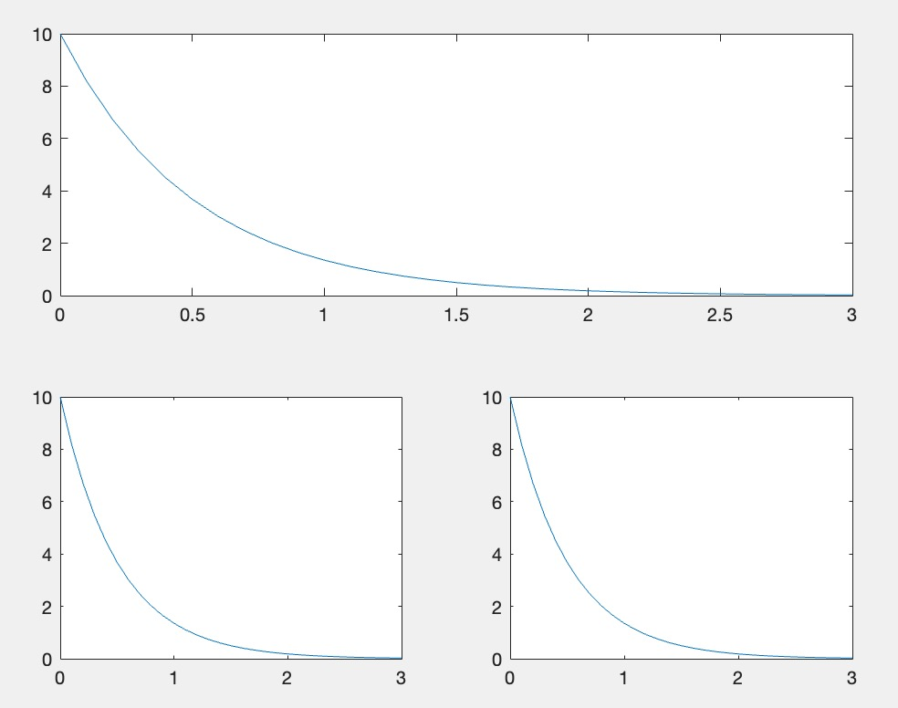

MATLAB (Matrix Laboratory) è un linguaggio di programmazione che permette di svolgere calcoli in modo semplice e interattivo.

# 1. Strutture Base
## 1.1 Matrici
$v = [1, 2, 3] = \begin{bmatrix}1 & 2 & 3\end{bmatrix}$ è un vettore orizzontale
$w = [1; 2; 3] = \begin{bmatrix}1 \\2 \\3\end{bmatrix}$ è un vettore verticale
$z = [1, 2; 3, 4]= \begin{bmatrix}1 &2 \\3&4\end{bmatrix}$ è una matrice

$v*w$ è il prodotto matriciale

## 1.2 Grafici
Per fare un grafico è necessario definire due vettori, uno per l'asse x e uno per l'asse y
```c
t = [0:0.1:3];
y = 10*exp(-2*t);
plot(t, y)
```

Un'altra funzione utile è quella di `subplot`
```c
subplot(righe, colonne, posizione)
```

```c
subplot(2, 1, 1);
plot(t1, y1);

subplot(2, 2, 3);
plot(t2, y2);

subplot(2, 2, 4);
plot(t3, y3)
```



## 1.3 Funzioni
```c
function s = sinc(t)
	s = sin(pi*t)./(pi*t);
	s(t == 0) = 1;
end
```
# 2. Convoluzione
```c
t_c = tx(1) + ty(1):T:tx(end) + ty(end);
c = T*conv(x, y);

plot(t_c, c)
```

# 3. Trasformata di Fourier
```c
N = length(x);
w = (0:N-1)*(2*pi)/(T*N);

S = T*fft(s);
```

Oppure in versione shifted
```c
N = length(x);
w = (-round(N - 1)/2:round(N/2) - 1)*(2*pi)/(T*N);

S = fftshift(T*fft(s));
```
## 3.1 Antitrasfromata di Fourier
```c
s = ifft(S)/T;
```

Oppure in versione shifted
```c
s = ifft(fftshift(X_1))/T;
```